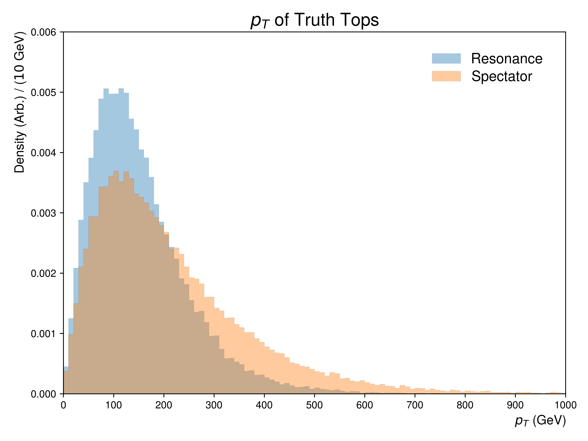
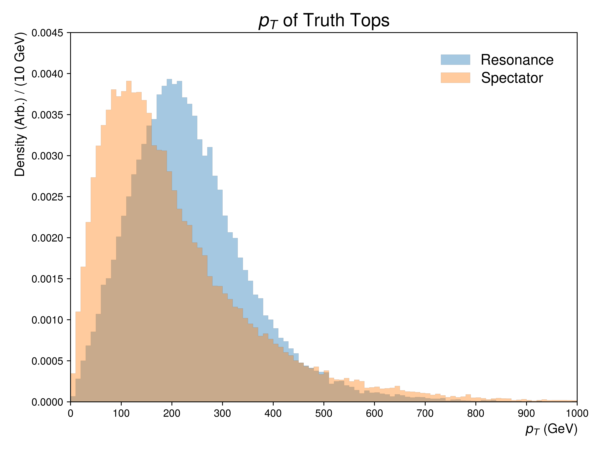

.. _figure_1a:

Figure 1.a
----------

A collection of figures depicting the **transverse momenta** distributions for spectator and resonance tops with various injected resonance mass points.

Mass Point: 400 GeV
^^^^^^^^^^^^^^^^^^^

Mass Point: 500 GeV
^^^^^^^^^^^^^^^^^^^

.. figure:: ./Mass.500.GeV/Figure.1.a.png
   :align: center

Mass Point: 600 GeV
^^^^^^^^^^^^^^^^^^^

Mass Point: 700 GeV
^^^^^^^^^^^^^^^^^^^

.. figure:: ./Mass.700.GeV/Figure.1.a.png
   :align: center

Mass Point: 800 GeV
^^^^^^^^^^^^^^^^^^^

.. figure:: ./Mass.800.GeV/Figure.1.a.png
   :align: center

Mass Point: 900 GeV
^^^^^^^^^^^^^^^^^^^

.. figure:: ./Mass.900.GeV/Figure.1.a.png
   :align: center

Mass Point: 1000 GeV
^^^^^^^^^^^^^^^^^^^^

.. figure:: ./Mass.1000.GeV/Figure.1.a.png
   :align: center

