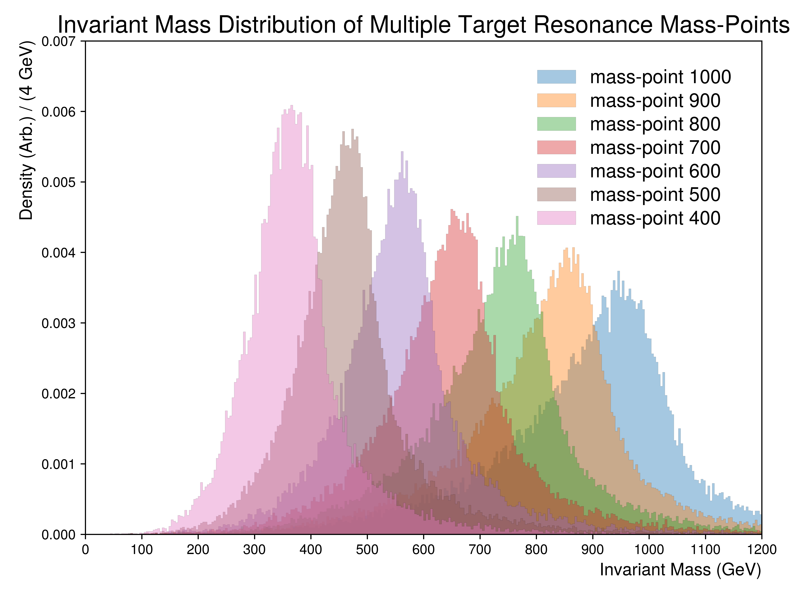

.. _figure_6d:

Figure 6.d
----------

  
A figure illustrating the collimation of all considered mass points for the resonance.
For this figure, detector based objects such as reconstructed jets and leptons were used to compute the resonance masses.
In cases of a leptonically decaying resonant top, **only the child neutrinos were used**.
For visibility, all distributions have been normalized to unity.
