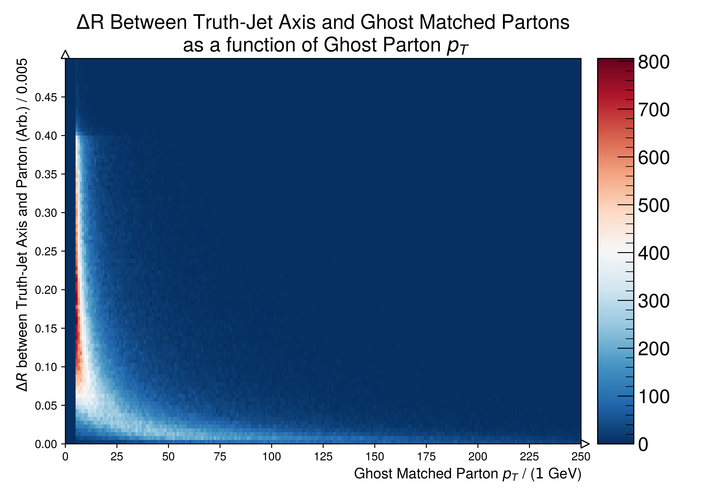

.. _figure_5q:

Figure.5.q
----------

Heat-maps of the :math:`\Delta R` dependency between the Truth-Jet axis and Ghost Matched Partons as a function of the Ghost Matched Parton's transverse momenta.
These figures are a decomposition of Figure :ref:`figure_5o`, where the underlying distributions are a function of the Ghost Matched Parton transverse momentum.

Mass Point: 400 GeV
^^^^^^^^^^^^^^^^^^^

.. figure:: ./Mass.400.GeV/Figure.5.q.png
   :align: center

Mass Point: 500 GeV
^^^^^^^^^^^^^^^^^^^

.. figure:: ./Mass.500.GeV/Figure.5.q.png
   :align: center

Mass Point: 600 GeV
^^^^^^^^^^^^^^^^^^^

Mass Point: 700 GeV
^^^^^^^^^^^^^^^^^^^

.. figure:: ./Mass.700.GeV/Figure.5.q.png
   :align: center

Mass Point: 800 GeV
^^^^^^^^^^^^^^^^^^^

.. figure:: ./Mass.800.GeV/Figure.5.q.png
   :align: center

Mass Point: 900 GeV
^^^^^^^^^^^^^^^^^^^

.. figure:: ./Mass.900.GeV/Figure.5.q.png
   :align: center

Mass Point: 1000 GeV
^^^^^^^^^^^^^^^^^^^^

.. figure:: ./Mass.1000.GeV/Figure.5.q.png
   :align: center

