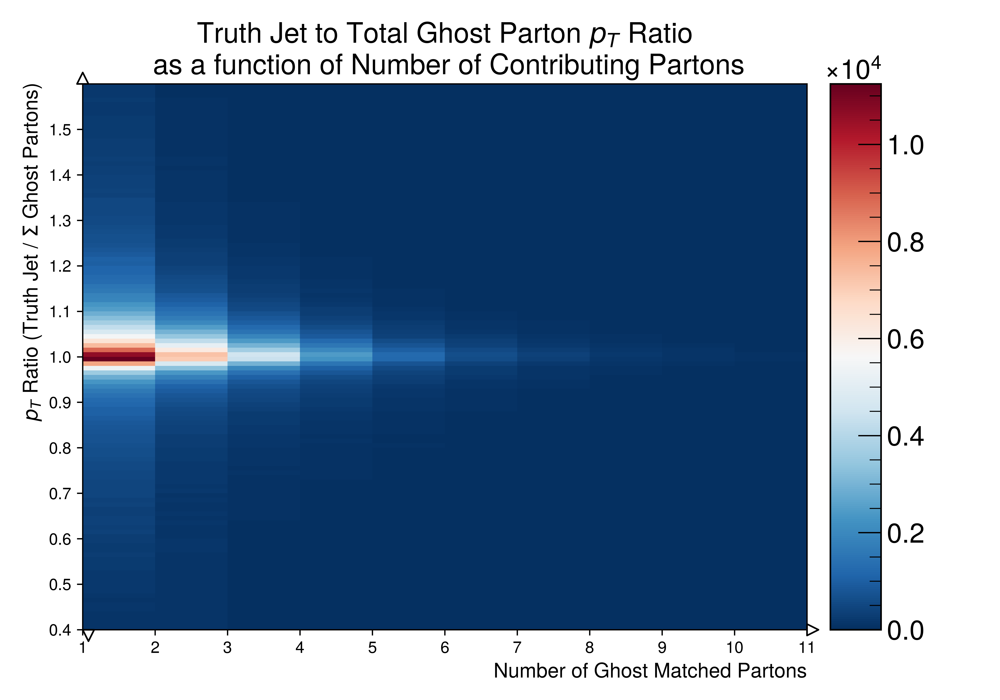

.. _figure_5w:

Figure.5.w
----------

A set of figures depicting a heat-map of the transverse momenta contribution ratio for ghost partons matched to a given truth-jet as a function of number of ghost partons matched.
**The ratio is computed by considering the transverse momenta of the truth-jet and dividing it by the sum of ghost parton transverse momenta**.

Mass Point: 400 GeV
^^^^^^^^^^^^^^^^^^^

.. figure:: ./Mass.400.GeV/Figure.5.w.png
   :align: center

Mass Point: 500 GeV
^^^^^^^^^^^^^^^^^^^

Mass Point: 600 GeV
^^^^^^^^^^^^^^^^^^^

.. figure:: ./Mass.600.GeV/Figure.5.w.png
   :align: center

Mass Point: 700 GeV
^^^^^^^^^^^^^^^^^^^

.. figure:: ./Mass.700.GeV/Figure.5.w.png
   :align: center

Mass Point: 800 GeV
^^^^^^^^^^^^^^^^^^^

.. figure:: ./Mass.800.GeV/Figure.5.w.png
   :align: center

Mass Point: 900 GeV
^^^^^^^^^^^^^^^^^^^

Mass Point: 1000 GeV
^^^^^^^^^^^^^^^^^^^^

.. figure:: ./Mass.1000.GeV/Figure.5.w.png
   :align: center

