Improved Performance and Algorithm Extension
============================================

This study centralizes around improving the speed of the reference algorithm and extending it.
The shown studies initially attempt to illustrate the performance of the extended algorithm (**pyc_combinatorial**) in regards to being able to resolve b-quark (jets) and lepton pairs, without explicitly knowning the correct pairing.
A set of projection plots aim to illustrate the performance, by comparing the reconstructed neutrinos to the reference algorithm and various other implementations.

The Extended Algorithm (pyc_combinatorial)
------------------------------------------
The process considered in the original paper was the :math:`\bar{t}t` leptonic decay mode.
For tops decaying leptonically, targeted events would contain a low number of b-quarks (jets), with no more than 2 b-quarks (jets) and 2 associated leptons.
In such cases, matching b-quarks (jets) to leptons would be simplistic, with only two possible permutations ({(l1, b1), (l2, b2)}, {(l2, b1), (l1, b2)}). 
Performing the reconstruction would yield a distance metric, indicating the proximity of analytical ellipses, with lower distances implying more accurate solution sets.

For standard and beyond standard model 4-top searches, the number of possible permutations increases with the number of considered b-jets, introducing ambiguity.
The ambiguity arises from not being able to distinguish between b-quarks (jets) originating from hadronically based top decay modes and leptonic tops.
As such, all possible pairs of b-quark (jets) and leptons need to be considered in the event topology, complicating the usage of the algorithm.
Furthermore, the algorithm requires statically defined top and W-boson masses, with the assumption that neutrino pairs originate from tops and W-bosons with identical masses.
Although a valid assumption, tops and W-bosons do not have static top masses, but rather a bandwidth of possible masses.

To address a subset of these assumptions, **pyc_combinatorial** implements a bandwidth of possible top and W-boson masses, and steps through a matrix of possible mass pairs.
Furthermore, the algorithm computes all possible permutations of b-quark (jets) and lepton pairings, in with the aforementioned mass matrix. 
In order to yield a single mass/particle pairing for a given event, the solution with the lowest distance is chosen. 

Selection Criteria
------------------

Events are required to have exactly two leptonically decaying top-quarks on truth children level.
For subsequent studies involving truth jets and detector based objects, both b-quarks and leptons on truth children level need to be matched accordingly.
If any of these conditions are not satisfied, the respective part of the study is skipped for the event.
Furthermore, truth jets and jets are required to have only single top contributions, otherwise the event is vetoed.

Particle Definitions
--------------------
Leptons and neutrinos are defined as:

- electrons
- muons
- taus

**Truth Children**
------------------

Figure 1.a
^^^^^^^^^^
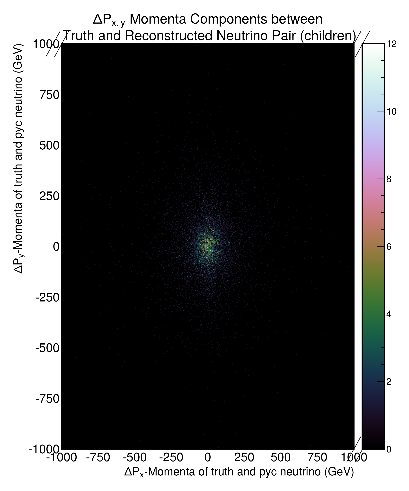

   A heat map of the momenta differential in the x and y direction between the truth and reconstructed neutrino using **pyc_combinatorial**.
   Ideally, reconstructed neutrino pairs cluster around the (0, 0) coordinate, indicating that the implementation is consistent.

Figure 1.b
^^^^^^^^^^

   A heat map of the momenta differential in the x and z direction between the truth and reconstructed neutrino using **pyc_combinatorial**.
   Ideally, reconstructed neutrino pairs cluster around the (0, 0) coordinate, indicating that the implementation is consistent.

Figure 1.c
^^^^^^^^^^
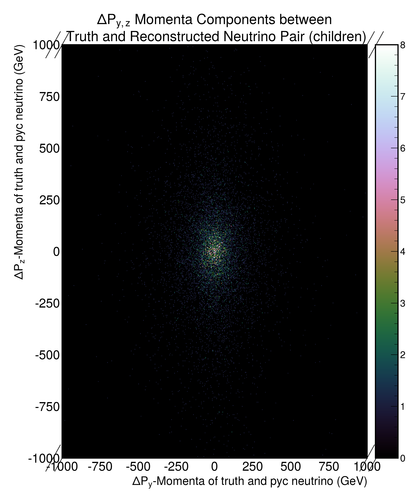

   A heat map of the momenta differential in the y and z direction between the truth and reconstructed neutrino using **pyc_combinatorial**.
   Ideally, reconstructed neutrino pairs cluster around the (0, 0) coordinate, indicating that the implementation is consistent.

Figure 1.d
^^^^^^^^^^
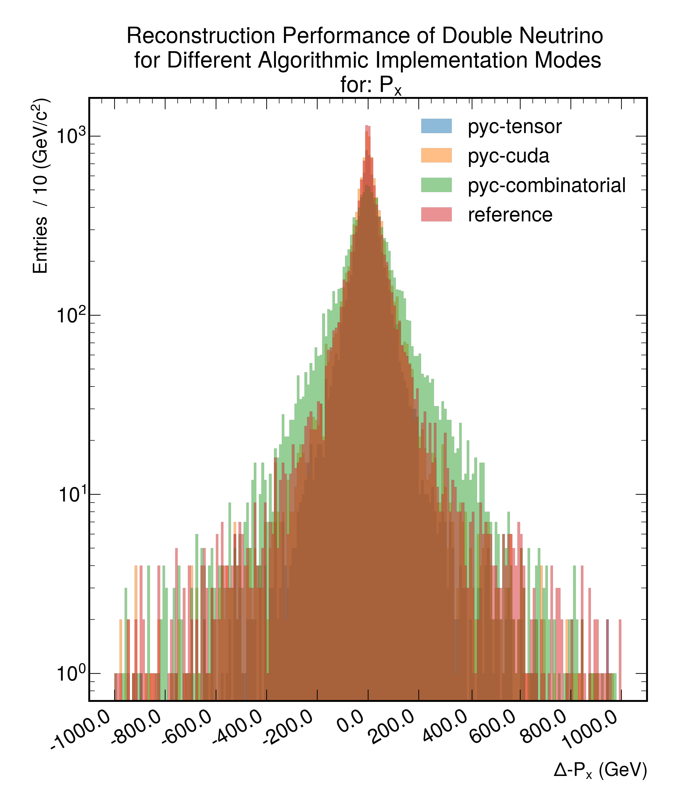

   A projection plot of the momenta differential between the truth and reconstructed neutrinos along the x-axis.
   Shown are the *reference* algorithm (extracted from the original paper), *pyc_cuda* (a native cuda implementation), *pyc-tensor* (a pytorch only implementation) and *pyc_combinatorial*.
   The objective is to have a clear peak around the 0 point, as this indicates perfect neutrino reconstruction.

Figure 1.e
^^^^^^^^^^
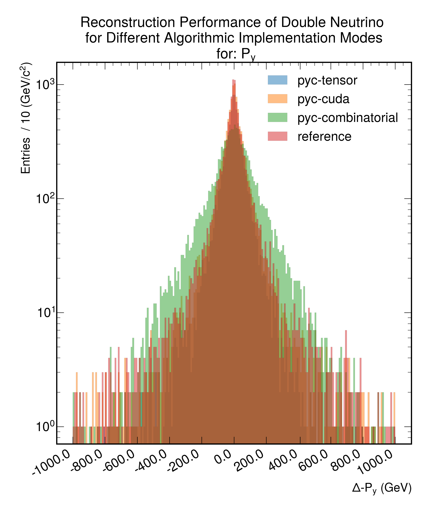

   A projection plot of the momenta differential between the truth and reconstructed neutrinos along the y-axis.
   Shown are the *reference* algorithm (extracted from the original paper), *pyc_cuda* (a native cuda implementation), *pyc-tensor* (a pytorch only implementation) and *pyc_combinatorial*.
   The objective is to have a clear peak around the 0 point, as this indicates perfect neutrino reconstruction.

Figure 1.f
^^^^^^^^^^

   A projection plot of the momenta differential between the truth and reconstructed neutrinos along the z-axis.
   Shown are the *reference* algorithm (extracted from the original paper), *pyc_cuda* (a native cuda implementation), *pyc-tensor* (a pytorch only implementation) and *pyc_combinatorial*.
   The objective is to have a clear peak around the 0 point, as this indicates perfect neutrino reconstruction.

Figure 1.g
^^^^^^^^^^
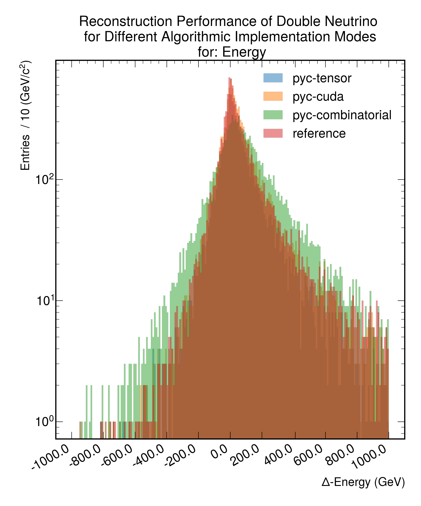

   A projection plot of the energy differential between the truth and reconstructed neutrinos.
   Shown are the *reference* algorithm (extracted from the original paper), *pyc_cuda* (a native cuda implementation), *pyc-tensor* (a pytorch only implementation) and *pyc_combinatorial*.
   The objective is to have a clear peak around the 0 point, as this indicates perfect neutrino reconstruction.

Figure 1.h
^^^^^^^^^^
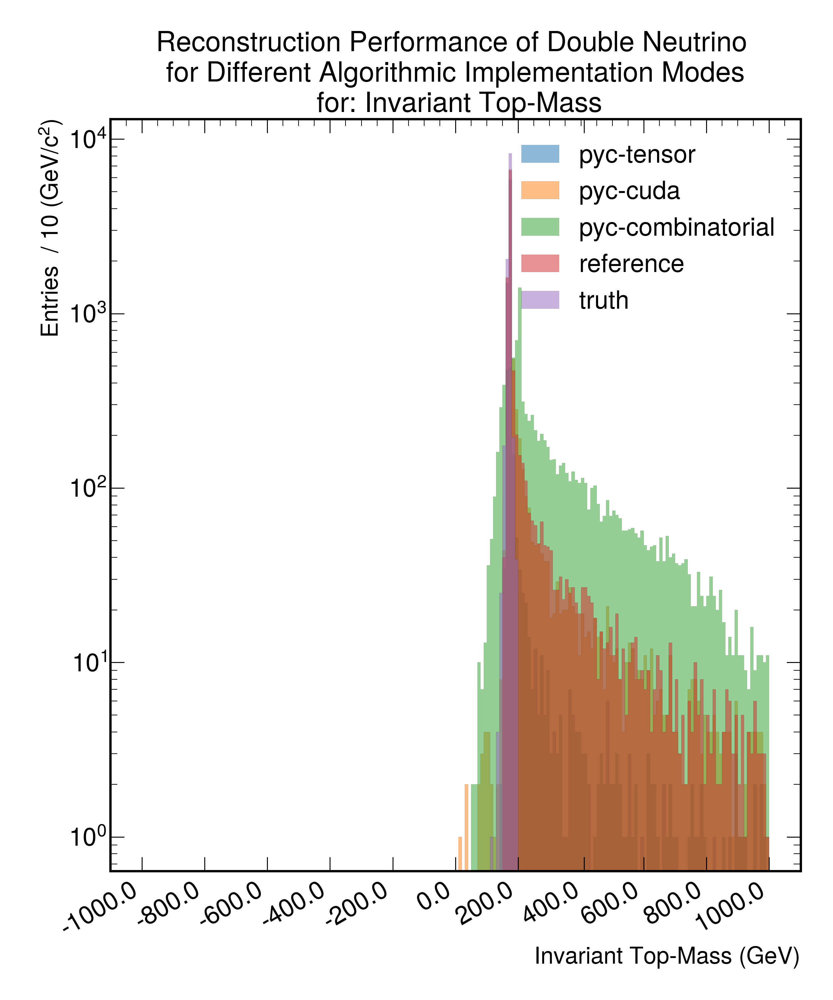

   An invariant top-mass histogram plot using reconstructed neutrinos from algorementioned algorithms compared to truth neutrinos.

Figure 1.i
^^^^^^^^^^
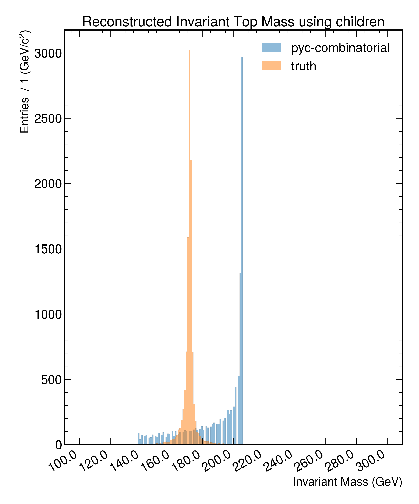

   The selected top-mass for the selected solution pairs compared to the underlying truth top-mass.
   Ideally the selected top-mass distribution coincides with the truth top-mass.

Figure 1.j
^^^^^^^^^^
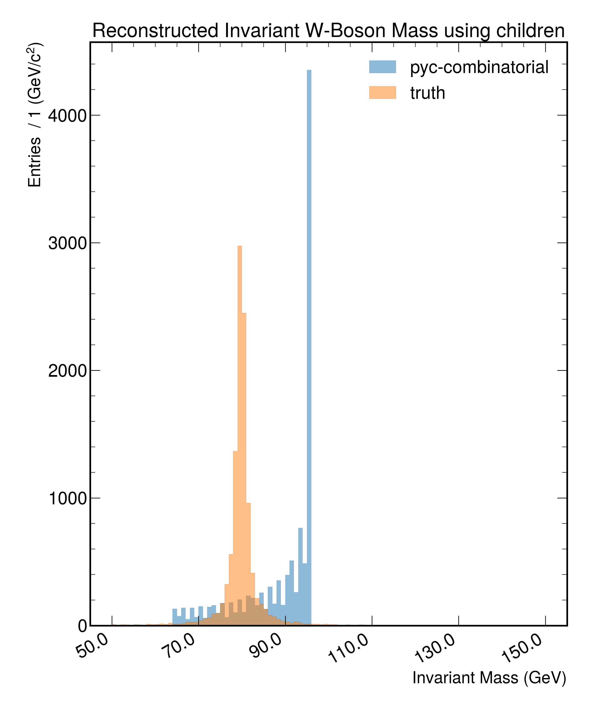

   The selected W-boson mass for the selected solution pairs compared to the underlying truth W-boson mass.
   Ideally the selected W-boson mass distribution coincides with the truth W-boson mass.

**Truth Jets**
--------------

Figure 2.a
^^^^^^^^^^

   A heat map of the momenta differential in the x and y direction between the truth and reconstructed neutrino using **pyc_combinatorial**.
   Ideally, reconstructed neutrino pairs cluster around the (0, 0) coordinate, indicating that the implementation is consistent.

Figure 2.b
^^^^^^^^^^

   A heat map of the momenta differential in the x and z direction between the truth and reconstructed neutrino using **pyc_combinatorial**.
   Ideally, reconstructed neutrino pairs cluster around the (0, 0) coordinate, indicating that the implementation is consistent.

Figure 2.c
^^^^^^^^^^
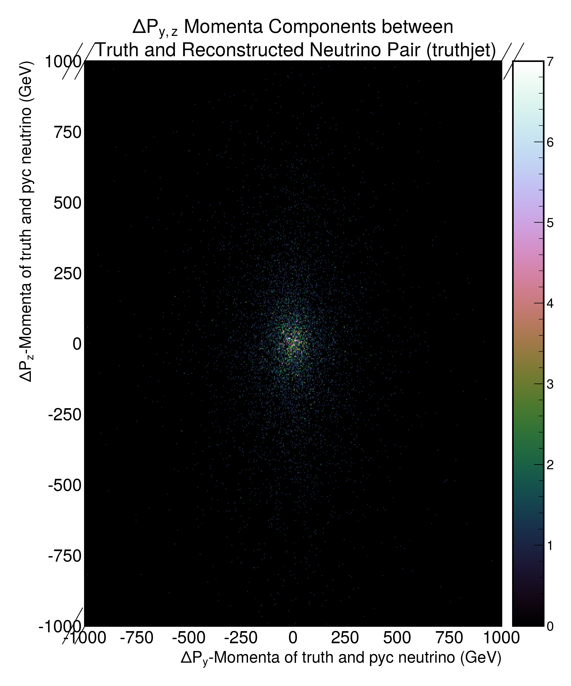

   A heat map of the momenta differential in the y and z direction between the truth and reconstructed neutrino using **pyc_combinatorial**.
   Ideally, reconstructed neutrino pairs cluster around the (0, 0) coordinate, indicating that the implementation is consistent.

Figure 2.d
^^^^^^^^^^
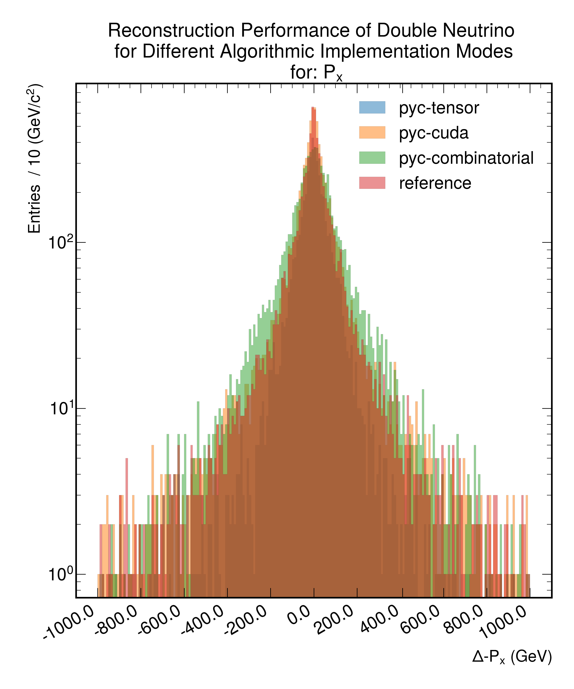

   A projection plot of the momenta differential between the truth and reconstructed neutrinos along the x-axis.
   Shown are the *reference* algorithm (extracted from the original paper), *pyc_cuda* (a native cuda implementation), *pyc-tensor* (a pytorch only implementation) and *pyc_combinatorial*.
   The objective is to have a clear peak around the 0 point, as this indicates perfect neutrino reconstruction.

Figure 2.e
^^^^^^^^^^
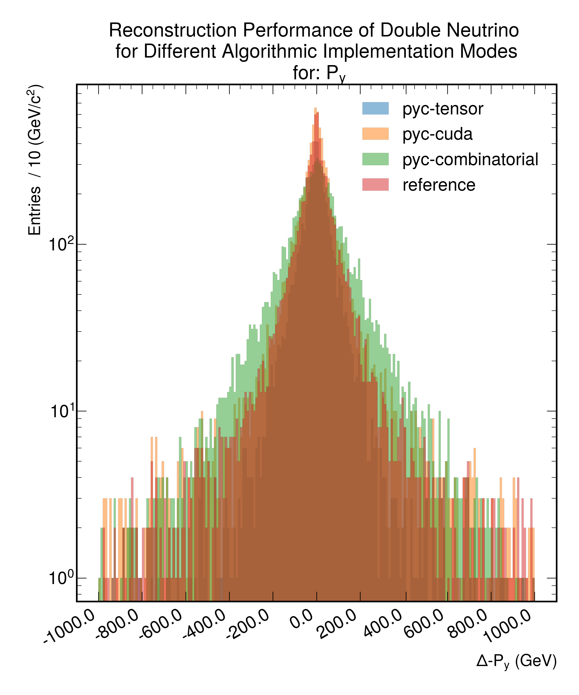

   A projection plot of the momenta differential between the truth and reconstructed neutrinos along the y-axis.
   Shown are the *reference* algorithm (extracted from the original paper), *pyc_cuda* (a native cuda implementation), *pyc-tensor* (a pytorch only implementation) and *pyc_combinatorial*.
   The objective is to have a clear peak around the 0 point, as this indicates perfect neutrino reconstruction.

Figure 2.f
^^^^^^^^^^
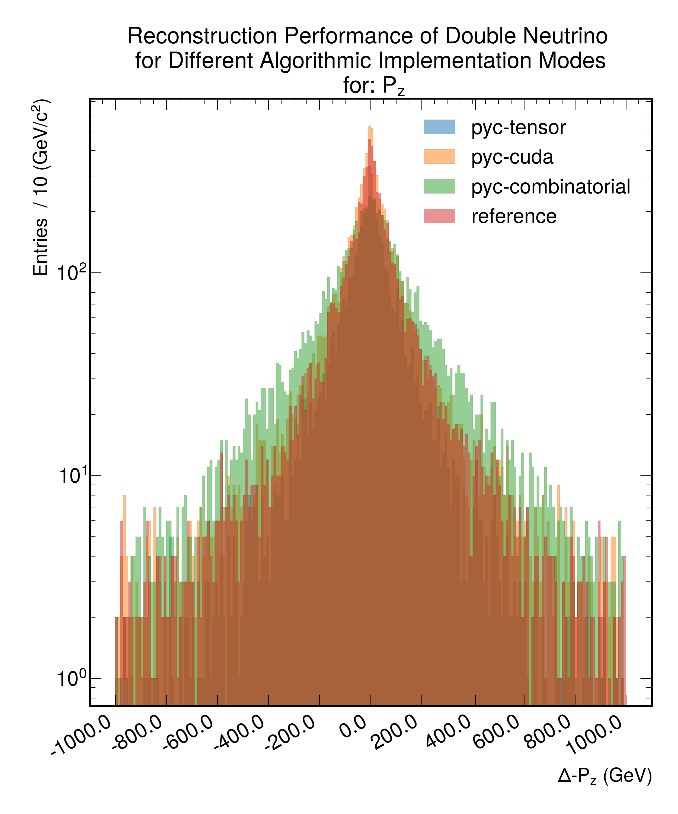

   A projection plot of the momenta differential between the truth and reconstructed neutrinos along the z-axis.
   Shown are the *reference* algorithm (extracted from the original paper), *pyc_cuda* (a native cuda implementation), *pyc-tensor* (a pytorch only implementation) and *pyc_combinatorial*.
   The objective is to have a clear peak around the 0 point, as this indicates perfect neutrino reconstruction.

Figure 2.g
^^^^^^^^^^
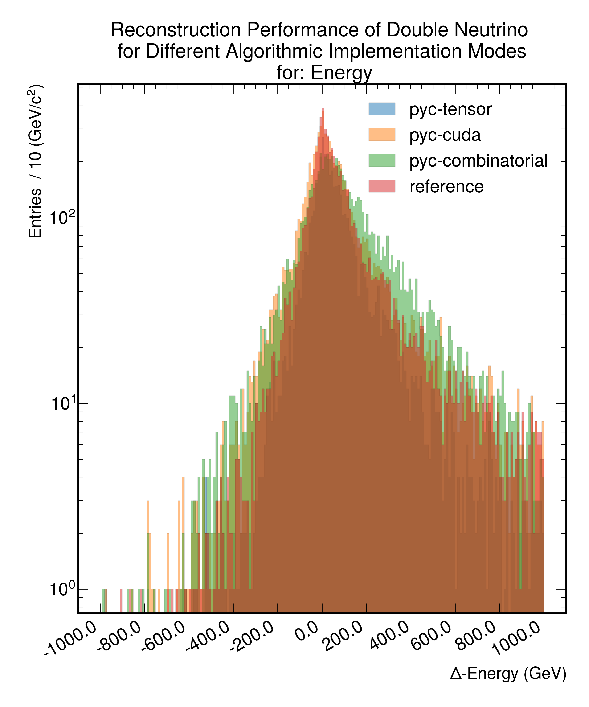

   A projection plot of the energy differential between the truth and reconstructed neutrinos.
   Shown are the *reference* algorithm (extracted from the original paper), *pyc_cuda* (a native cuda implementation), *pyc-tensor* (a pytorch only implementation) and *pyc_combinatorial*.
   The objective is to have a clear peak around the 0 point, as this indicates perfect neutrino reconstruction.

Figure 2.h
^^^^^^^^^^
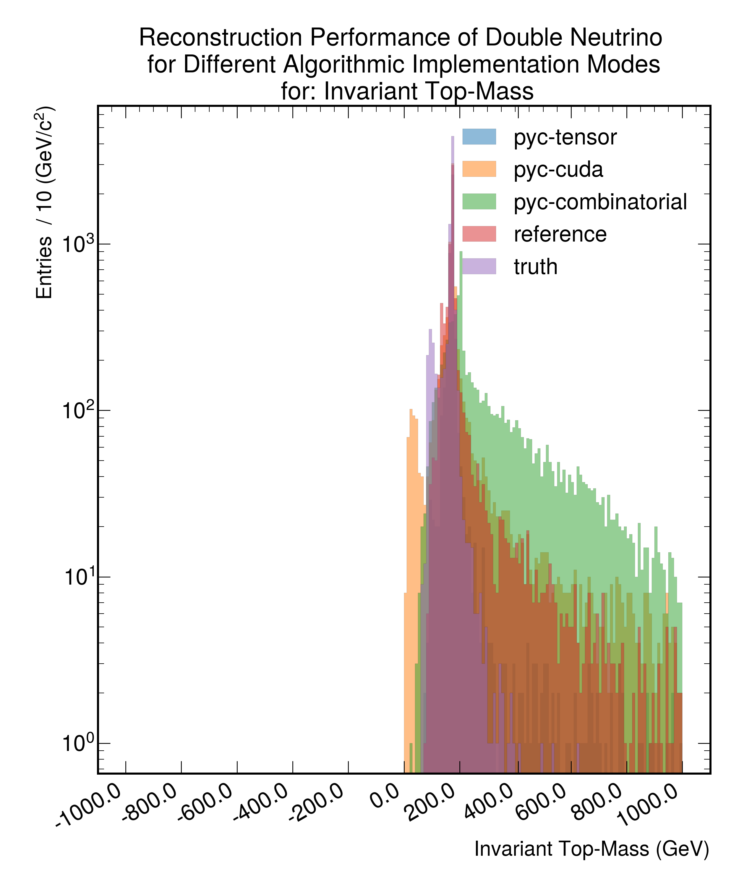

   An invariant top-mass histogram plot using reconstructed neutrinos from algorementioned algorithms compared to truth neutrinos.

Figure 2.i
^^^^^^^^^^
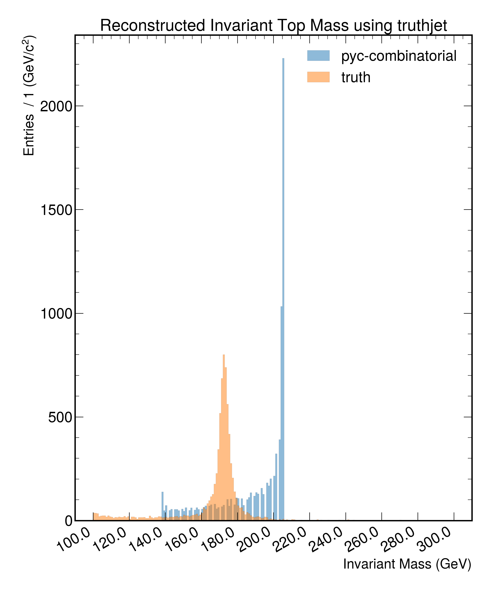

   The selected top-mass for the selected solution pairs compared to the underlying truth top-mass.
   Ideally the selected top-mass distribution coincides with the truth top-mass.

Figure 2.j
^^^^^^^^^^

   The selected W-boson mass for the selected solution pairs compared to the underlying truth W-boson mass.
   Ideally the selected W-boson mass distribution coincides with the truth W-boson mass.

**Jets**
--------

Figure 3.a
^^^^^^^^^^
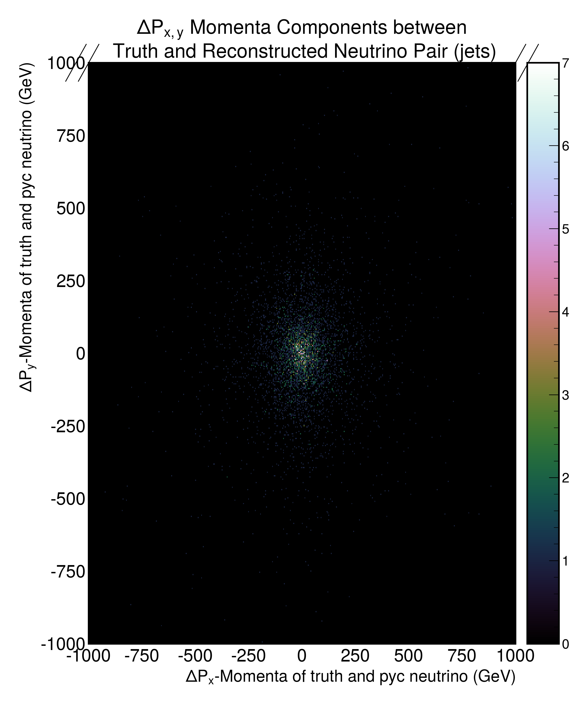

   A heat map of the momenta differential in the x and y direction between the truth and reconstructed neutrino using **pyc_combinatorial**.
   Ideally, reconstructed neutrino pairs cluster around the (0, 0) coordinate, indicating that the implementation is consistent.

Figure 3.b
^^^^^^^^^^

   A heat map of the momenta differential in the x and z direction between the truth and reconstructed neutrino using **pyc_combinatorial**.
   Ideally, reconstructed neutrino pairs cluster around the (0, 0) coordinate, indicating that the implementation is consistent.

Figure 3.c
^^^^^^^^^^
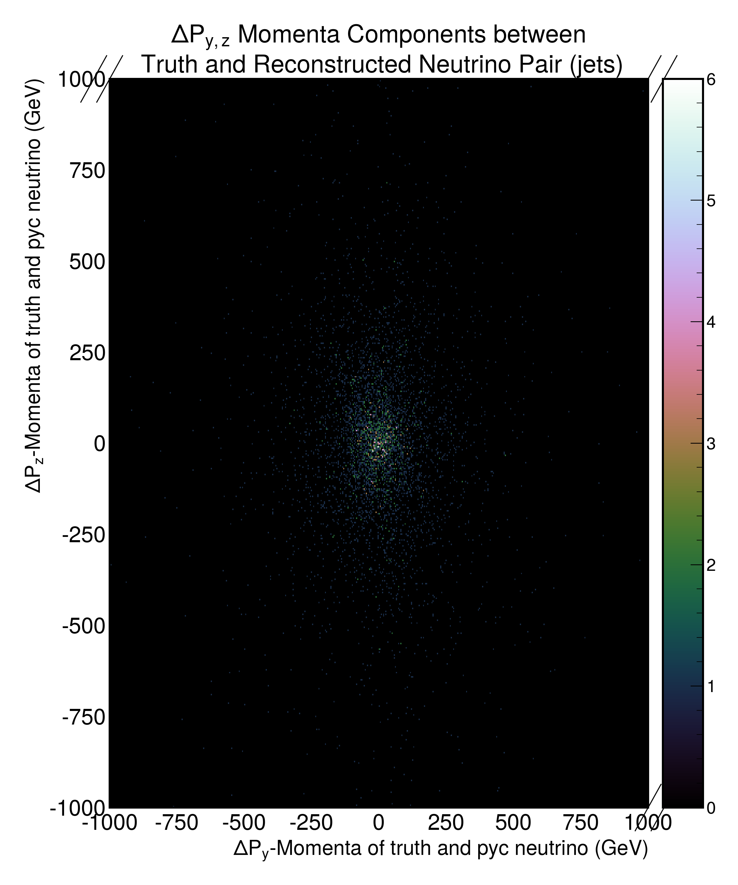

   A heat map of the momenta differential in the y and z direction between the truth and reconstructed neutrino using **pyc_combinatorial**.
   Ideally, reconstructed neutrino pairs cluster around the (0, 0) coordinate, indicating that the implementation is consistent.

Figure 3.d
^^^^^^^^^^

   A projection plot of the momenta differential between the truth and reconstructed neutrinos along the x-axis.
   Shown are the *reference* algorithm (extracted from the original paper), *pyc_cuda* (a native cuda implementation), *pyc-tensor* (a pytorch only implementation) and *pyc_combinatorial*.
   The objective is to have a clear peak around the 0 point, as this indicates perfect neutrino reconstruction.

Figure 3.e
^^^^^^^^^^

   A projection plot of the momenta differential between the truth and reconstructed neutrinos along the y-axis.
   Shown are the *reference* algorithm (extracted from the original paper), *pyc_cuda* (a native cuda implementation), *pyc-tensor* (a pytorch only implementation) and *pyc_combinatorial*.
   The objective is to have a clear peak around the 0 point, as this indicates perfect neutrino reconstruction.

Figure 3.f
^^^^^^^^^^

   A projection plot of the momenta differential between the truth and reconstructed neutrinos along the z-axis.
   Shown are the *reference* algorithm (extracted from the original paper), *pyc_cuda* (a native cuda implementation), *pyc-tensor* (a pytorch only implementation) and *pyc_combinatorial*.
   The objective is to have a clear peak around the 0 point, as this indicates perfect neutrino reconstruction.

Figure 3.g
^^^^^^^^^^
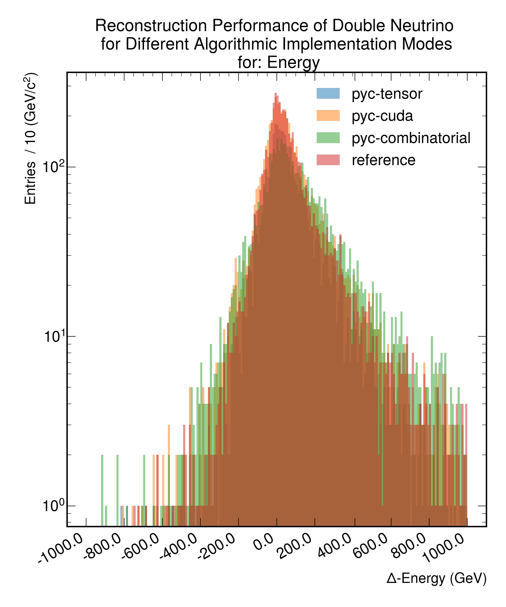

   A projection plot of the energy differential between the truth and reconstructed neutrinos.
   Shown are the *reference* algorithm (extracted from the original paper), *pyc_cuda* (a native cuda implementation), *pyc-tensor* (a pytorch only implementation) and *pyc_combinatorial*.
   The objective is to have a clear peak around the 0 point, as this indicates perfect neutrino reconstruction.

Figure 3.h
^^^^^^^^^^
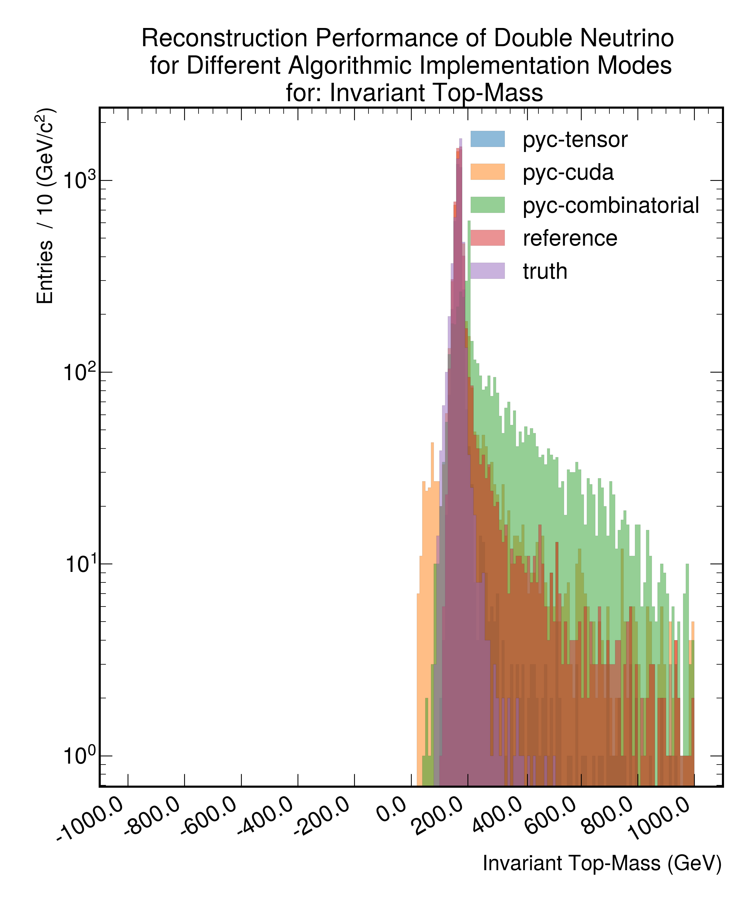

   An invariant top-mass histogram plot using reconstructed neutrinos from algorementioned algorithms compared to truth neutrinos.

Figure 3.i
^^^^^^^^^^
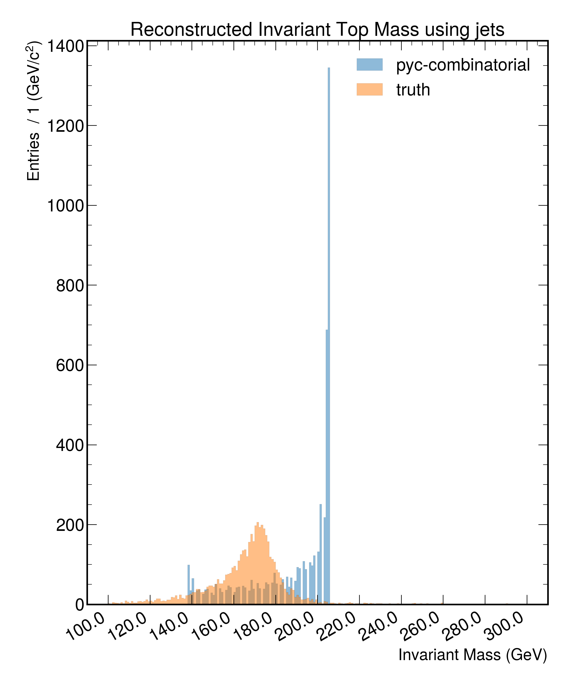

   The selected top-mass for the selected solution pairs compared to the underlying truth top-mass.
   Ideally the selected top-mass distribution coincides with the truth top-mass.

Figure 3.j
^^^^^^^^^^

   The selected W-boson mass for the selected solution pairs compared to the underlying truth W-boson mass.
   Ideally the selected W-boson mass distribution coincides with the truth W-boson mass.

**Jets with Detector Leptons**
------------------------------

Figure 4.a
^^^^^^^^^^
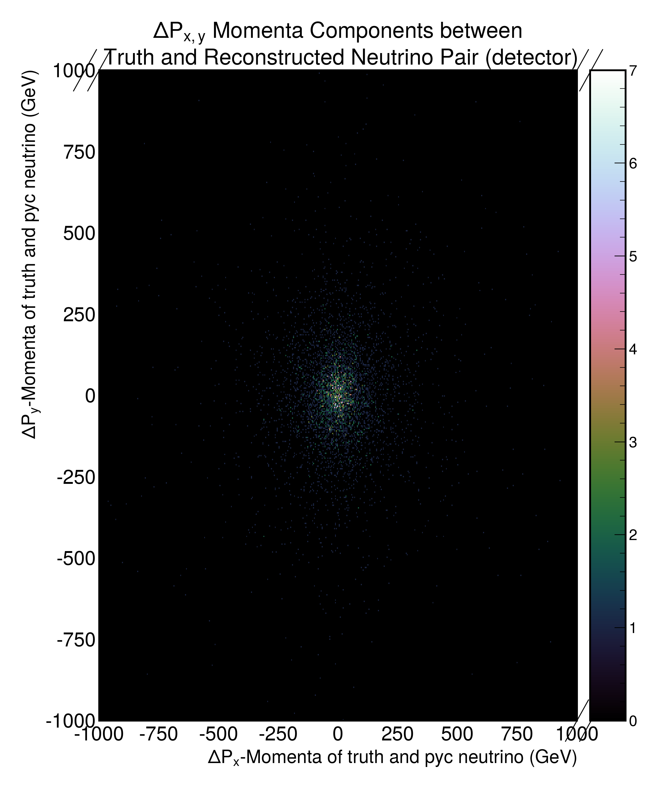

   A heat map of the momenta differential in the x and y direction between the truth and reconstructed neutrino using **pyc_combinatorial**.
   Ideally, reconstructed neutrino pairs cluster around the (0, 0) coordinate, indicating that the implementation is consistent.

Figure 4.b
^^^^^^^^^^

   A heat map of the momenta differential in the x and z direction between the truth and reconstructed neutrino using **pyc_combinatorial**.
   Ideally, reconstructed neutrino pairs cluster around the (0, 0) coordinate, indicating that the implementation is consistent.

Figure 4.c
^^^^^^^^^^

   A heat map of the momenta differential in the y and z direction between the truth and reconstructed neutrino using **pyc_combinatorial**.
   Ideally, reconstructed neutrino pairs cluster around the (0, 0) coordinate, indicating that the implementation is consistent.

Figure 4.d
^^^^^^^^^^
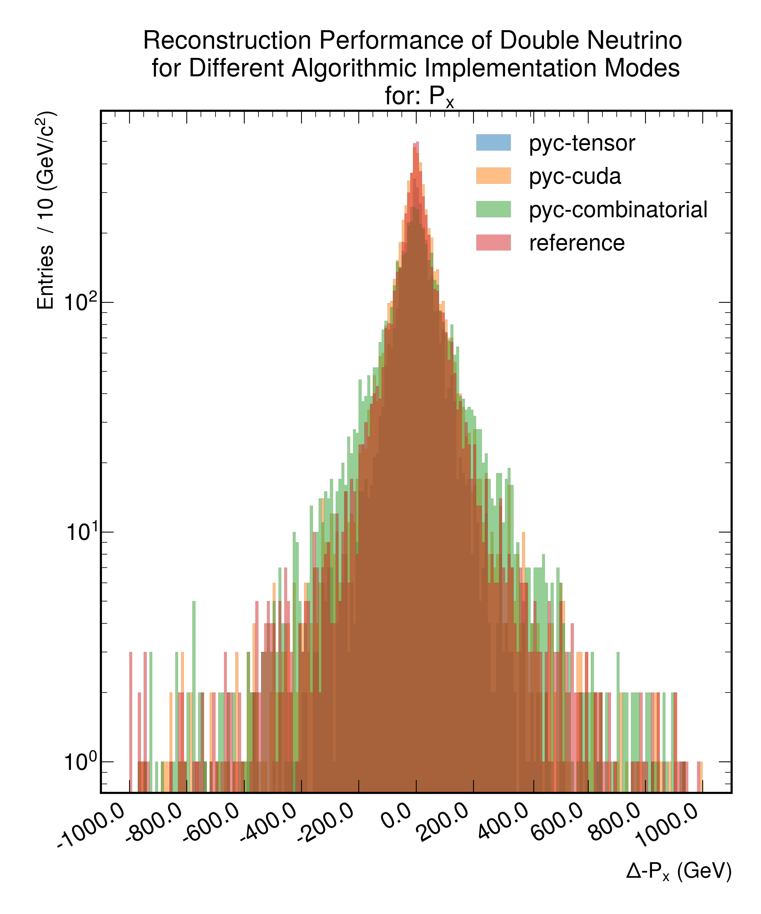

   A projection plot of the momenta differential between the truth and reconstructed neutrinos along the x-axis.
   Shown are the *reference* algorithm (extracted from the original paper), *pyc_cuda* (a native cuda implementation), *pyc-tensor* (a pytorch only implementation) and *pyc_combinatorial*.
   The objective is to have a clear peak around the 0 point, as this indicates perfect neutrino reconstruction.

Figure 4.e
^^^^^^^^^^
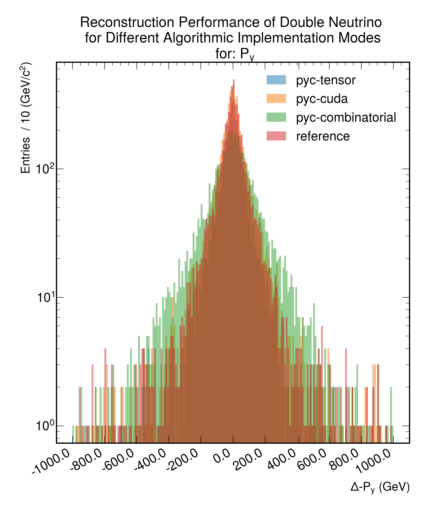

   A projection plot of the momenta differential between the truth and reconstructed neutrinos along the y-axis.
   Shown are the *reference* algorithm (extracted from the original paper), *pyc_cuda* (a native cuda implementation), *pyc-tensor* (a pytorch only implementation) and *pyc_combinatorial*.
   The objective is to have a clear peak around the 0 point, as this indicates perfect neutrino reconstruction.

Figure 4.f
^^^^^^^^^^
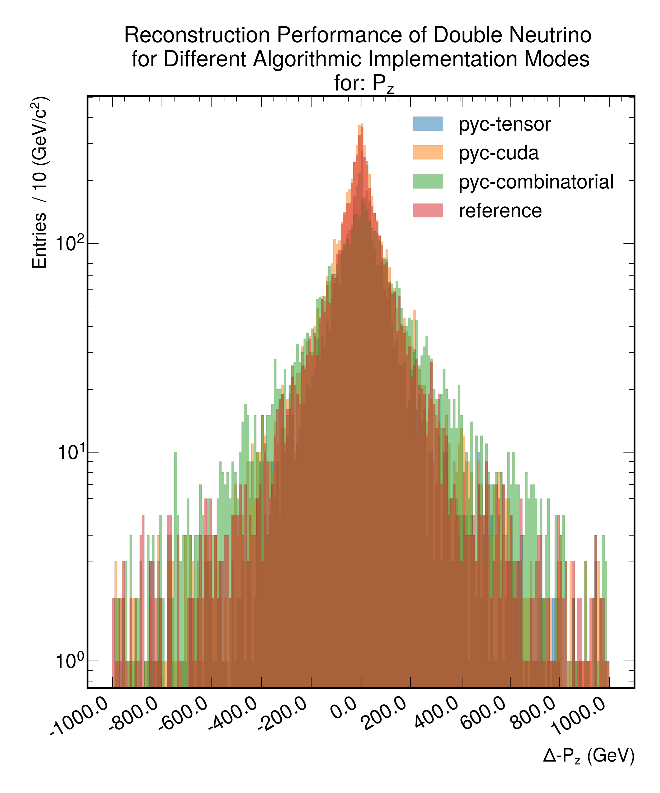

   A projection plot of the momenta differential between the truth and reconstructed neutrinos along the z-axis.
   Shown are the *reference* algorithm (extracted from the original paper), *pyc_cuda* (a native cuda implementation), *pyc-tensor* (a pytorch only implementation) and *pyc_combinatorial*.
   The objective is to have a clear peak around the 0 point, as this indicates perfect neutrino reconstruction.

Figure 4.g
^^^^^^^^^^
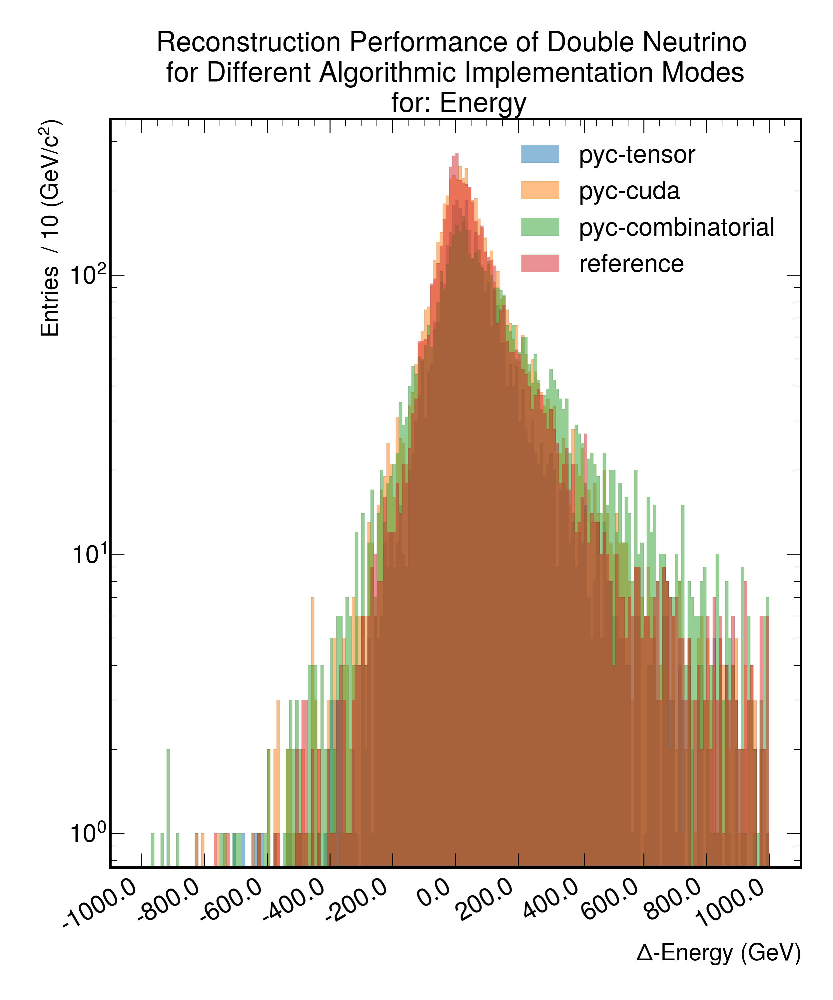

   A projection plot of the energy differential between the truth and reconstructed neutrinos.
   Shown are the *reference* algorithm (extracted from the original paper), *pyc_cuda* (a native cuda implementation), *pyc-tensor* (a pytorch only implementation) and *pyc_combinatorial*.
   The objective is to have a clear peak around the 0 point, as this indicates perfect neutrino reconstruction.

Figure 4.h
^^^^^^^^^^
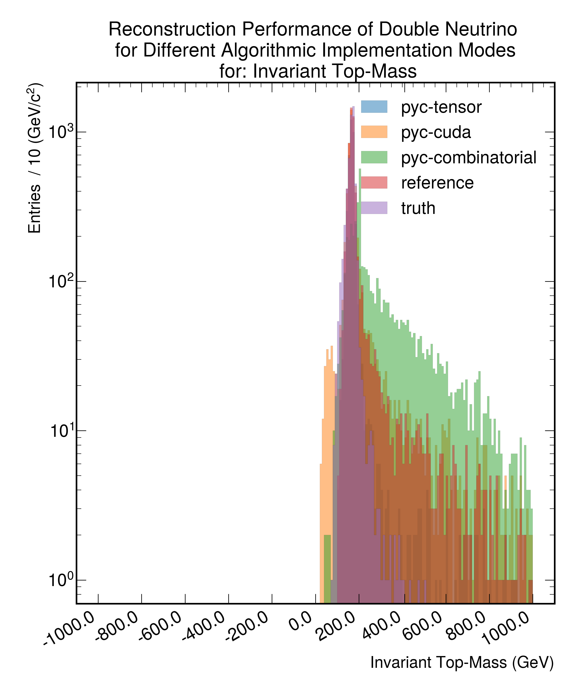

   An invariant top-mass histogram plot using reconstructed neutrinos from algorementioned algorithms compared to truth neutrinos.

Figure 4.i
^^^^^^^^^^
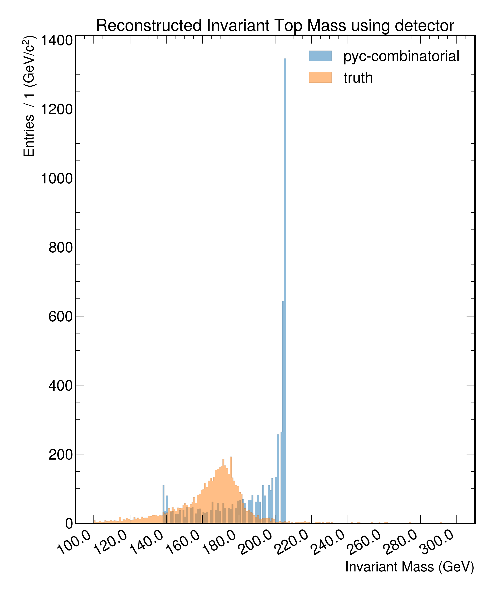

   The selected top-mass for the selected solution pairs compared to the underlying truth top-mass.
   Ideally the selected top-mass distribution coincides with the truth top-mass.

Figure 4.j
^^^^^^^^^^
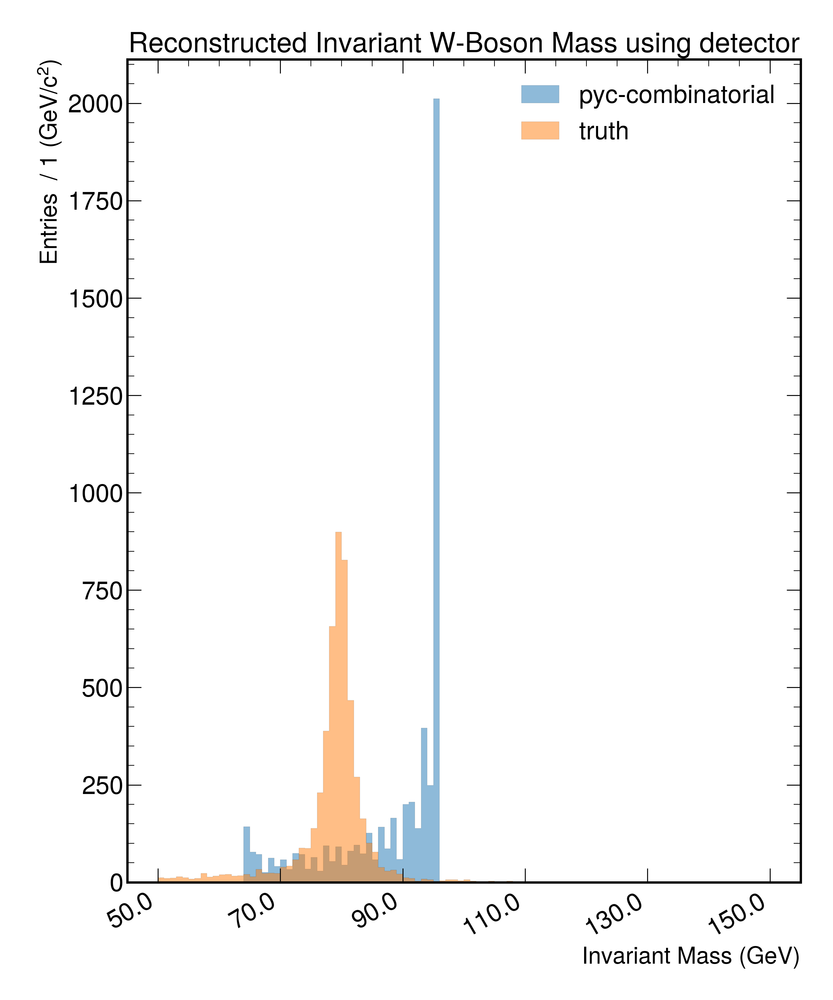

   The selected W-boson mass for the selected solution pairs compared to the underlying truth W-boson mass.
   Ideally the selected W-boson mass distribution coincides with the truth W-boson mass.

