Single Neutrino
===============
For this study the Monte Carlo truth is varied, the first set of plots illustrate the possible resolution achievable using truth children, in particular truth b-quark and lepton, which are shown below as under Figure.1 collections.
As for the Figure.2 collections, the truth b-quark is replaced with a truth-jet matched to the b-quark parton.
In cases where the b-quark has no associated truth-jet, the event is skipped. 
Figure.3 collections use the detector reconstructed jets but still use the truth children lepton.
Again for instances where no jet is matched to the associated b-quark, the event is skipped.
Finally, Figure.4 collections illustrate the worst possible resolution, since the truth children lepton is replaced with detector based matched lepton.
Similar to the (truth)-jet cases, if neither a b-quark has been matched to a jet or the truth children lepton has no associated matching, the event is skipped.

The latter part of the study focuses on bruteforcing the S-matrix values, which minimize the :math:`\chi` value of the difference between the truth and reconstructed neutrino kinematic values.

Selection Criteria
------------------
Events are required to have exactly one top-quark decaying leptonically.
The :math:`E_T` and :math:`\phi` of the detector is used as input for the algorithm, with the top and W masses being derived from the truth children or matched (truth)-jets and detector leptons.
The neutrino algorithm **zero** value is being set to 1e-10, since anything below this value creates large differences between C++ and Python floating point definitions.
Furthermore, the momentum imbalance uncertainty matrix **S**, has been assigned the values: :math:`S_xx = 1000, S_xy = 100, S_yx = 100, S_yy = 1000`. 
These values were chosen arbitrarily, and not optimized for the bulk of the study.
For the S-Matrix optimization, only detector based jets and leptons are used.

Particle Definitions
--------------------
Leptons and neutrinos are defined as:

- electrons
- muons 
- taus

**Truth Children**
------------------

Figure 1.a (PYC)
^^^^^^^^^^^^^^^^
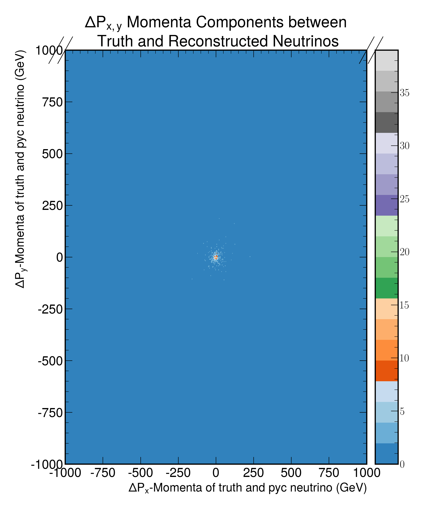

   A heat-map of the momenta differential in the x and y direction between the truth and reconstructed neutrino (using **pyc**).
   This is to validate whether the difference between the truth and the reconstructed neutrino is consistent. 
   Ideally the heat-map should have a single bin at (0,0), indicating perfect reconstruction.

Figure 1.b (PYC)
^^^^^^^^^^^^^^^^

   A heat-map of the momenta differential in the x and z direction between the truth and reconstructed neutrino (using **pyc**).
   This is to validate whether the difference between the truth and the reconstructed neutrino is consistent. 
   Ideally the heat-map should have a single bin at (0,0), indicating perfect reconstruction.

Figure 1.c (PYC)
^^^^^^^^^^^^^^^^
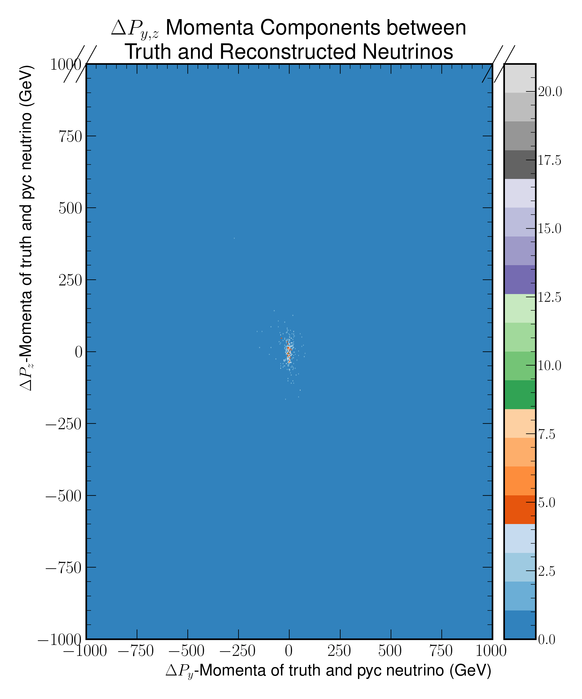

   A heat-map of the momenta differential in the y and z direction between the truth and reconstructed neutrino (using **pyc**).
   This is to validate whether the difference between the truth and the reconstructed neutrino is consistent. 
   Ideally the heat-map should have a single bin at (0,0), indicating perfect reconstruction.

Figure 1.d (REFERENCE)
^^^^^^^^^^^^^^^^^^^^^^
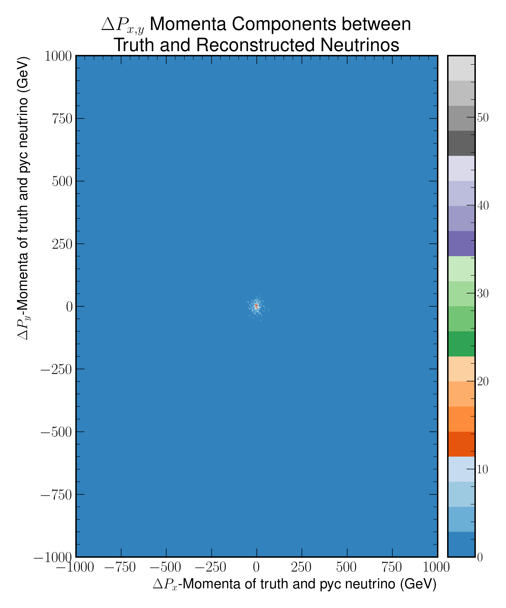

   A heat-map of the momenta differential in the x and y direction between the truth and reconstructed neutrino (using **reference**).
   This is to validate whether the difference between the truth and the reconstructed neutrino is consistent. 
   Ideally the heat-map should have a single bin at (0,0), indicating perfect reconstruction.

Figure 1.e (REFERENCE)
^^^^^^^^^^^^^^^^^^^^^^

   A heat-map of the momenta differential in the x and z direction between the truth and reconstructed neutrino (using **reference**).
   This is to validate whether the difference between the truth and the reconstructed neutrino is consistent. 
   Ideally the heat-map should have a single bin at (0,0), indicating perfect reconstruction.

Figure 1.f (REFERENCE)
^^^^^^^^^^^^^^^^^^^^^^

   A heat-map of the momenta differential in the y and z direction between the truth and reconstructed neutrino (using **reference**).
   This is to validate whether the difference between the truth and the reconstructed neutrino is consistent. 
   Ideally the heat-map should have a single bin at (0,0), indicating perfect reconstruction.

Figure 1.g
^^^^^^^^^^

   A projection plot in the :math:`P_x` direction illustrating differences between the reference and pyc implementions.

Figure 1.h
^^^^^^^^^^
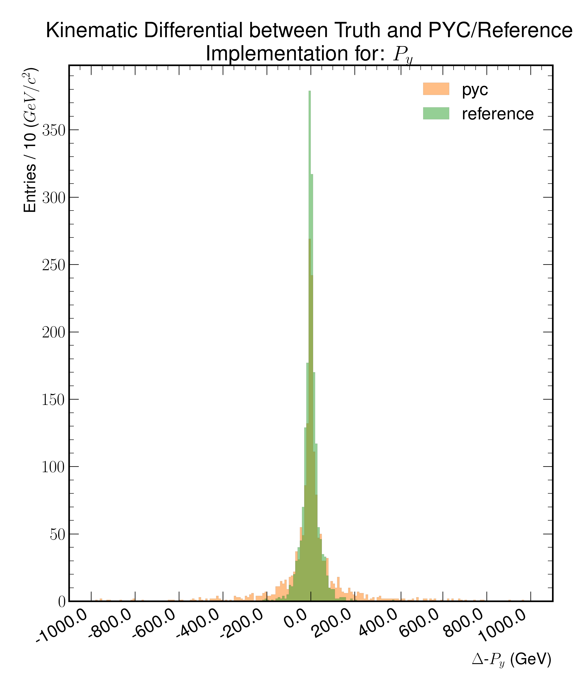

   A projection plot in the :math:`P_y` direction illustrating differences between the reference and pyc implementions.

Figure 1.i
^^^^^^^^^^

   A projection plot in the :math:`P_z` direction illustrating differences between the reference and pyc implementions.

Figure 1.j
^^^^^^^^^^

   A plot illustrating the energy difference between the truth and reconstructed neutrino for the reference and pyc implementation.

Figure 1.k
^^^^^^^^^^
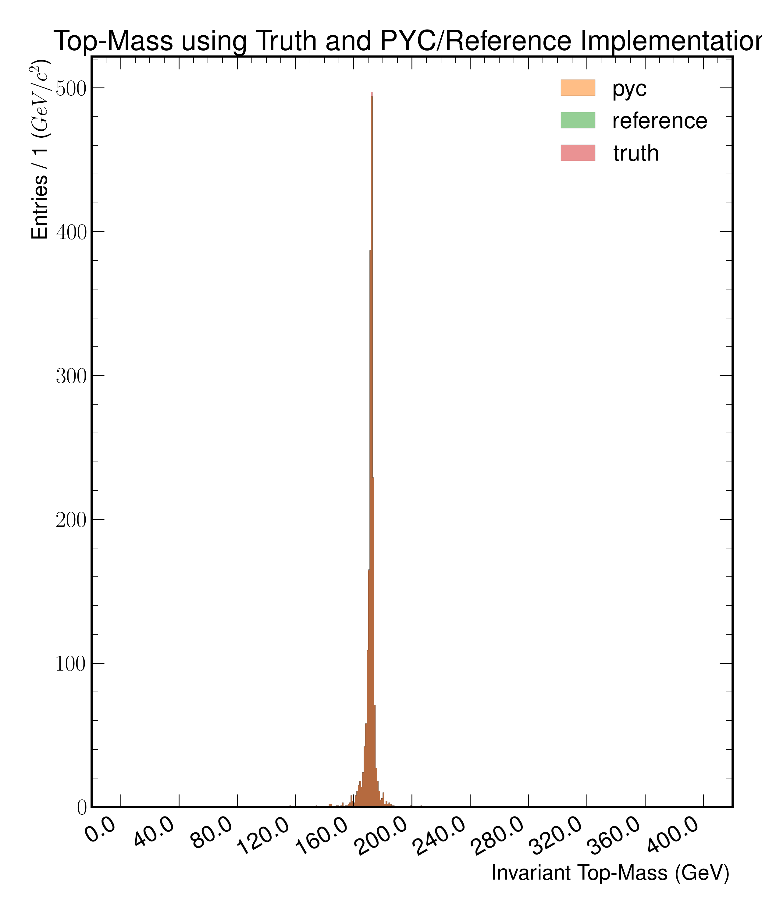

   Reconstructed invariant top-mass using the reference and pyc implementations, compared to the true top-mass parton mass.

**Truth Jets**
--------------

Figure 2.a (PYC)
^^^^^^^^^^^^^^^^

   A heat-map of the momenta differential in the x and y direction between the truth and reconstructed neutrino (using **pyc**).
   This is to validate whether the difference between the truth and the reconstructed neutrino is consistent. 
   Ideally the heat-map should have a single bin at (0,0), indicating perfect reconstruction.

Figure 2.b (PYC)
^^^^^^^^^^^^^^^^

   A heat-map of the momenta differential in the x and z direction between the truth and reconstructed neutrino (using **pyc**).
   This is to validate whether the difference between the truth and the reconstructed neutrino is consistent. 
   Ideally the heat-map should have a single bin at (0,0), indicating perfect reconstruction.

Figure 2.c (PYC)
^^^^^^^^^^^^^^^^

   A heat-map of the momenta differential in the y and z direction between the truth and reconstructed neutrino (using **pyc**).
   This is to validate whether the difference between the truth and the reconstructed neutrino is consistent. 
   Ideally the heat-map should have a single bin at (0,0), indicating perfect reconstruction.

Figure 2.d (REFERENCE)
^^^^^^^^^^^^^^^^^^^^^^

   A heat-map of the momenta differential in the x and y direction between the truth and reconstructed neutrino (using **reference**).
   This is to validate whether the difference between the truth and the reconstructed neutrino is consistent. 
   Ideally the heat-map should have a single bin at (0,0), indicating perfect reconstruction.

Figure 2.e (REFERENCE)
^^^^^^^^^^^^^^^^^^^^^^

   A heat-map of the momenta differential in the x and z direction between the truth and reconstructed neutrino (using **reference**).
   This is to validate whether the difference between the truth and the reconstructed neutrino is consistent. 
   Ideally the heat-map should have a single bin at (0,0), indicating perfect reconstruction.

Figure 2.f (REFERENCE)
^^^^^^^^^^^^^^^^^^^^^^
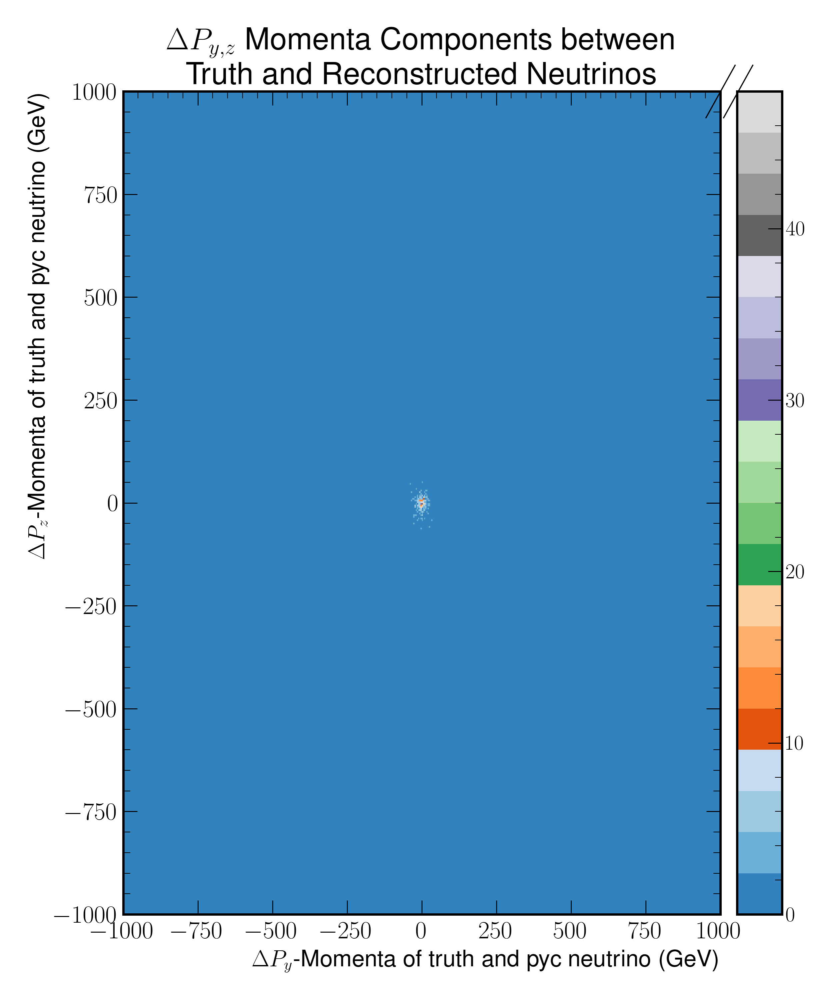

   A heat-map of the momenta differential in the y and z direction between the truth and reconstructed neutrino (using **reference**).
   This is to validate whether the difference between the truth and the reconstructed neutrino is consistent. 
   Ideally the heat-map should have a single bin at (0,0), indicating perfect reconstruction.

Figure 2.g
^^^^^^^^^^

   A projection plot in the :math:`P_x` direction illustrating differences between the reference and pyc implementions.

Figure 2.h
^^^^^^^^^^

   A projection plot in the :math:`P_y` direction illustrating differences between the reference and pyc implementions.

Figure 2.i
^^^^^^^^^^
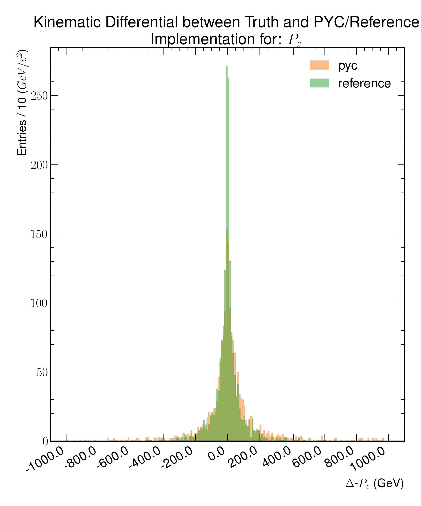

   A projection plot in the :math:`P_z` direction illustrating differences between the reference and pyc implementions.

Figure 2.j
^^^^^^^^^^
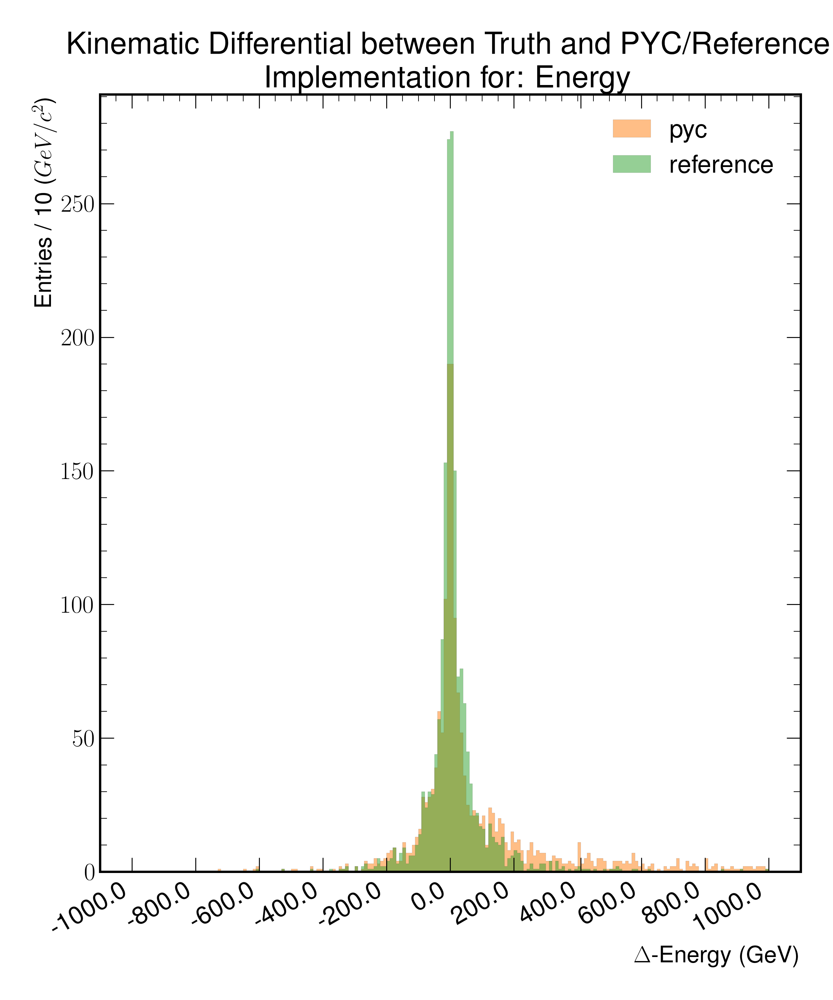

   A plot illustrating the energy difference between the truth and reconstructed neutrino for the reference and pyc implementation.

Figure 2.k
^^^^^^^^^^
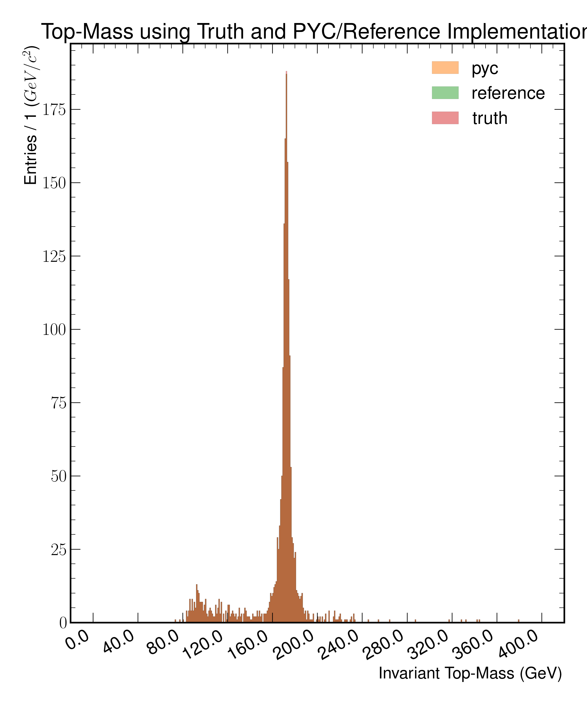

   Reconstructed invariant top-mass using the reference and pyc implementations, compared to the true top-mass parton mass.

**Jets**
--------

Figure 3.a (PYC)
^^^^^^^^^^^^^^^^

   A heat-map of the momenta differential in the x and y direction between the truth and reconstructed neutrino (using **pyc**).
   This is to validate whether the difference between the truth and the reconstructed neutrino is consistent. 
   Ideally the heat-map should have a single bin at (0,0), indicating perfect reconstruction.

Figure 3.b (PYC)
^^^^^^^^^^^^^^^^

   A heat-map of the momenta differential in the x and z direction between the truth and reconstructed neutrino (using **pyc**).
   This is to validate whether the difference between the truth and the reconstructed neutrino is consistent. 
   Ideally the heat-map should have a single bin at (0,0), indicating perfect reconstruction.

Figure 3.c (PYC)
^^^^^^^^^^^^^^^^

   A heat-map of the momenta differential in the y and z direction between the truth and reconstructed neutrino (using **pyc**).
   This is to validate whether the difference between the truth and the reconstructed neutrino is consistent. 
   Ideally the heat-map should have a single bin at (0,0), indicating perfect reconstruction.

Figure 3.d (REFERENCE)
^^^^^^^^^^^^^^^^^^^^^^

   A heat-map of the momenta differential in the x and y direction between the truth and reconstructed neutrino (using **reference**).
   This is to validate whether the difference between the truth and the reconstructed neutrino is consistent. 
   Ideally the heat-map should have a single bin at (0,0), indicating perfect reconstruction.

Figure 3.e (REFERENCE)
^^^^^^^^^^^^^^^^^^^^^^

   A heat-map of the momenta differential in the x and z direction between the truth and reconstructed neutrino (using **reference**).
   This is to validate whether the difference between the truth and the reconstructed neutrino is consistent. 
   Ideally the heat-map should have a single bin at (0,0), indicating perfect reconstruction.

Figure 3.f (REFERENCE)
^^^^^^^^^^^^^^^^^^^^^^

   A heat-map of the momenta differential in the y and z direction between the truth and reconstructed neutrino (using **reference**).
   This is to validate whether the difference between the truth and the reconstructed neutrino is consistent. 
   Ideally the heat-map should have a single bin at (0,0), indicating perfect reconstruction.

Figure 3.g
^^^^^^^^^^

   A projection plot in the :math:`P_x` direction illustrating differences between the reference and pyc implementions.

Figure 3.h
^^^^^^^^^^
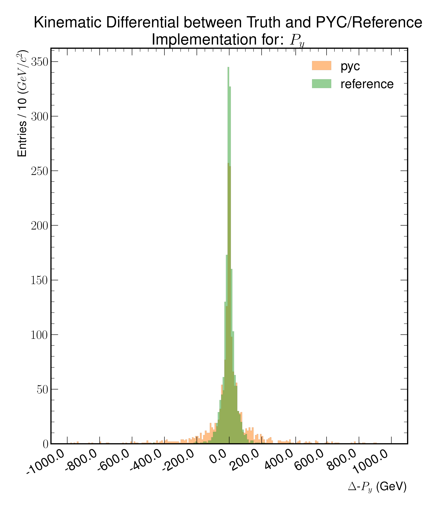

   A projection plot in the :math:`P_y` direction illustrating differences between the reference and pyc implementions.

Figure 3.i
^^^^^^^^^^
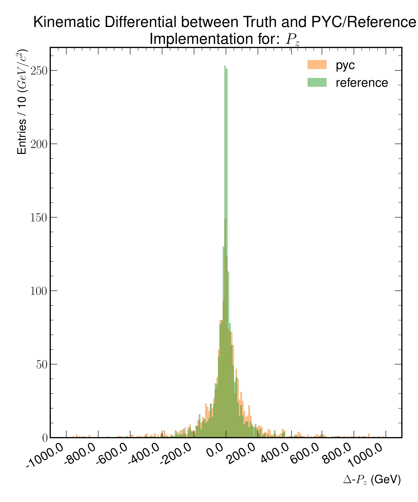

   A projection plot in the :math:`P_z` direction illustrating differences between the reference and pyc implementions.

Figure 3.j
^^^^^^^^^^
.. figure:: ./figures/Figure.3.j.png
   :align: center
   :name: Figure.3.nu.j

   A plot illustrating the energy difference between the truth and reconstructed neutrino for the reference and pyc implementation.

Figure 3.k
^^^^^^^^^^
.. figure:: ./figures/Figure.3.k.png
   :align: center
   :name: Figure.3.nu.k

   Reconstructed invariant top-mass using the reference and pyc implementations, compared to the true top-mass parton mass.

**Jets with Detector Leptons**
------------------------------

Figure 4.a (PYC)
^^^^^^^^^^^^^^^^

   A heat-map of the momenta differential in the x and y direction between the truth and reconstructed neutrino (using **pyc**).
   This is to validate whether the difference between the truth and the reconstructed neutrino is consistent. 
   Ideally the heat-map should have a single bin at (0,0), indicating perfect reconstruction.

Figure 4.b (PYC)
^^^^^^^^^^^^^^^^

   A heat-map of the momenta differential in the x and z direction between the truth and reconstructed neutrino (using **pyc**).
   This is to validate whether the difference between the truth and the reconstructed neutrino is consistent. 
   Ideally the heat-map should have a single bin at (0,0), indicating perfect reconstruction.

Figure 4.c (PYC)
^^^^^^^^^^^^^^^^

   A heat-map of the momenta differential in the y and z direction between the truth and reconstructed neutrino (using **pyc**).
   This is to validate whether the difference between the truth and the reconstructed neutrino is consistent. 
   Ideally the heat-map should have a single bin at (0,0), indicating perfect reconstruction.

Figure 4.d (REFERENCE)
^^^^^^^^^^^^^^^^^^^^^^

   A heat-map of the momenta differential in the x and y direction between the truth and reconstructed neutrino (using **reference**).
   This is to validate whether the difference between the truth and the reconstructed neutrino is consistent. 
   Ideally the heat-map should have a single bin at (0,0), indicating perfect reconstruction.

Figure 4.e (REFERENCE)
^^^^^^^^^^^^^^^^^^^^^^

   A heat-map of the momenta differential in the x and z direction between the truth and reconstructed neutrino (using **reference**).
   This is to validate whether the difference between the truth and the reconstructed neutrino is consistent. 
   Ideally the heat-map should have a single bin at (0,0), indicating perfect reconstruction.

Figure 4.f (REFERENCE)
^^^^^^^^^^^^^^^^^^^^^^

   A heat-map of the momenta differential in the y and z direction between the truth and reconstructed neutrino (using **reference**).
   This is to validate whether the difference between the truth and the reconstructed neutrino is consistent. 
   Ideally the heat-map should have a single bin at (0,0), indicating perfect reconstruction.

Figure 4.g
^^^^^^^^^^

   A projection plot in the :math:`P_x` direction illustrating differences between the reference and pyc implementions.

Figure 4.h
^^^^^^^^^^

   A projection plot in the :math:`P_y` direction illustrating differences between the reference and pyc implementions.

Figure 4.i
^^^^^^^^^^

   A projection plot in the :math:`P_z` direction illustrating differences between the reference and pyc implementions.

Figure 4.j
^^^^^^^^^^
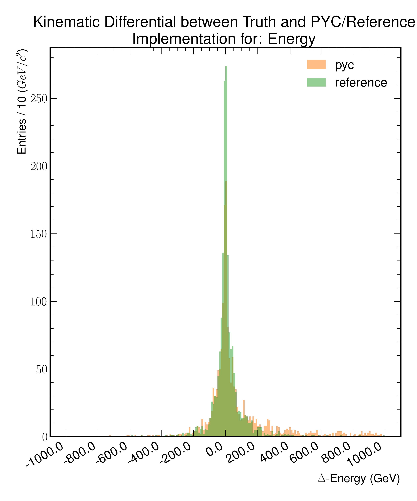

   A plot illustrating the energy difference between the truth and reconstructed neutrino for the reference and pyc implementation.

Figure 4.k
^^^^^^^^^^
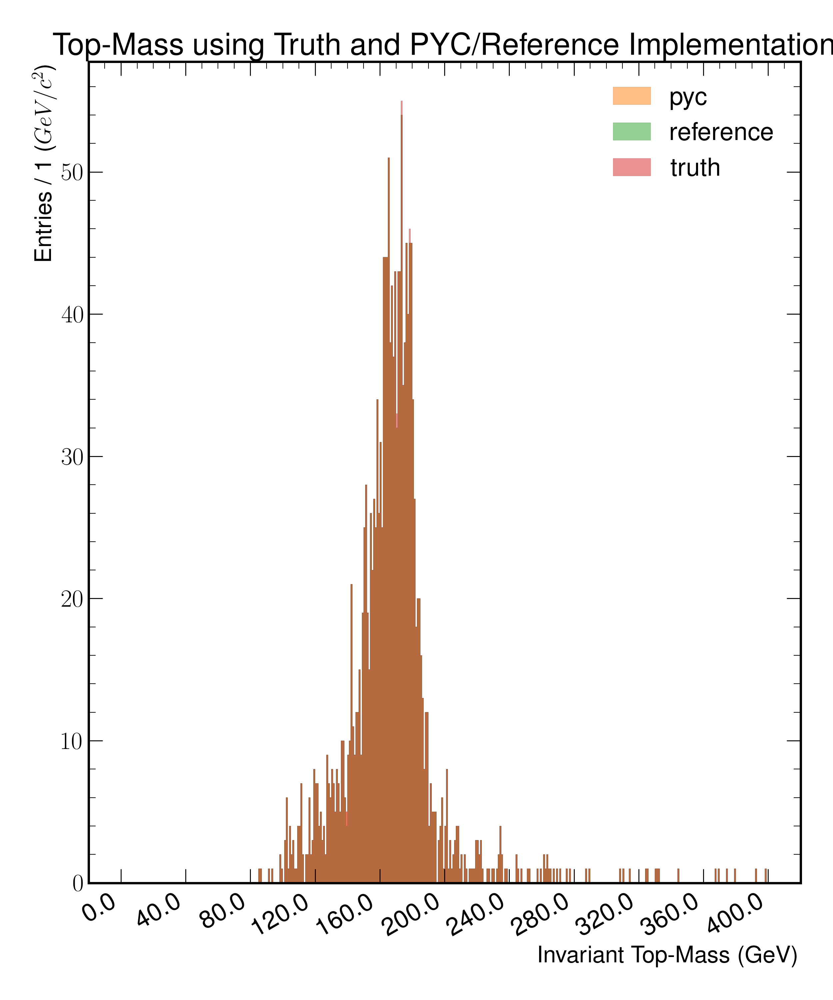

   Reconstructed invariant top-mass using the reference and pyc implementations, compared to the true top-mass parton mass.

S-Matrix (Momentum Imbalance Uncertainty Matrix)
------------------------------------------------

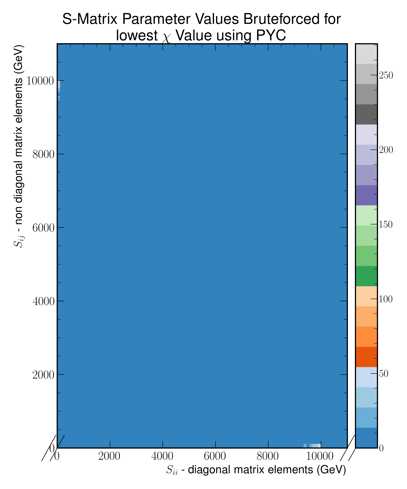

   A heat-map of the S-matrix values for the diagonal and non-diagonal elements.
   Each bin counts the frequency of finding the lowest :math:`\chi` at the given matrix values.
   Large clustering around particular :math:`(S_{xx}, S_{yy}), (S_{xy}, S_{yx})` pairs indicates a potential optimization point.
   However, if no clustering is observed, the S-matrix values can be chosen arbitrarily, with no preferential values.
   Note: This is for the **pyc** implementation.

.. figure:: ./figures/Figure.5.b.png
   :align: center
   :name: Figure.5.nu.b

   A heat-map of the S-matrix values for the diagonal and non-diagonal elements.
   Each bin counts the frequency of finding the lowest :math:`\chi` at the given matrix values.
   Large clustering around particular :math:`(S_{xx}, S_{yy}), (S_{xy}, S_{yx})` pairs indicates a potential optimization point.
   However, if no clustering is observed, the S-matrix values can be chosen arbitrarily, with no preferential values.
   Note: This is for the **reference** implementation.

   A histogram plot depicting the :math:`\Delta Px` of the truth neutrino (truth children) and the reconstructed neutrino.
   In order to compare the performance of the two implementations, clustering around 0 indicates perfect reconstruction.

   A histogram plot depicting the :math:`\Delta Py` of the truth neutrino (truth children) and the reconstructed neutrino.
   In order to compare the performance of the two implementations, clustering around 0 indicates perfect reconstruction.

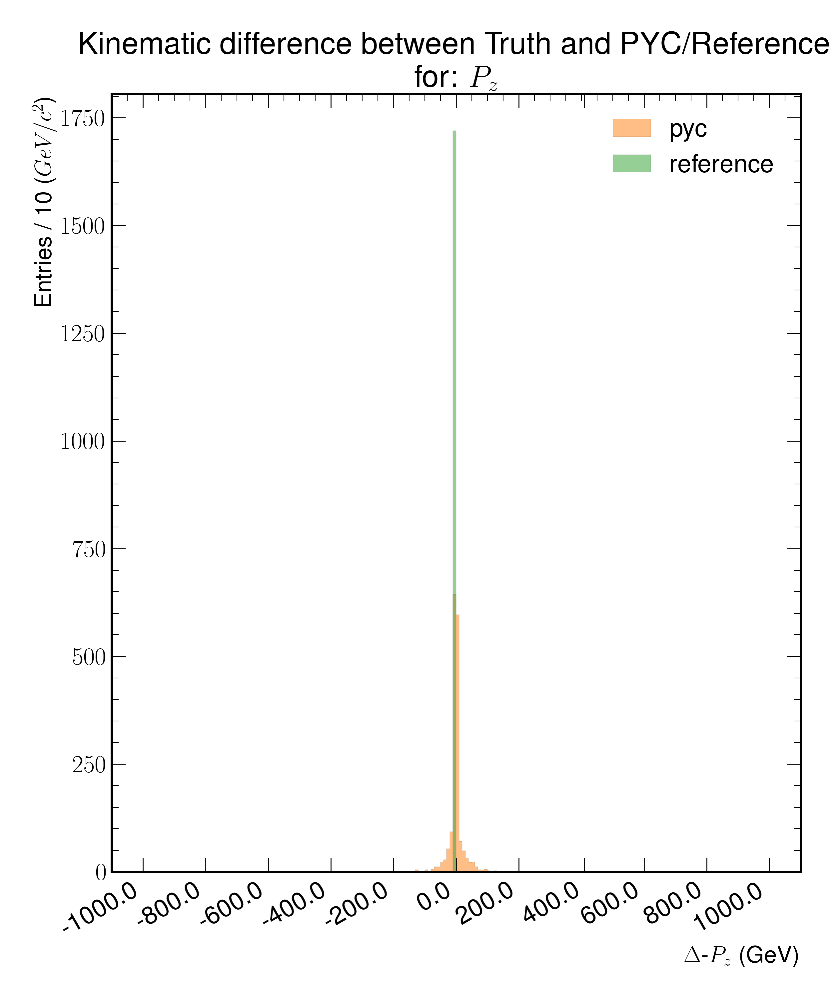

   A histogram plot depicting the :math:`\Delta Pz` of the truth neutrino (truth children) and the reconstructed neutrino.
   In order to compare the performance of the two implementations, clustering around 0 indicates perfect reconstruction.

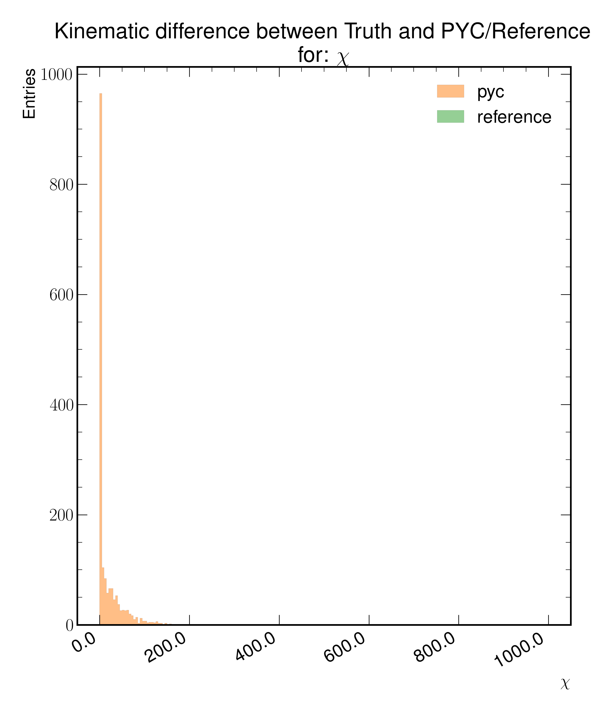

   A histogram plot depicting the :math:`\chi` of summing the difference between the individual momentum components of the truth and reconstructed neutrino.
   Values close to 0, indicate better reconstruction performance.

