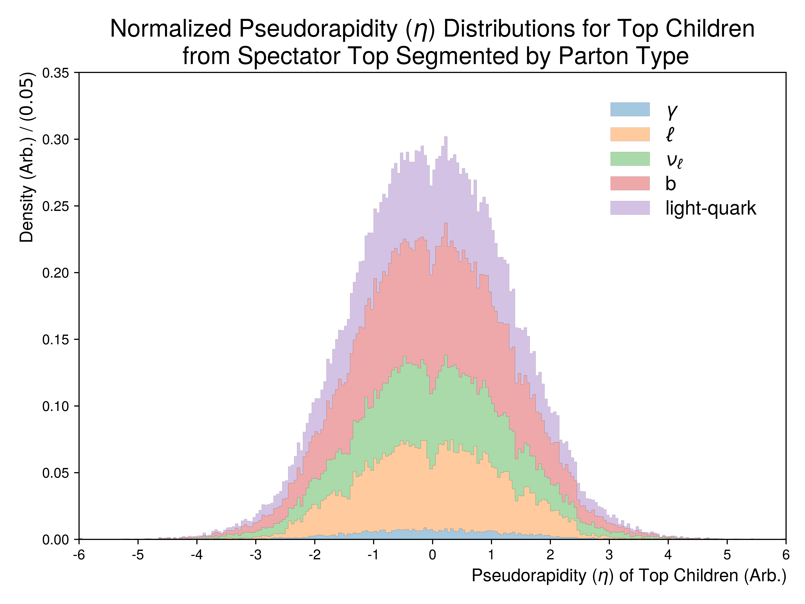
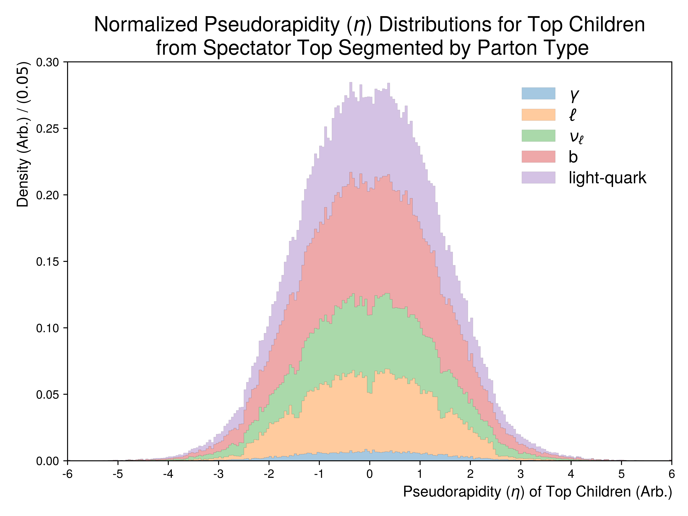

Figure 3.f
----------

Pseudorapidity distributions of the truth children originating from **resonant** top-quarks.
Stack plots showing the underlying distribution associated with the PDGID's of the truth children.

Mass Point: 400 GeV
^^^^^^^^^^^^^^^^^^^

Mass Point: 500 GeV
^^^^^^^^^^^^^^^^^^^

Mass Point: 600 GeV
^^^^^^^^^^^^^^^^^^^

Mass Point: 700 GeV
^^^^^^^^^^^^^^^^^^^

Mass Point: 800 GeV
^^^^^^^^^^^^^^^^^^^

Mass Point: 900 GeV
^^^^^^^^^^^^^^^^^^^

Mass Point: 1000 GeV
^^^^^^^^^^^^^^^^^^^^

