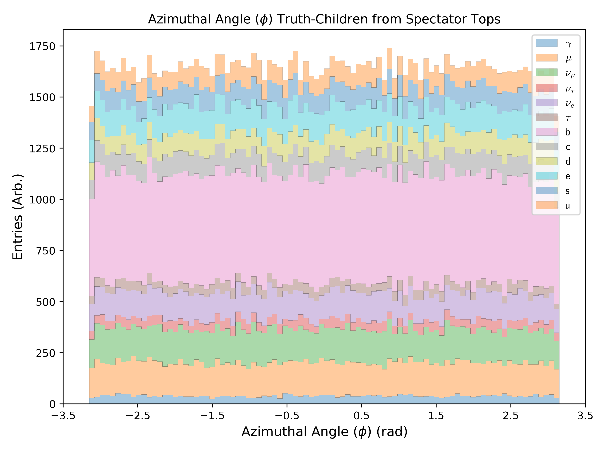
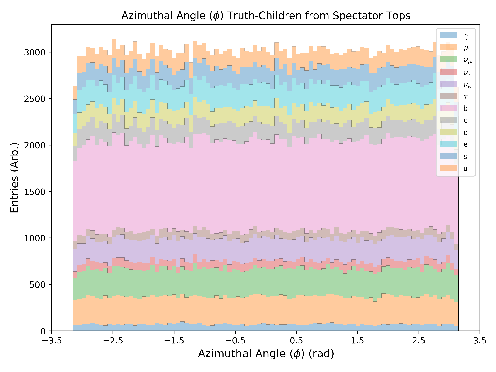
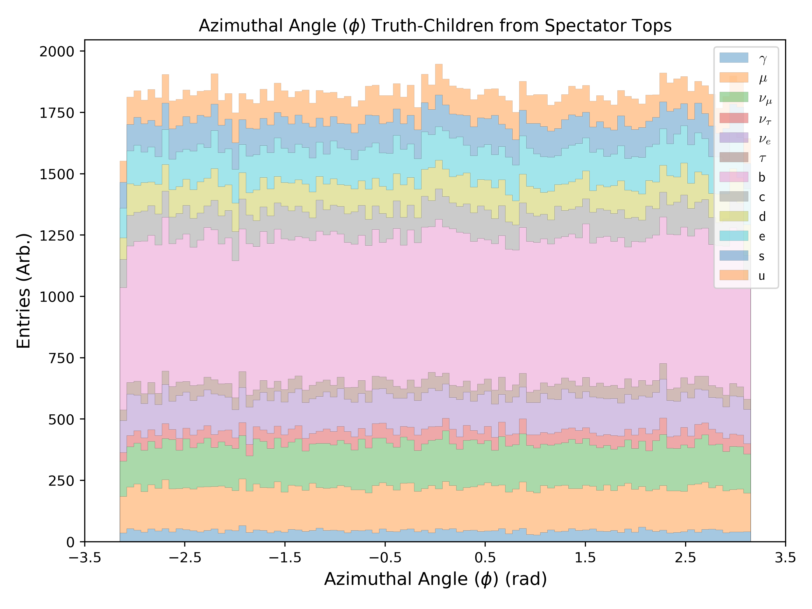
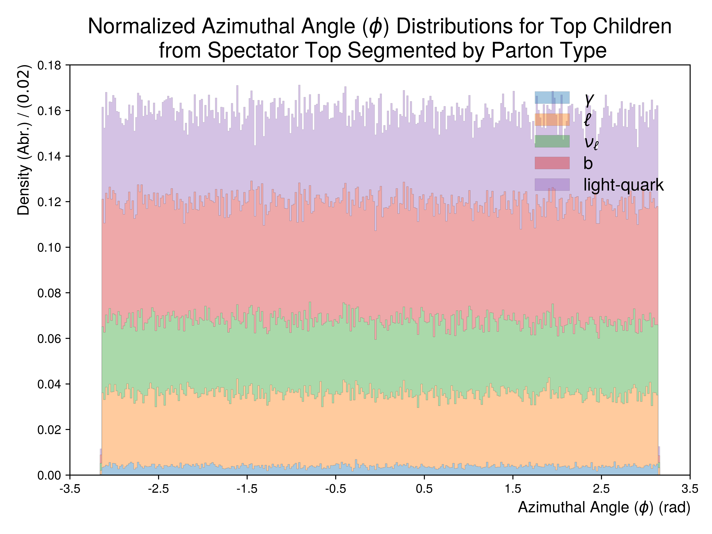
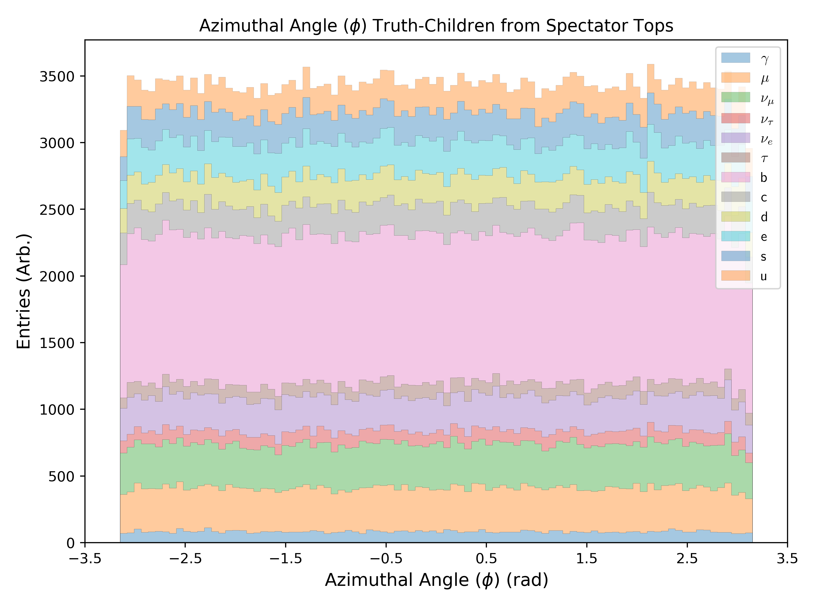
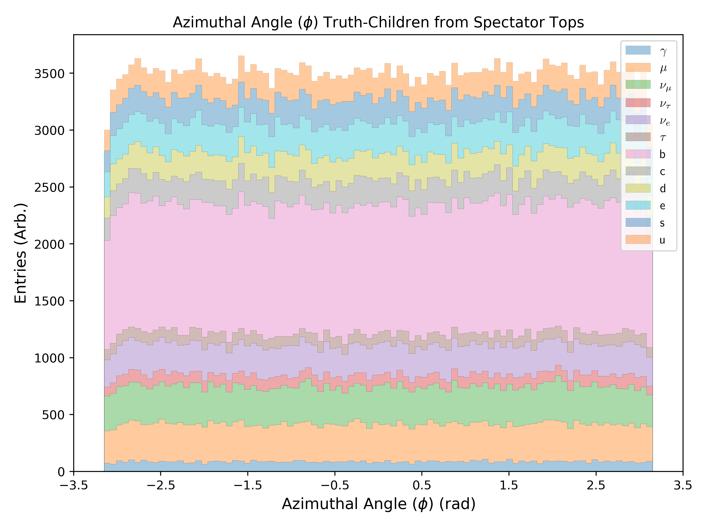
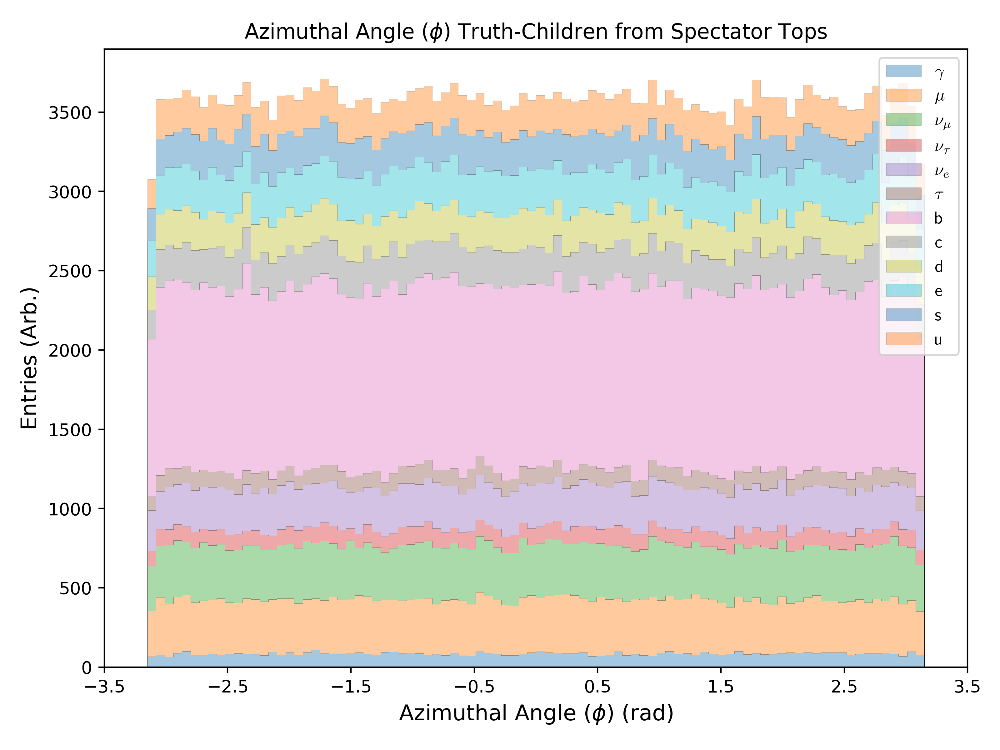

.. _figure_3i:

Figure 3.i
----------

A collection of stacked normalized **azimuthal** distributions using the truth children matched to a **spectator** top-quark.
The overall distribution is partitioned into whether the PDGID of the truth child is a lepton, neutrino, light quark, b-quark or rarely a photon.

Mass Point: 400 GeV
^^^^^^^^^^^^^^^^^^^

Mass Point: 500 GeV
^^^^^^^^^^^^^^^^^^^

Mass Point: 600 GeV
^^^^^^^^^^^^^^^^^^^

Mass Point: 700 GeV
^^^^^^^^^^^^^^^^^^^

Mass Point: 800 GeV
^^^^^^^^^^^^^^^^^^^

Mass Point: 900 GeV
^^^^^^^^^^^^^^^^^^^

Mass Point: 1000 GeV
^^^^^^^^^^^^^^^^^^^^

