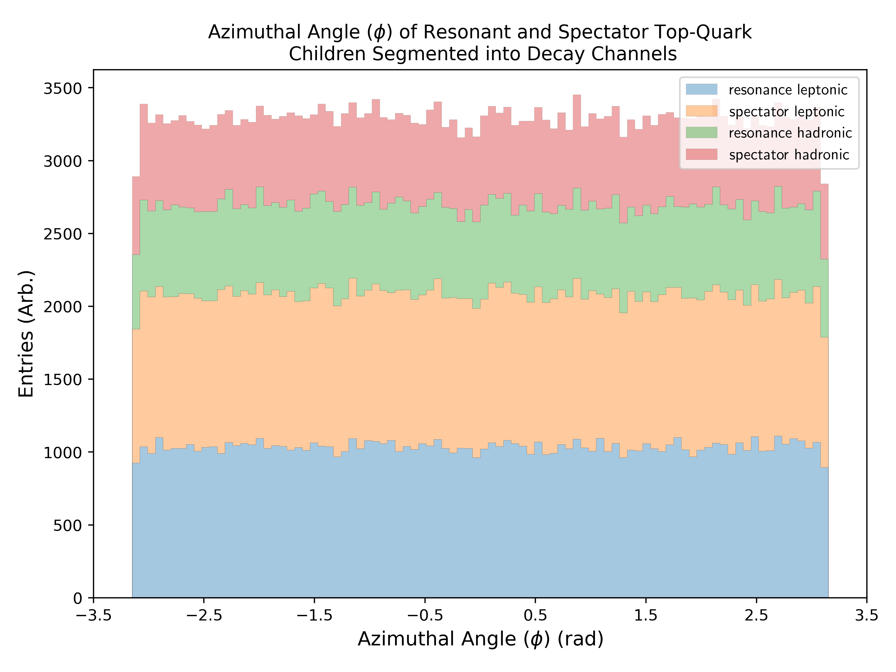
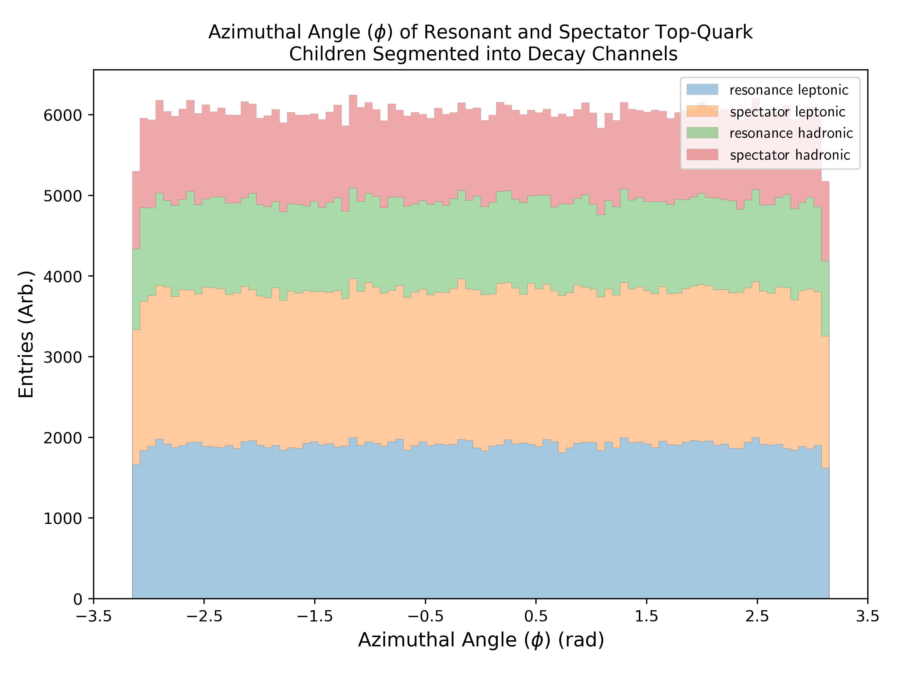
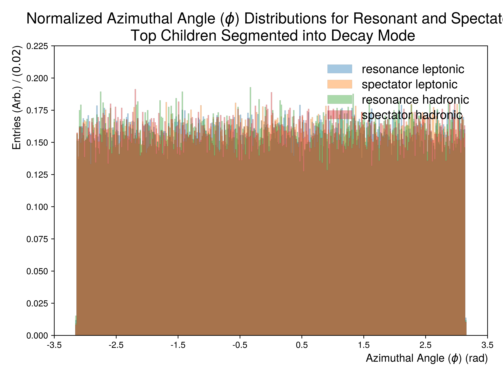
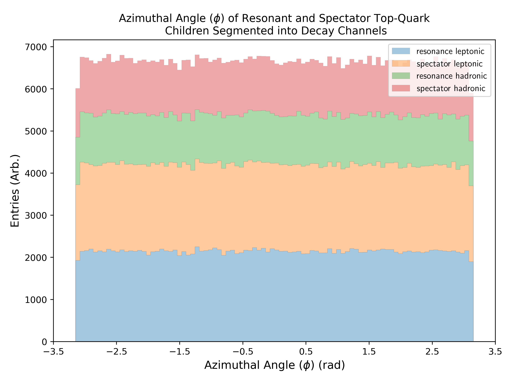
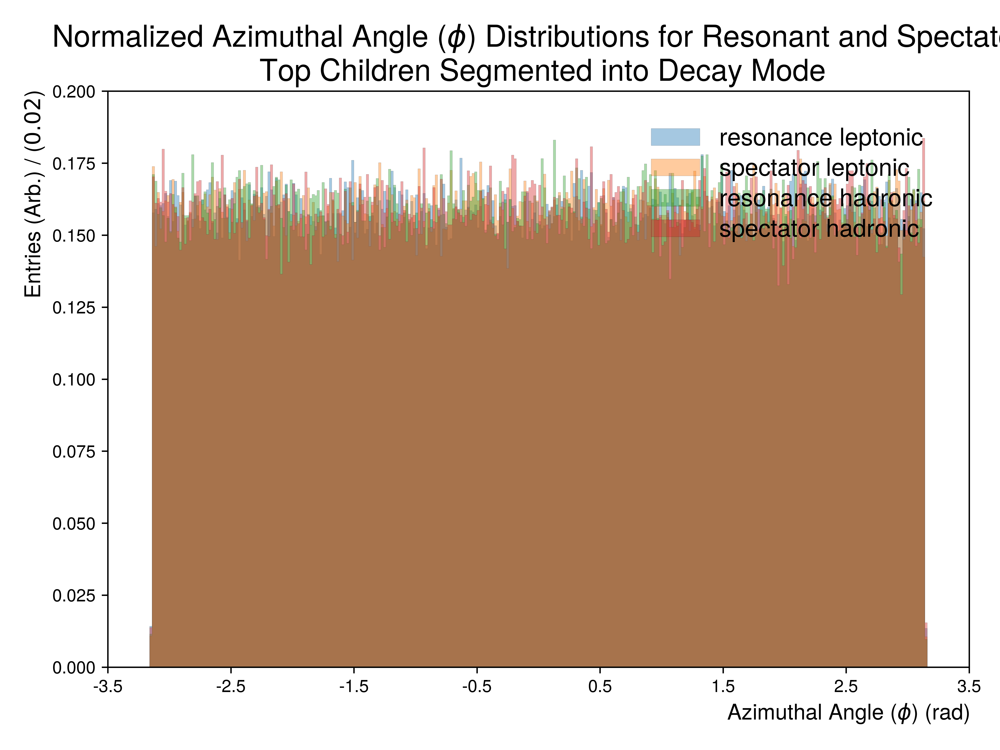
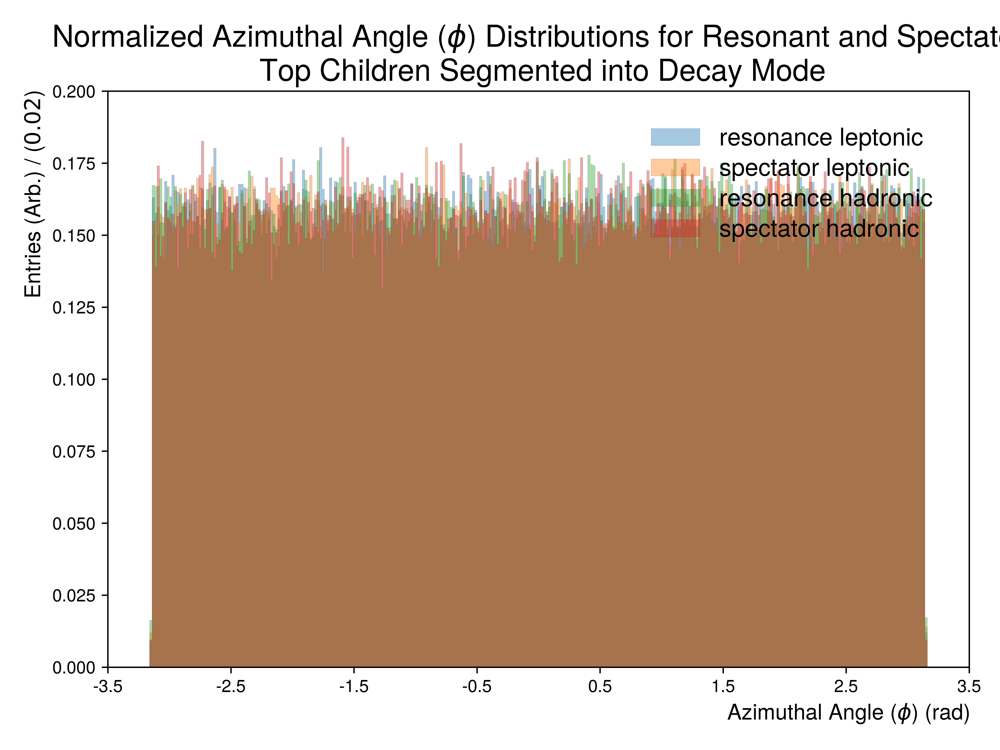

.. _figure_3o:

Figure 3.o
----------

A collection of normalized **azimuthal** distributions of truth children originating from resonance and spectator and decaying either leptonically or hadronically.

Mass Point: 400 GeV
^^^^^^^^^^^^^^^^^^^

Mass Point: 500 GeV
^^^^^^^^^^^^^^^^^^^

Mass Point: 600 GeV
^^^^^^^^^^^^^^^^^^^

Mass Point: 700 GeV
^^^^^^^^^^^^^^^^^^^

Mass Point: 800 GeV
^^^^^^^^^^^^^^^^^^^

Mass Point: 900 GeV
^^^^^^^^^^^^^^^^^^^

Mass Point: 1000 GeV
^^^^^^^^^^^^^^^^^^^^

