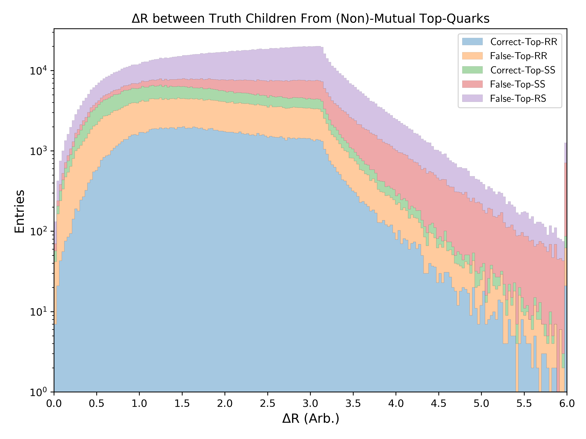
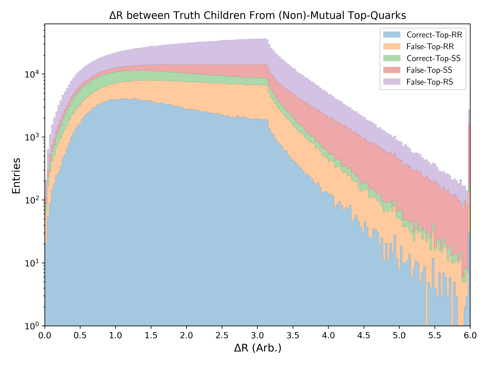
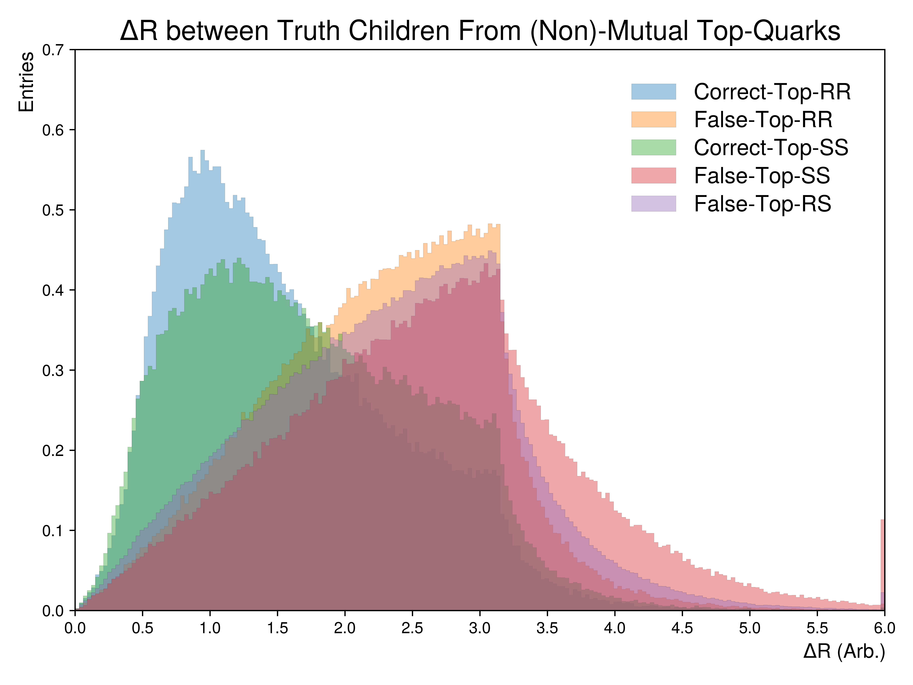
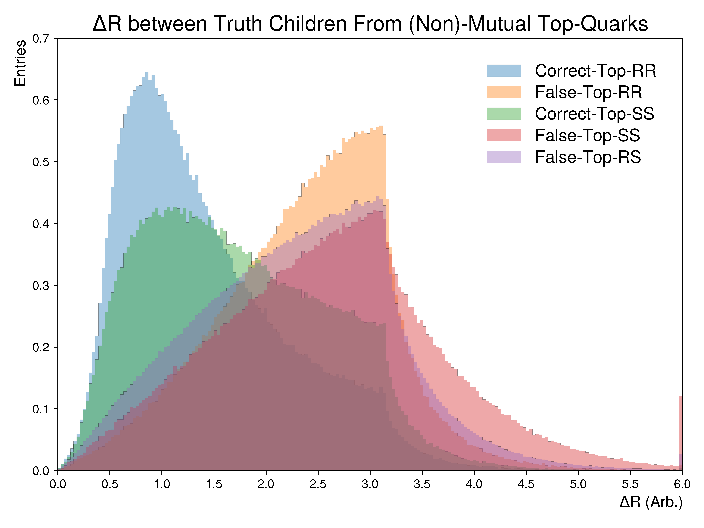
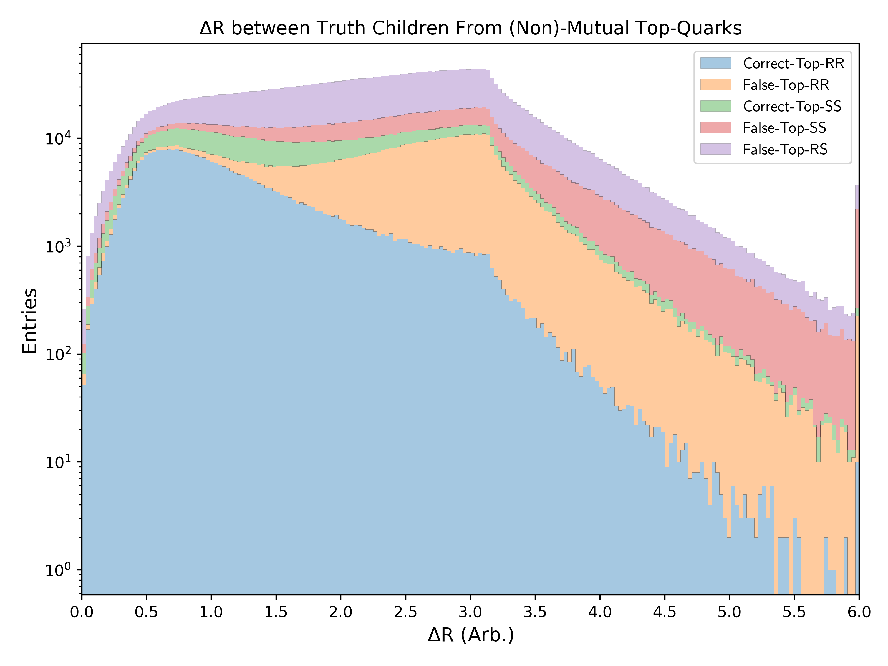
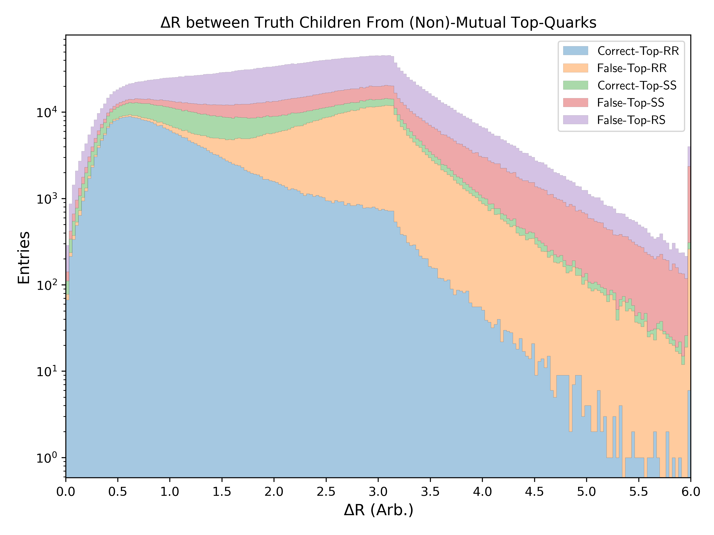

.. _figure_3q:

Figure 3.q
----------

:math:`\Delta` R between truth children which originate from the same or different top-quarks. 
Shown figures are segmented into whether the paired objects originate from spectator (SS), resonant top-pairs (RR) or a mixture (RS).
For cases where the truth children are matched to a non-mutual top, eventhough they originate from a resonance or spectator top, the pairing is considered false.

Mass Point: 400 GeV
^^^^^^^^^^^^^^^^^^^

Mass Point: 500 GeV
^^^^^^^^^^^^^^^^^^^

Mass Point: 600 GeV
^^^^^^^^^^^^^^^^^^^

Mass Point: 700 GeV
^^^^^^^^^^^^^^^^^^^

Mass Point: 800 GeV
^^^^^^^^^^^^^^^^^^^

Mass Point: 900 GeV
^^^^^^^^^^^^^^^^^^^

Mass Point: 1000 GeV
^^^^^^^^^^^^^^^^^^^^

