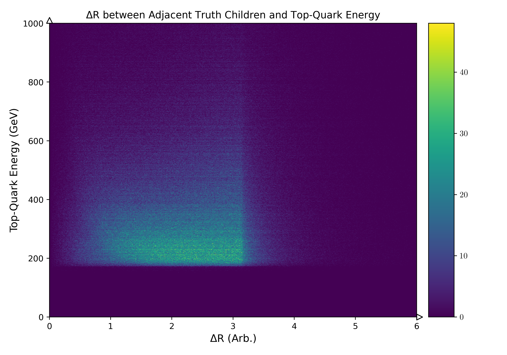
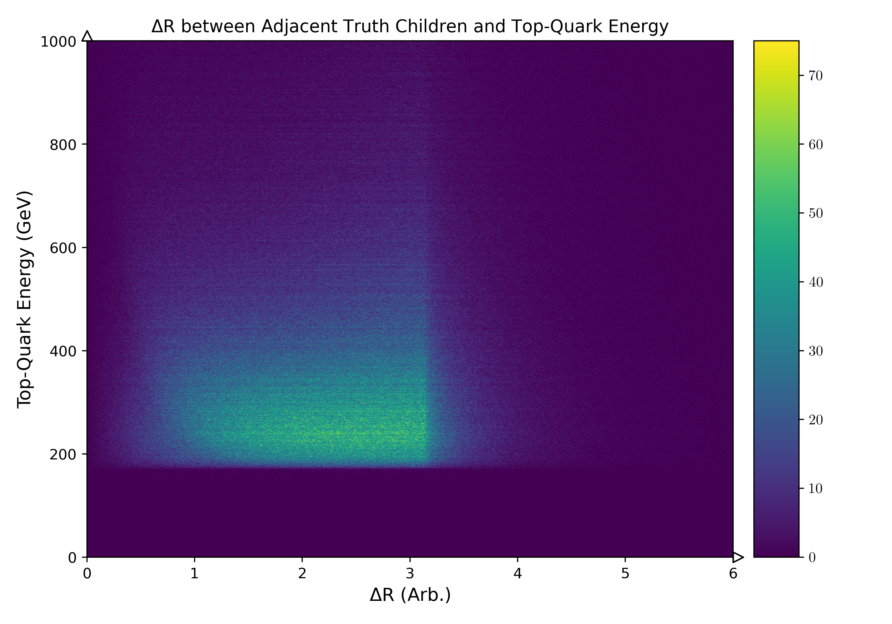
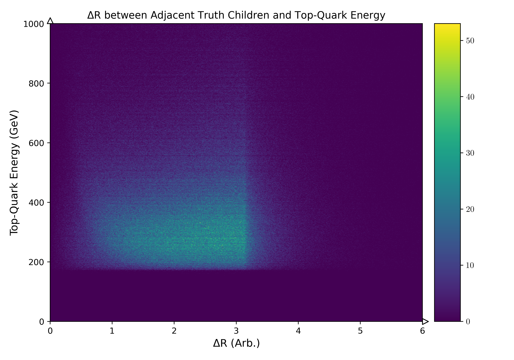
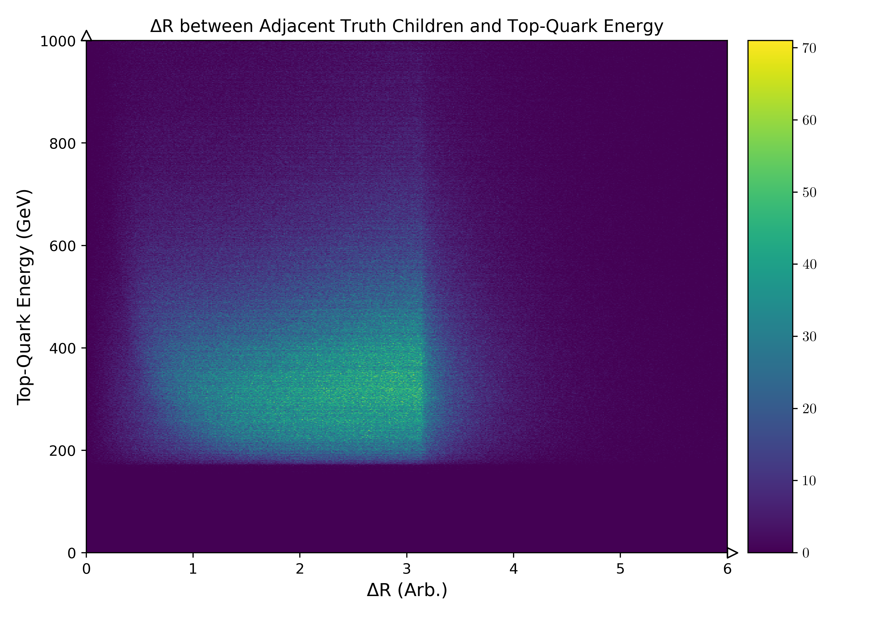
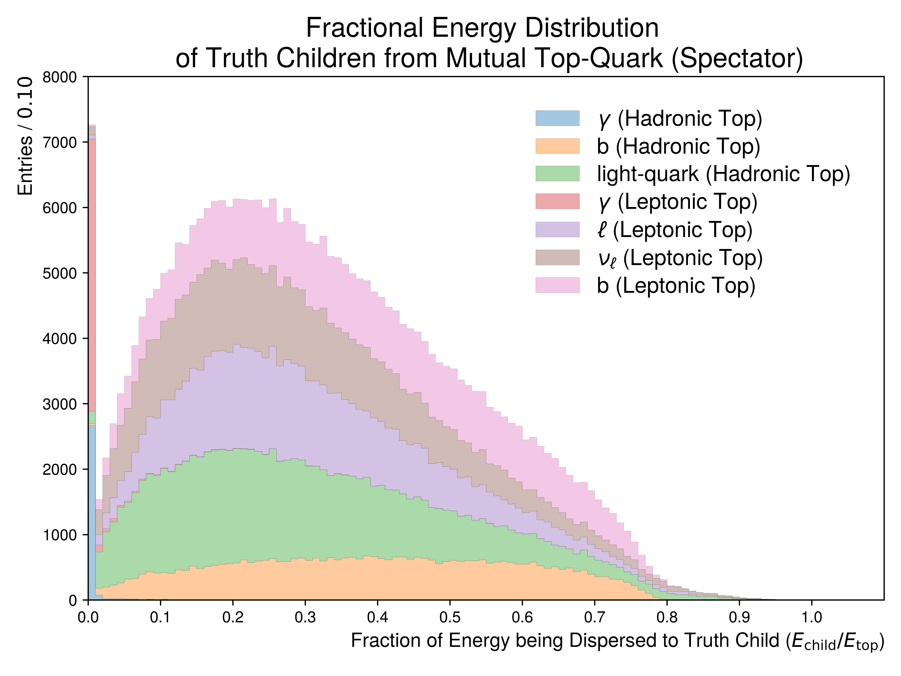
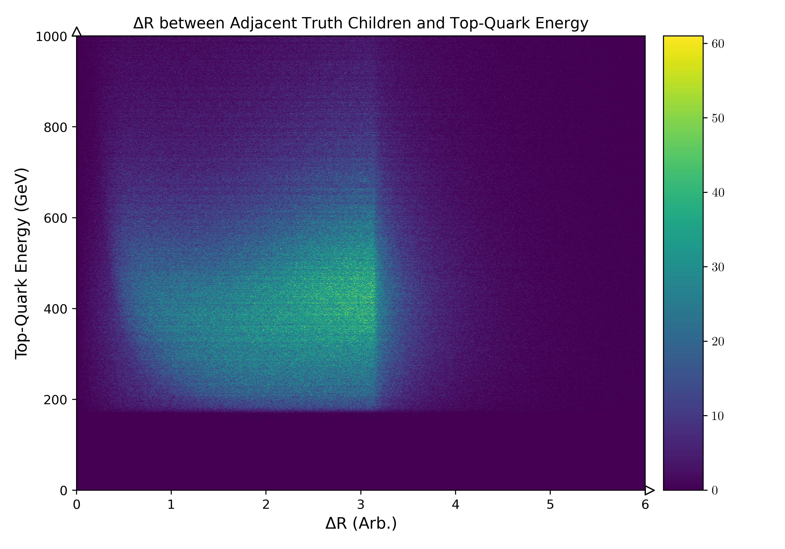
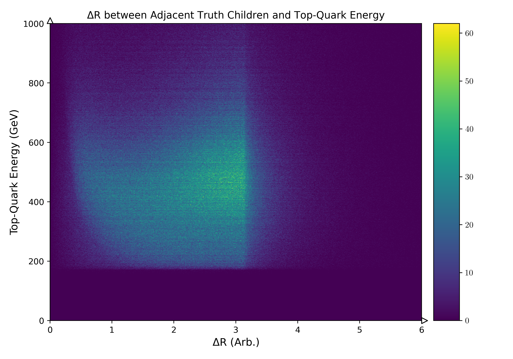

.. _figure_3u:

Figure 3.u
----------

A collection of figures illustrating the fractional **energy** dispersed to truth children from **spectator** tops.
The distribution is segmented into whether the PDGID of the truth child is a lepton, neutrino, light quark or b-quark or rarely a photon.

Mass Point: 400 GeV
^^^^^^^^^^^^^^^^^^^

Mass Point: 500 GeV
^^^^^^^^^^^^^^^^^^^

Mass Point: 600 GeV
^^^^^^^^^^^^^^^^^^^

Mass Point: 700 GeV
^^^^^^^^^^^^^^^^^^^

Mass Point: 800 GeV
^^^^^^^^^^^^^^^^^^^

Mass Point: 900 GeV
^^^^^^^^^^^^^^^^^^^

Mass Point: 1000 GeV
^^^^^^^^^^^^^^^^^^^^

