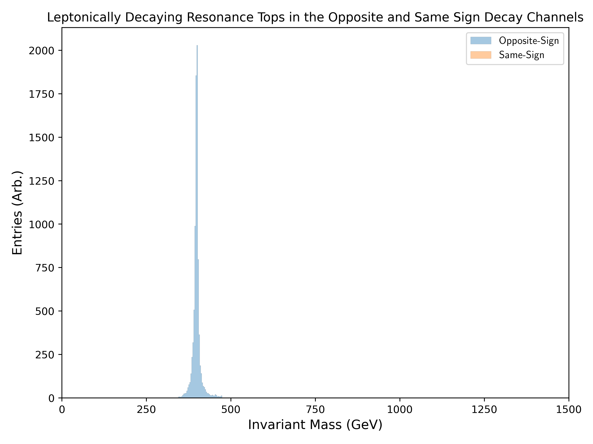
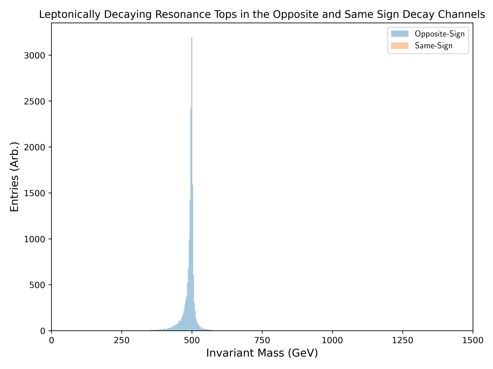
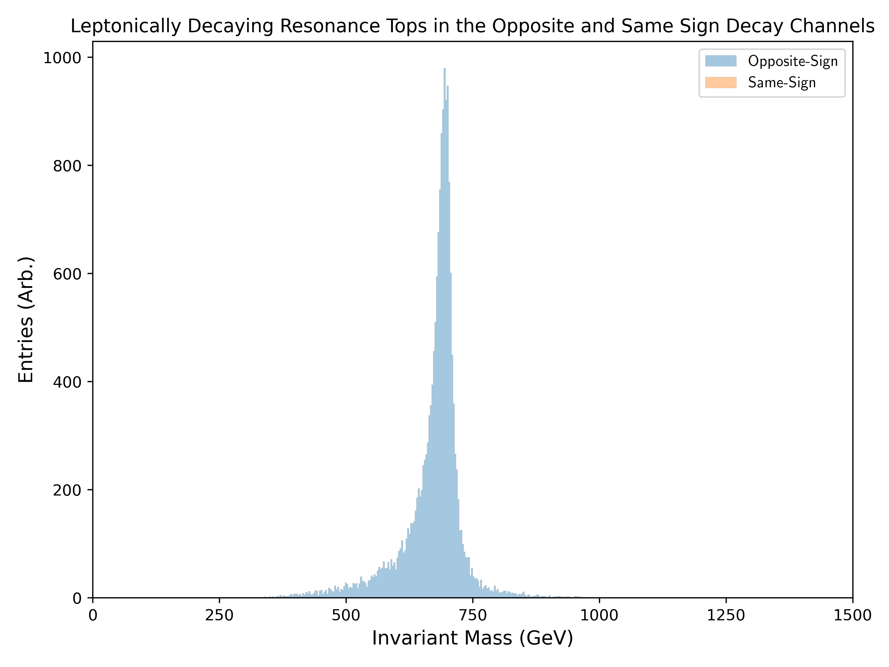
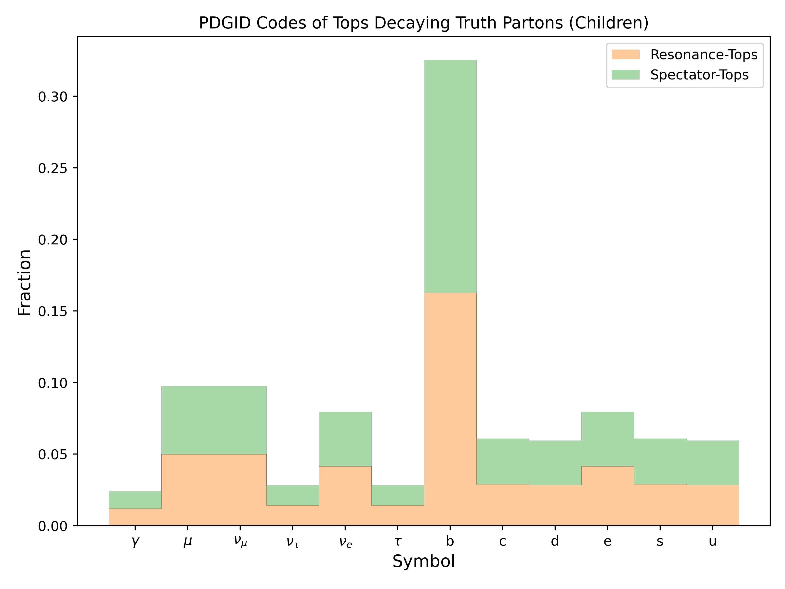
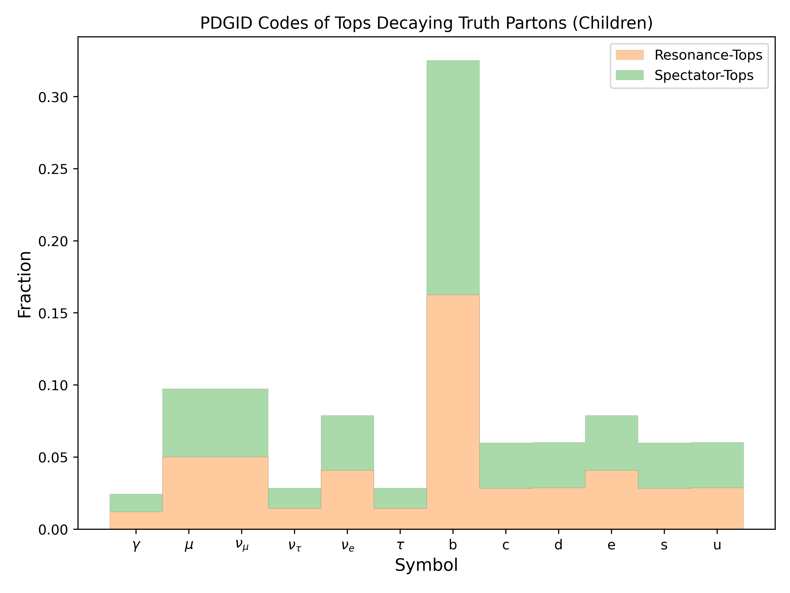
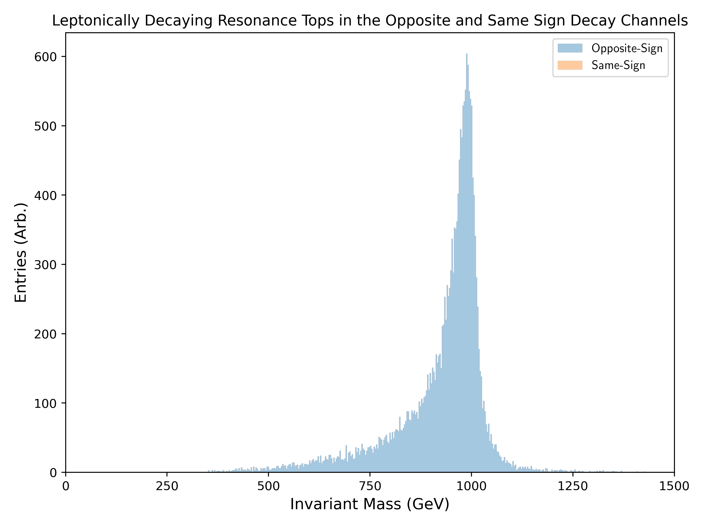

Figure.4.b
----------

A set of invariant mass distribution plots of the resonance partitioned into **same and opposite sign** decay modes, where resonant top-quarks decay leptonically.
No entries should be visible for top partons decaying leptonically with identical electric charge (no Same-Sign entries), since the selection is based on **truth children**.

Mass Point: 400 GeV
^^^^^^^^^^^^^^^^^^^

Mass Point: 500 GeV
^^^^^^^^^^^^^^^^^^^

Mass Point: 600 GeV
^^^^^^^^^^^^^^^^^^^

Mass Point: 700 GeV
^^^^^^^^^^^^^^^^^^^

Mass Point: 800 GeV
^^^^^^^^^^^^^^^^^^^

Mass Point: 900 GeV
^^^^^^^^^^^^^^^^^^^

Mass Point: 1000 GeV
^^^^^^^^^^^^^^^^^^^^

