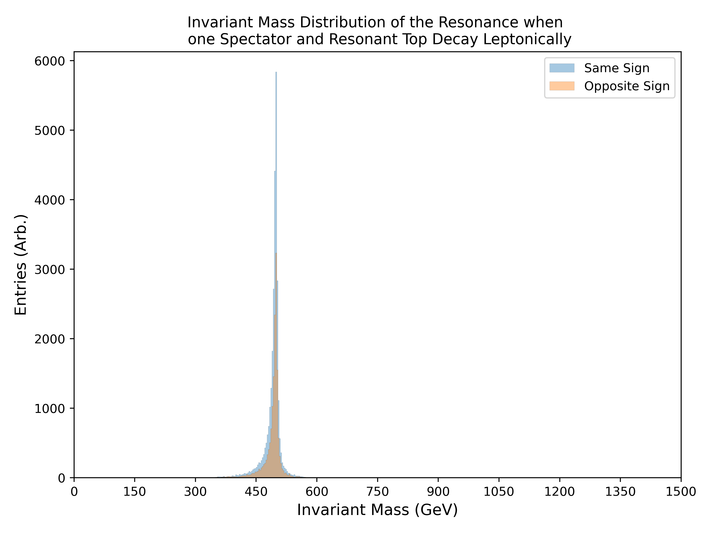
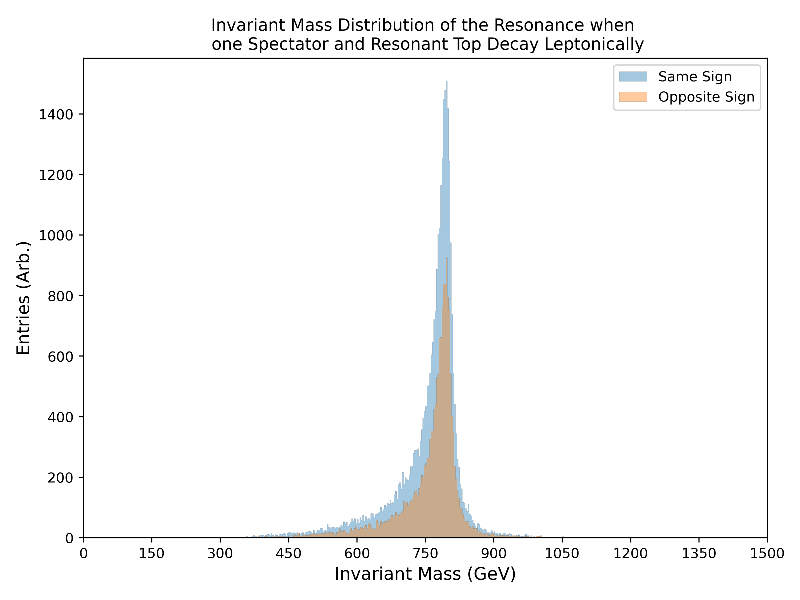
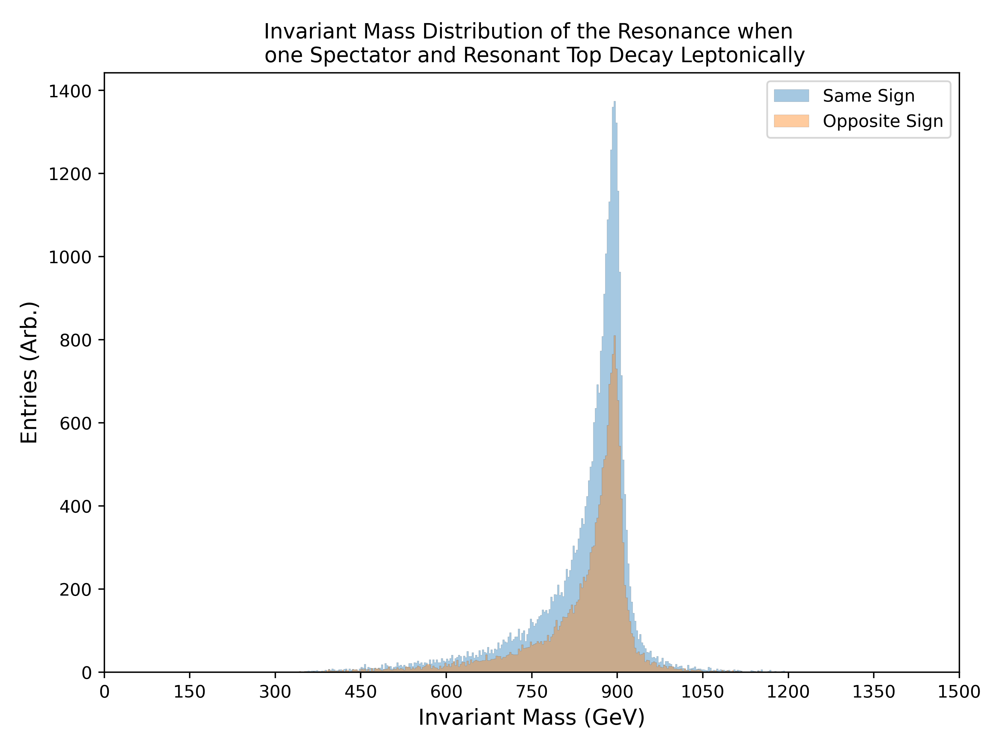
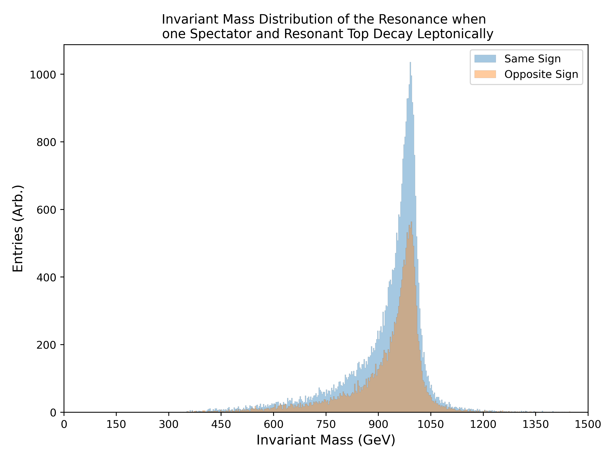

.. _figure_4c:

Figure.4.c
----------

Figures depicting the invariant mass of the resonance, when constraining the **decay mode of one spectator and resonant top to be leptonically**.
The resulting decaying leptons can be categorized as being opposite (OS) or same-signed (SS), to further resolve the resonance.

Mass Point: 400 GeV
^^^^^^^^^^^^^^^^^^^

.. figure:: ./Mass.400.GeV/Figure.4.c.png
   :align: center

Mass Point: 500 GeV
^^^^^^^^^^^^^^^^^^^

Mass Point: 600 GeV
^^^^^^^^^^^^^^^^^^^

.. figure:: ./Mass.600.GeV/Figure.4.c.png
   :align: center

Mass Point: 700 GeV
^^^^^^^^^^^^^^^^^^^

Mass Point: 800 GeV
^^^^^^^^^^^^^^^^^^^

Mass Point: 900 GeV
^^^^^^^^^^^^^^^^^^^

Mass Point: 1000 GeV
^^^^^^^^^^^^^^^^^^^^

