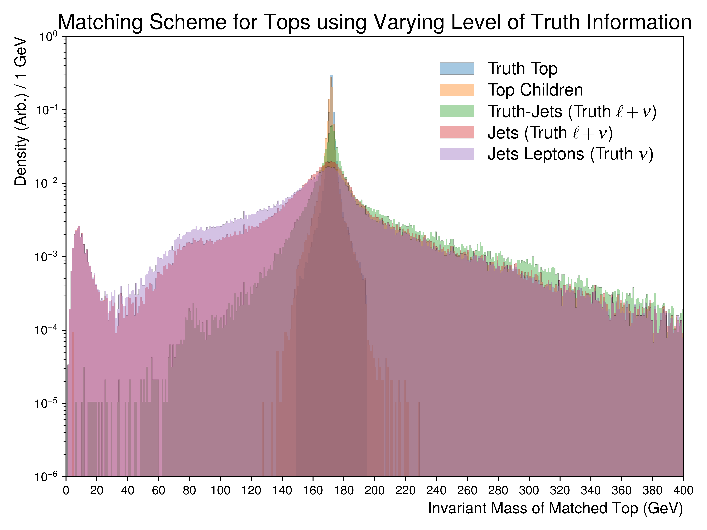
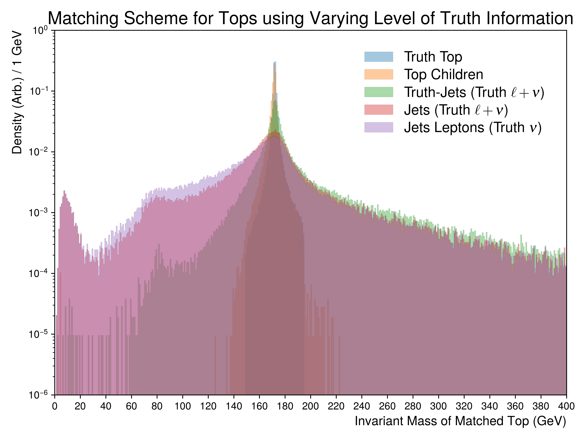

Figure.2.a
----------

Figures depicting the top-quark invariant mass reconstruction using the truth matching scheme for different levels of truth.
As shown, a perfect peak around 172 GeV (truth-tops) is visible, with degrading resolution as more truth information is removed from the matching.
The worst resolution is expected to be detector reconstructed jets and leptons.

Mass Point: 400 GeV
^^^^^^^^^^^^^^^^^^^

Mass Point: 500 GeV
^^^^^^^^^^^^^^^^^^^

Mass Point: 600 GeV
^^^^^^^^^^^^^^^^^^^

Mass Point: 700 GeV
^^^^^^^^^^^^^^^^^^^

Mass Point: 800 GeV
^^^^^^^^^^^^^^^^^^^

Mass Point: 900 GeV
^^^^^^^^^^^^^^^^^^^

Mass Point: 1000 GeV
^^^^^^^^^^^^^^^^^^^^

.. figure:: ./Mass.1000.GeV/Figure.2.a.png
   :align: center

