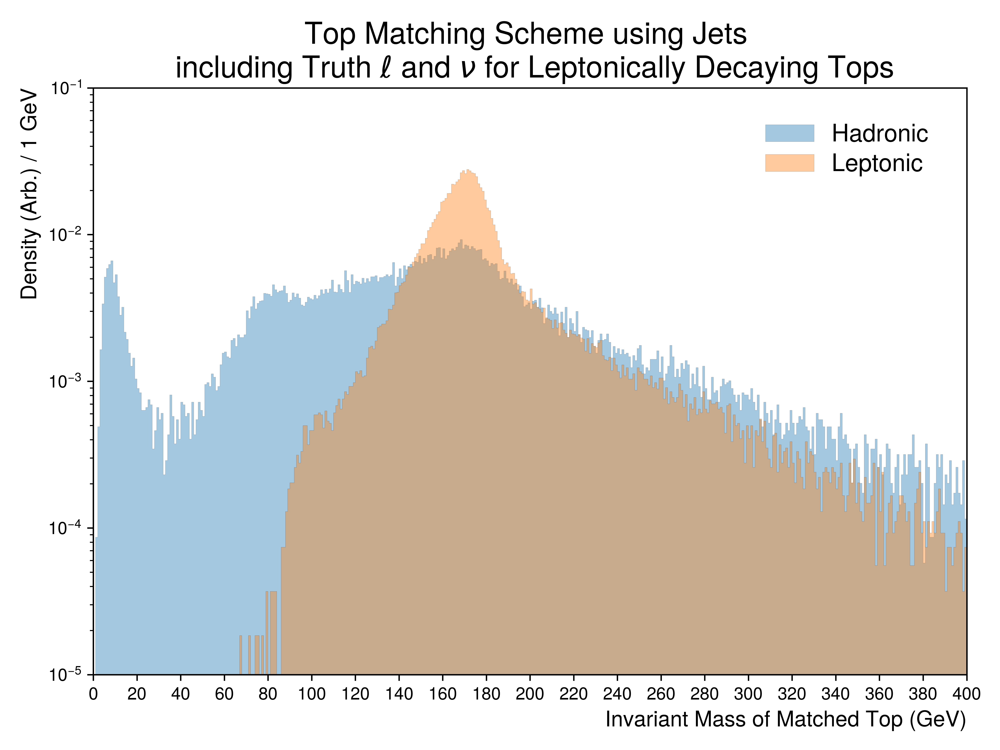
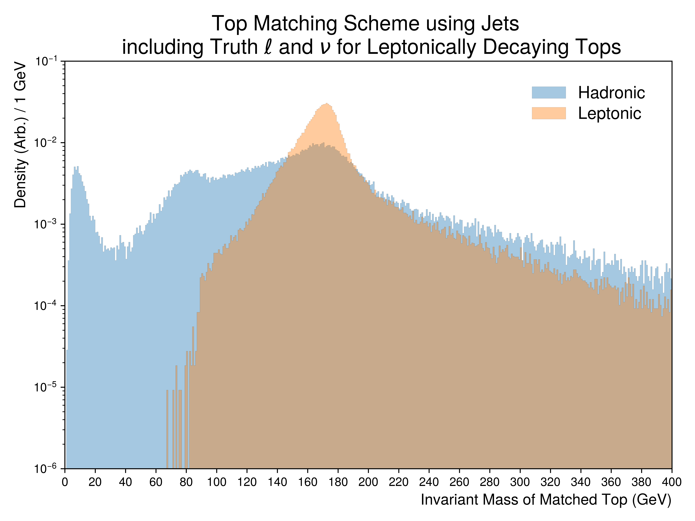

Figure.2.d
----------

Figures depicting the top-quark invariant mass reconstruction from **detector jets**. 
For leptonically decaying tops, the **truth lepton and neutrino** were used.
The overall distributions are partitioned into the hadronic and leptonic decay modes of the tops.

Mass Point: 400 GeV
^^^^^^^^^^^^^^^^^^^

Mass Point: 500 GeV
^^^^^^^^^^^^^^^^^^^

.. figure:: ./Mass.500.GeV/Figure.2.d.png
   :align: center

Mass Point: 600 GeV
^^^^^^^^^^^^^^^^^^^

.. figure:: ./Mass.600.GeV/Figure.2.d.png
   :align: center

Mass Point: 700 GeV
^^^^^^^^^^^^^^^^^^^

Mass Point: 800 GeV
^^^^^^^^^^^^^^^^^^^

Mass Point: 900 GeV
^^^^^^^^^^^^^^^^^^^

Mass Point: 1000 GeV
^^^^^^^^^^^^^^^^^^^^

