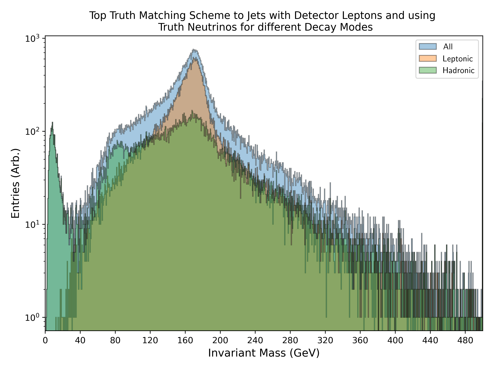
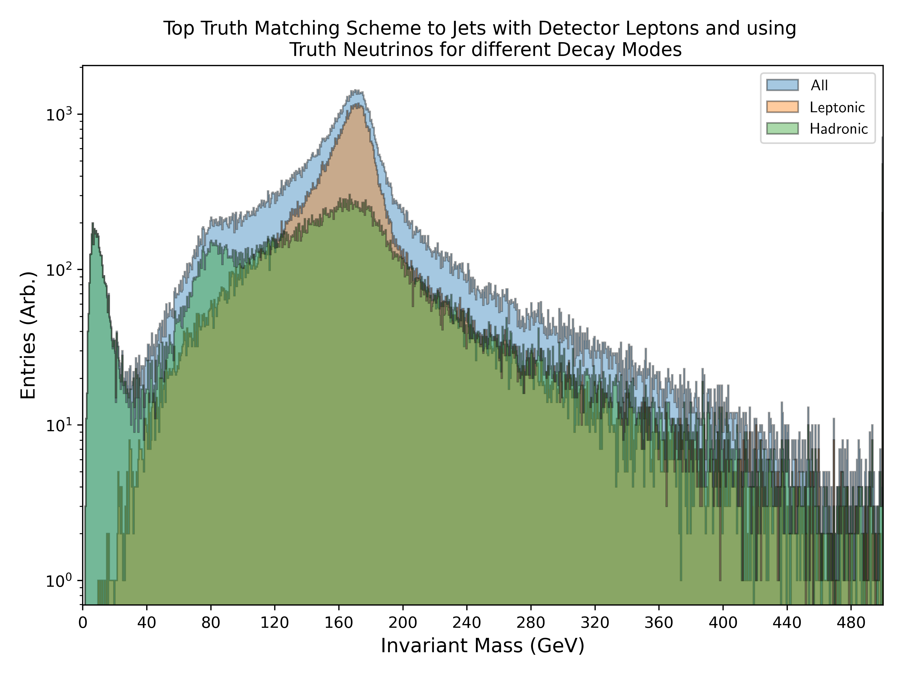
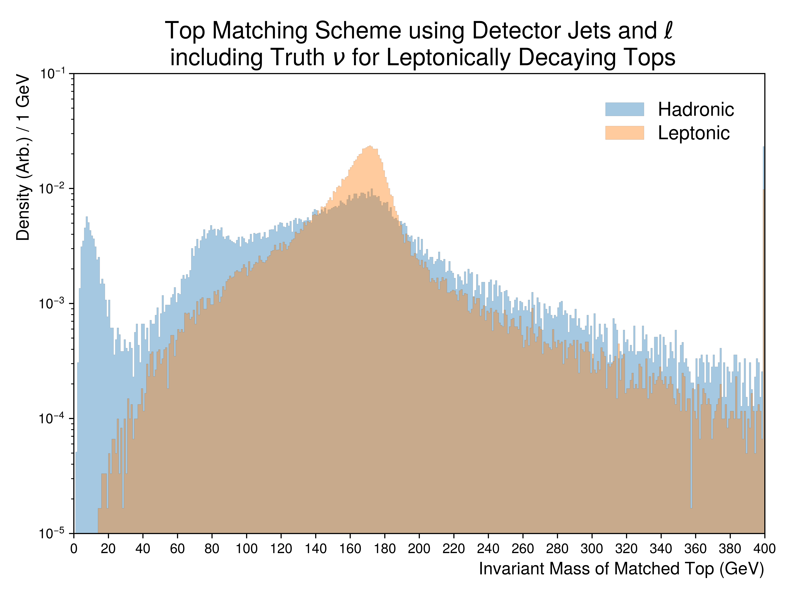
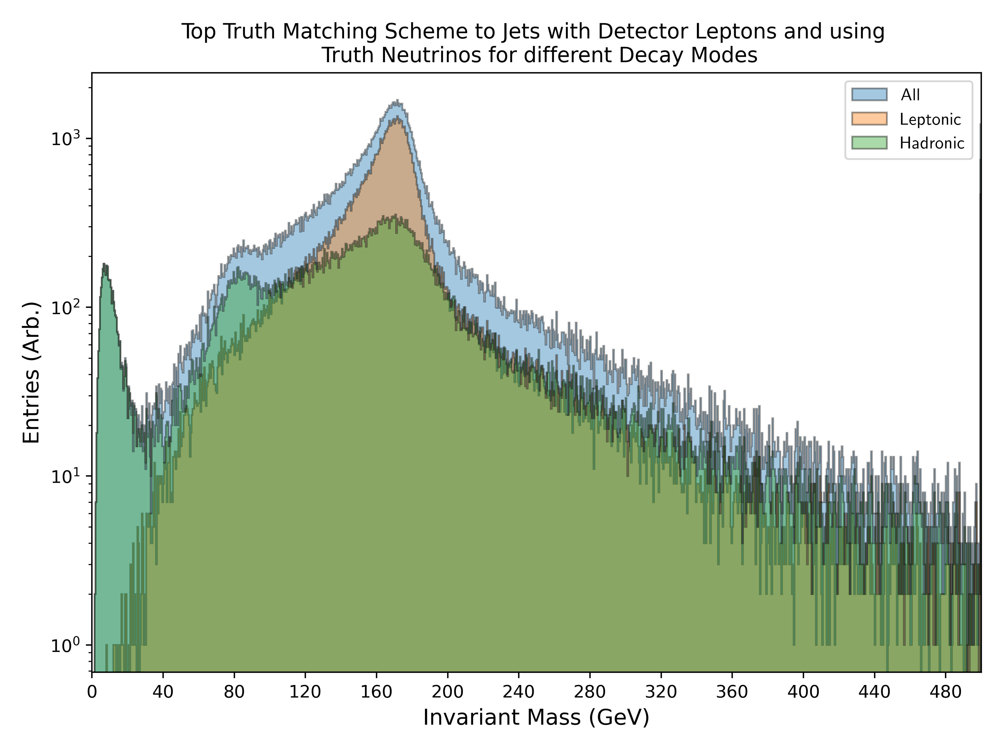
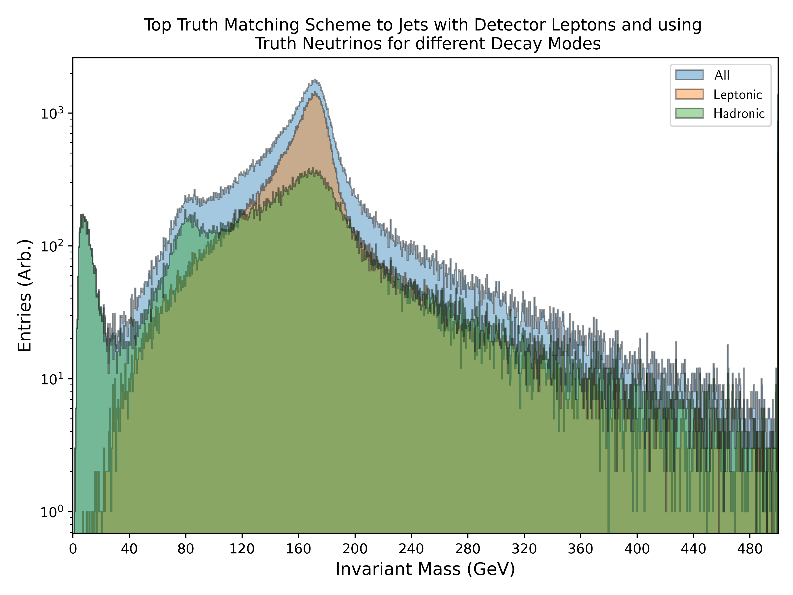
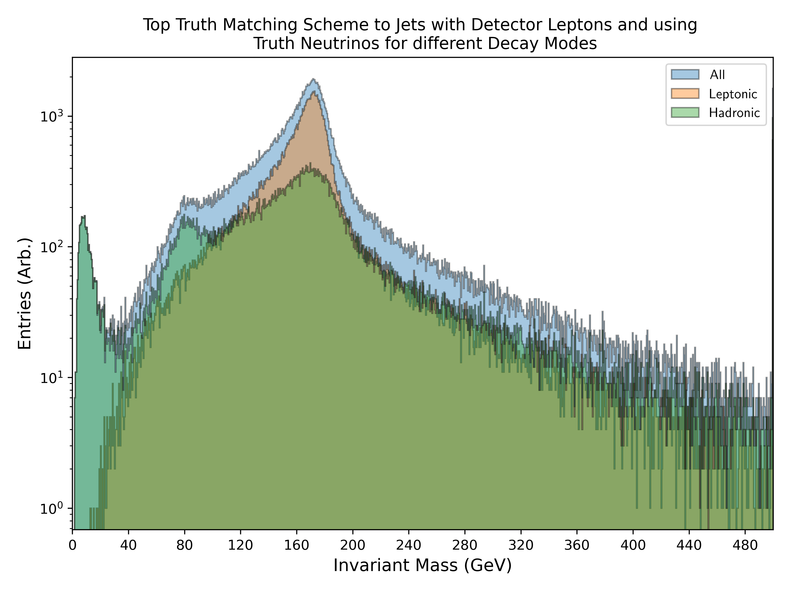

.. _figure_2e:

Figure.2.e
----------

Density distributions of the invariant mass for detector based **jets and leptons** being matched to mutual tops.
For leptonically decaying tops, the respective **neutrino was sourced from the children**.
All distributions are normalized to unity.

Mass Point: 400 GeV
^^^^^^^^^^^^^^^^^^^

Mass Point: 500 GeV
^^^^^^^^^^^^^^^^^^^

Mass Point: 600 GeV
^^^^^^^^^^^^^^^^^^^

Mass Point: 700 GeV
^^^^^^^^^^^^^^^^^^^

Mass Point: 800 GeV
^^^^^^^^^^^^^^^^^^^

Mass Point: 900 GeV
^^^^^^^^^^^^^^^^^^^

Mass Point: 1000 GeV
^^^^^^^^^^^^^^^^^^^^

