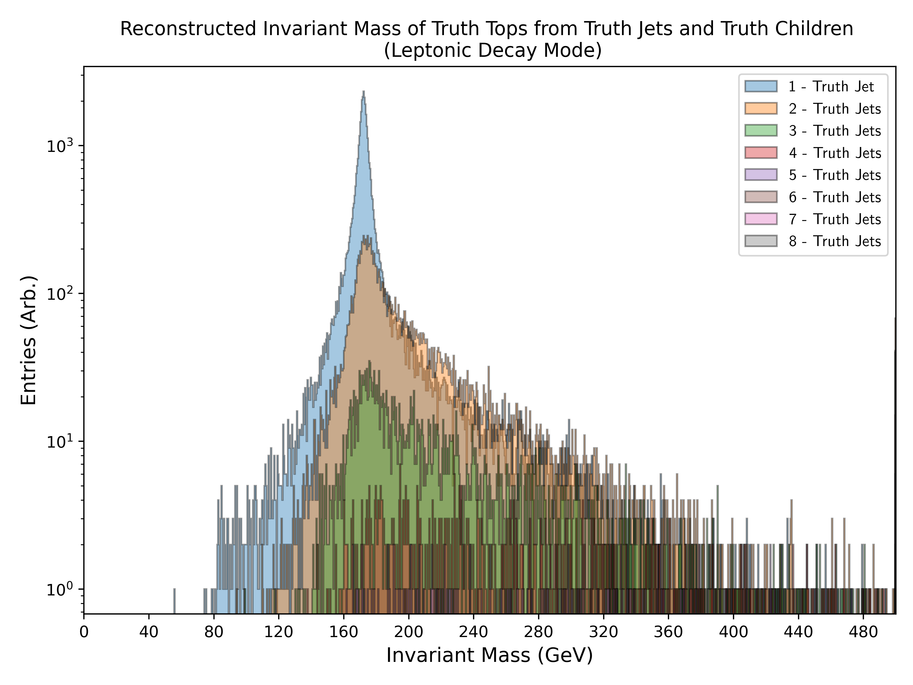
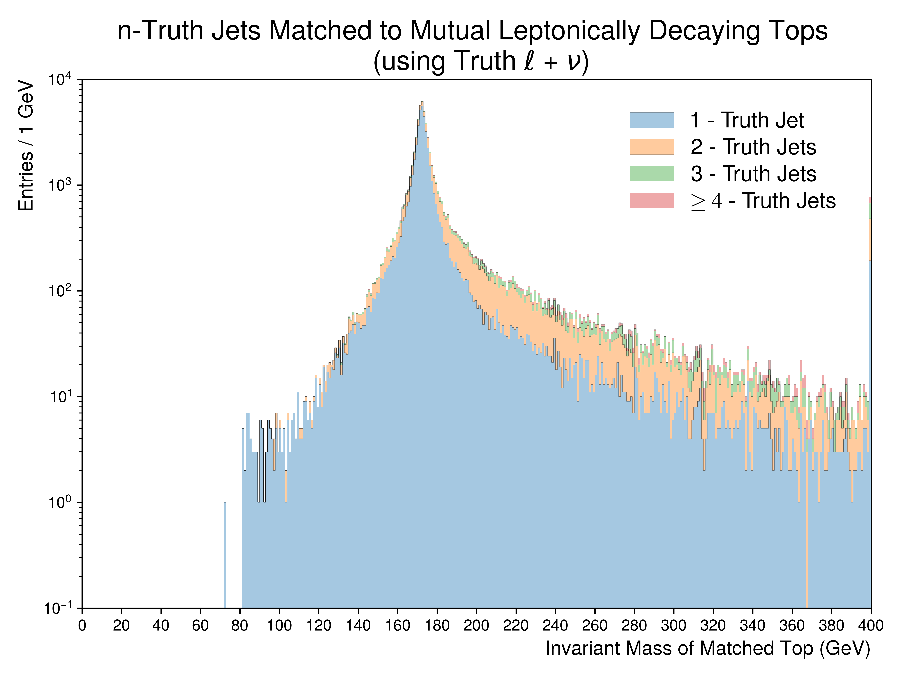
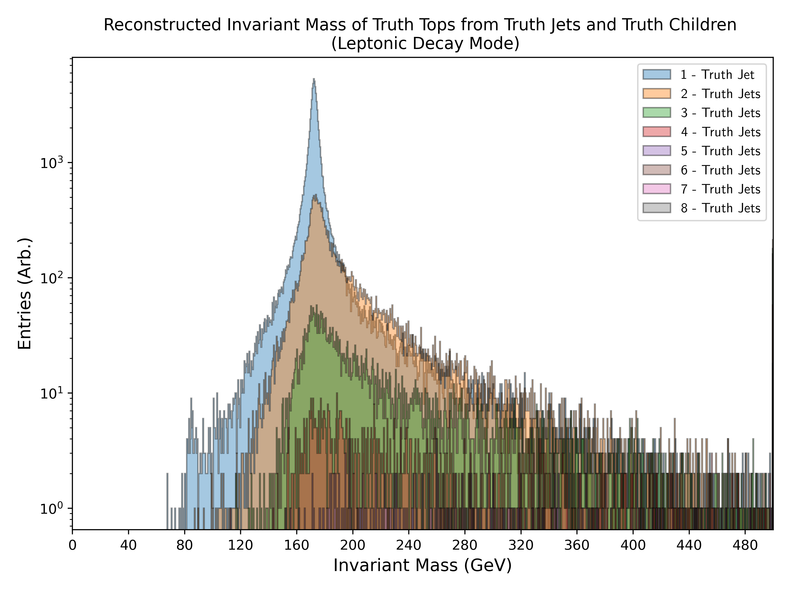
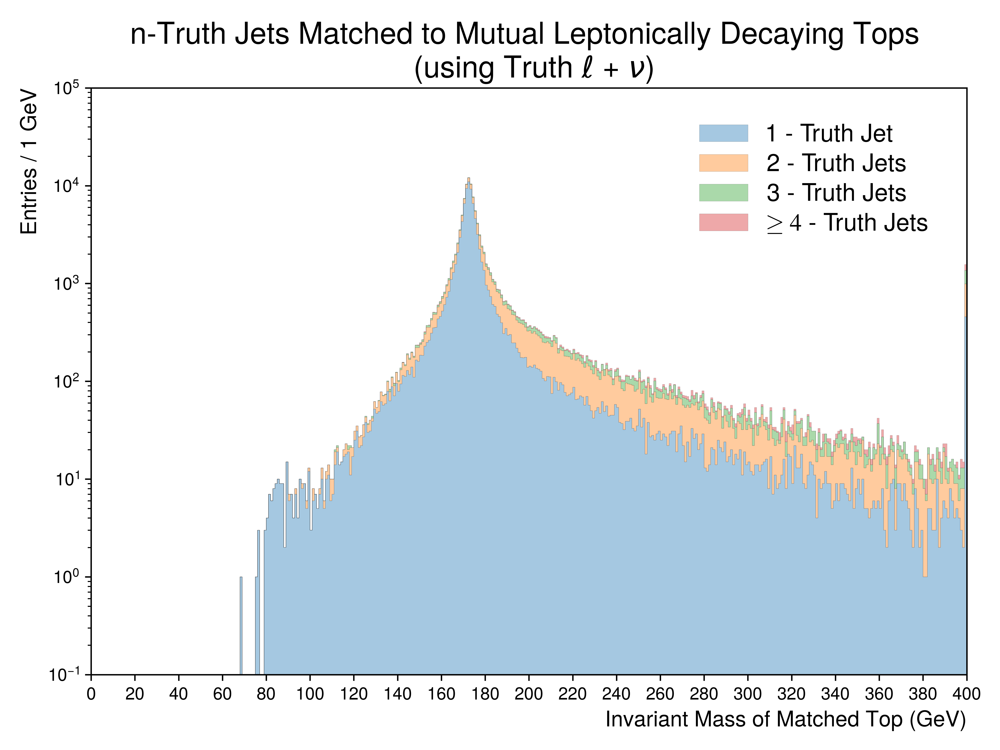
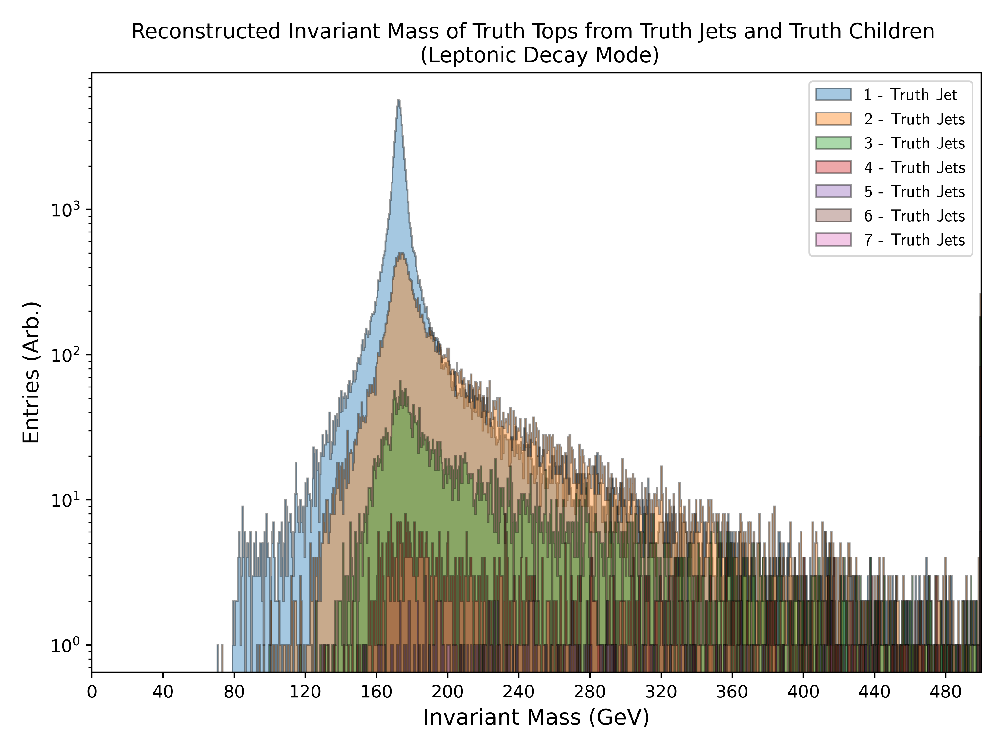

Figure.2.f
----------

Figures depicting the top-quark invariant mass reconstructed from **truth jets**. 
For leptonically decaying tops, the **truth leptons and neutrinos** were used.
**The figure aims to illustrate the number of truth jets contributing to leptonically decaying top-quarks**.

Mass Point: 400 GeV
^^^^^^^^^^^^^^^^^^^

Mass Point: 500 GeV
^^^^^^^^^^^^^^^^^^^

Mass Point: 600 GeV
^^^^^^^^^^^^^^^^^^^

Mass Point: 700 GeV
^^^^^^^^^^^^^^^^^^^

Mass Point: 800 GeV
^^^^^^^^^^^^^^^^^^^

Mass Point: 900 GeV
^^^^^^^^^^^^^^^^^^^

Mass Point: 1000 GeV
^^^^^^^^^^^^^^^^^^^^

