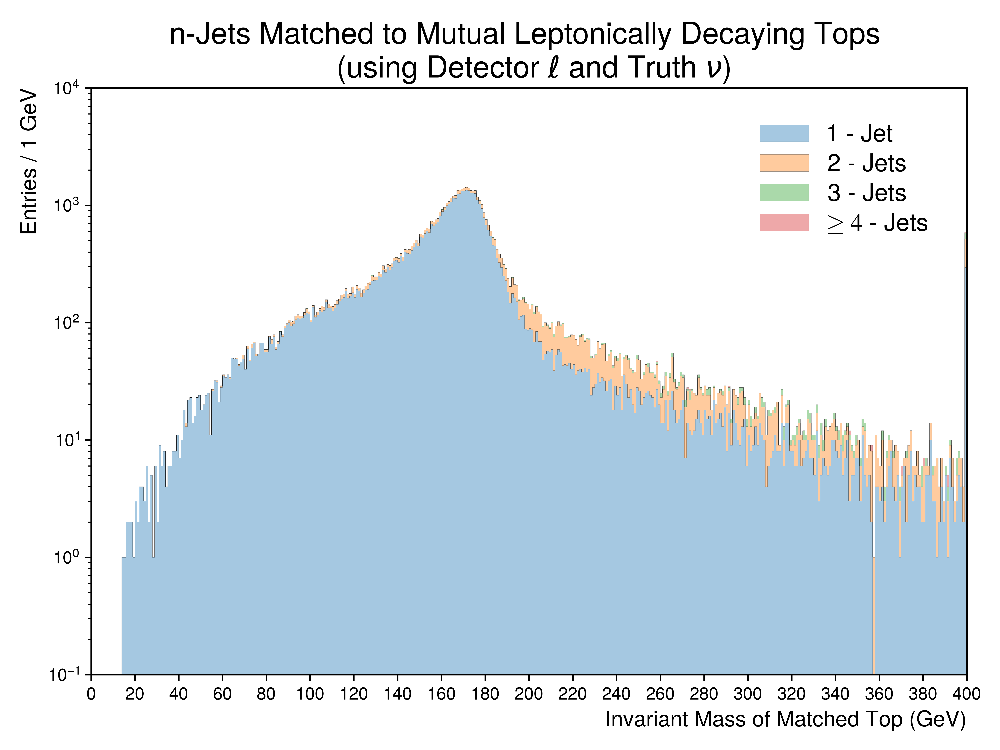
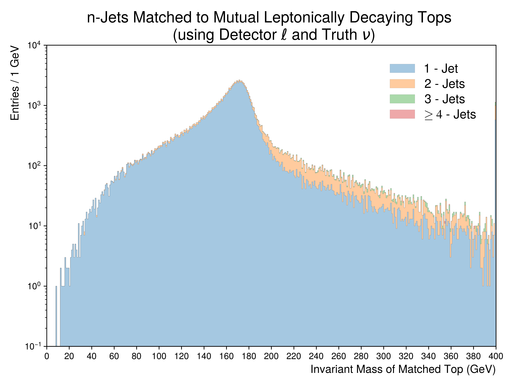
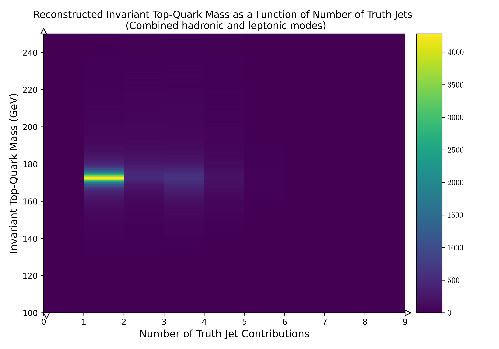
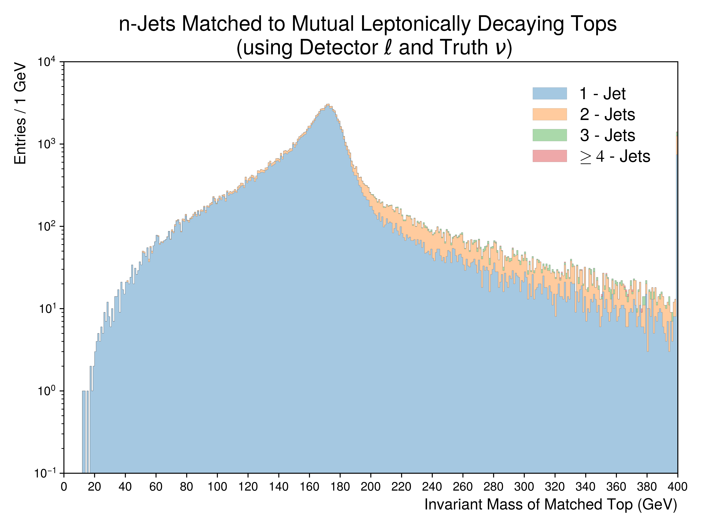

.. _figure_2h:

Figure.2.h
----------

Figures depicting the invariant top mass of matched detector **jets and leptons** from mutual tops. 
For leptonically decaying tops, the **truth neutrino** was used.
**The figure aims to illustrate the number of jets contributing to matched tops in the leptonic decay channel**.

Mass Point: 400 GeV
^^^^^^^^^^^^^^^^^^^

Mass Point: 500 GeV
^^^^^^^^^^^^^^^^^^^

Mass Point: 600 GeV
^^^^^^^^^^^^^^^^^^^

Mass Point: 700 GeV
^^^^^^^^^^^^^^^^^^^

Mass Point: 800 GeV
^^^^^^^^^^^^^^^^^^^

Mass Point: 900 GeV
^^^^^^^^^^^^^^^^^^^

Mass Point: 1000 GeV
^^^^^^^^^^^^^^^^^^^^

