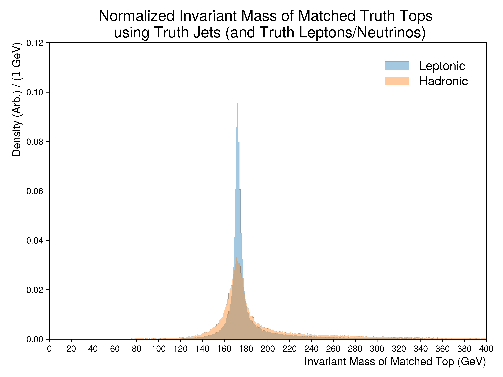

Figure.5.a
----------

A collection of figures illustrating the formed invariant mass of the top-quark from truth jets being matched to individual tops by index.
The underlying distributions are partitioned into whether a given top has decayed leptonically or hadronically.
For leptonically decaying tops, truth children (lepton and neutrino) are used from the matched parent top.

Mass Point: 400 GeV
^^^^^^^^^^^^^^^^^^^

Mass Point: 500 GeV
^^^^^^^^^^^^^^^^^^^

Mass Point: 600 GeV
^^^^^^^^^^^^^^^^^^^

Mass Point: 700 GeV
^^^^^^^^^^^^^^^^^^^

Mass Point: 800 GeV
^^^^^^^^^^^^^^^^^^^

Mass Point: 900 GeV
^^^^^^^^^^^^^^^^^^^

Mass Point: 1000 GeV
^^^^^^^^^^^^^^^^^^^^

