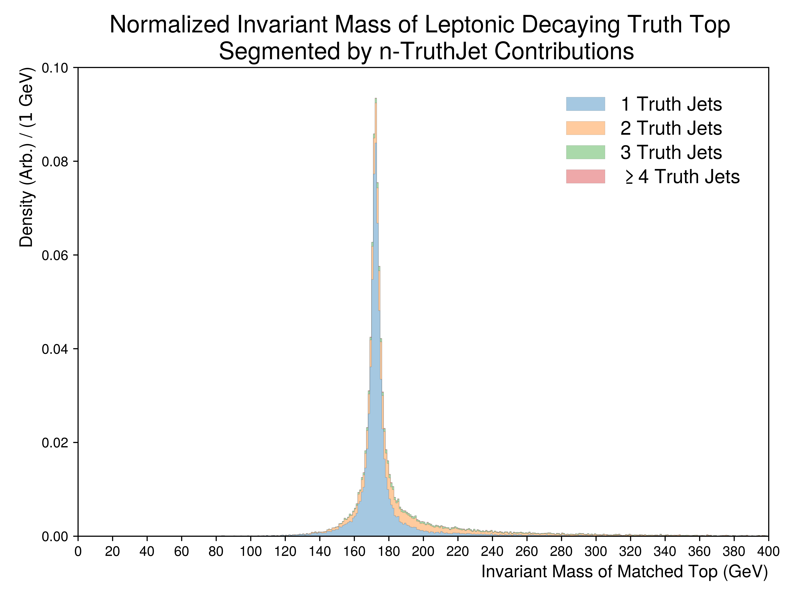
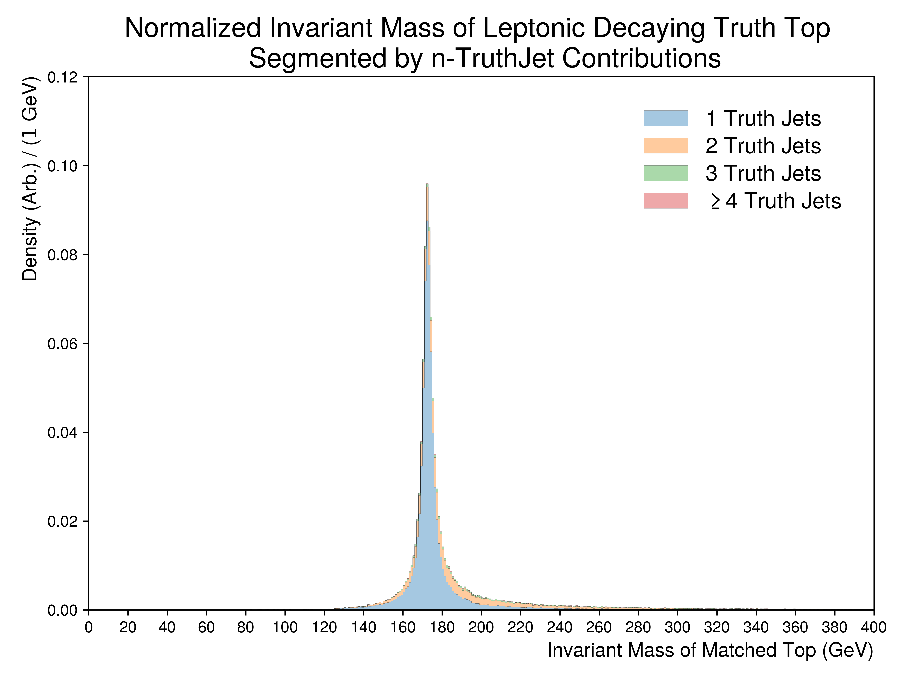

Figure.5.b
----------

A set of figures illustrating the formed invariant mass of the top-quark from truth jets being matched to **leptonically decaying** tops.
The underlying distributions are partitioned into the number of truth-jet contributions.
For this matching scheme the truth children are used to add the missing the neutrinos and leptons.

Mass Point: 400 GeV
^^^^^^^^^^^^^^^^^^^

Mass Point: 500 GeV
^^^^^^^^^^^^^^^^^^^

Mass Point: 600 GeV
^^^^^^^^^^^^^^^^^^^

Mass Point: 700 GeV
^^^^^^^^^^^^^^^^^^^

Mass Point: 800 GeV
^^^^^^^^^^^^^^^^^^^

.. figure:: ./Mass.800.GeV/Figure.5.b.png
   :align: center

Mass Point: 900 GeV
^^^^^^^^^^^^^^^^^^^

.. figure:: ./Mass.900.GeV/Figure.5.b.png
   :align: center

Mass Point: 1000 GeV
^^^^^^^^^^^^^^^^^^^^

