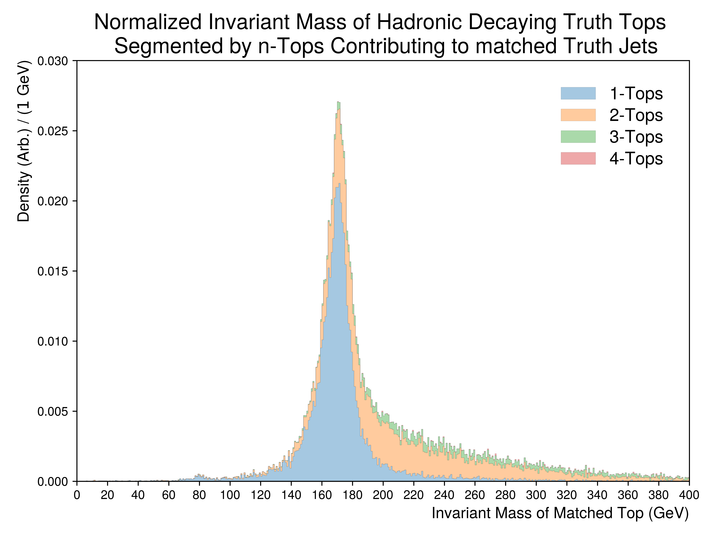
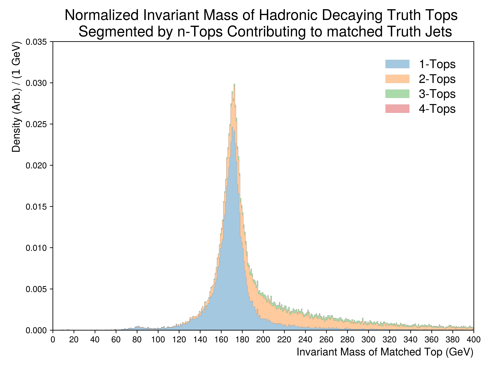

Figure.5.e
----------

A set of figures illustrating the formed invariant mass of the top-quark from truth jets being matched to **hadronically decaying** tops.
The underlying distributions are partitioned into the number of tops contributing to a given matched truth jet.
These plots aim to demonstrate cases, where a truth jet is shared between adjacent tops.

Mass Point: 400 GeV
^^^^^^^^^^^^^^^^^^^

Mass Point: 500 GeV
^^^^^^^^^^^^^^^^^^^

Mass Point: 600 GeV
^^^^^^^^^^^^^^^^^^^

Mass Point: 700 GeV
^^^^^^^^^^^^^^^^^^^

Mass Point: 800 GeV
^^^^^^^^^^^^^^^^^^^

Mass Point: 900 GeV
^^^^^^^^^^^^^^^^^^^

Mass Point: 1000 GeV
^^^^^^^^^^^^^^^^^^^^

