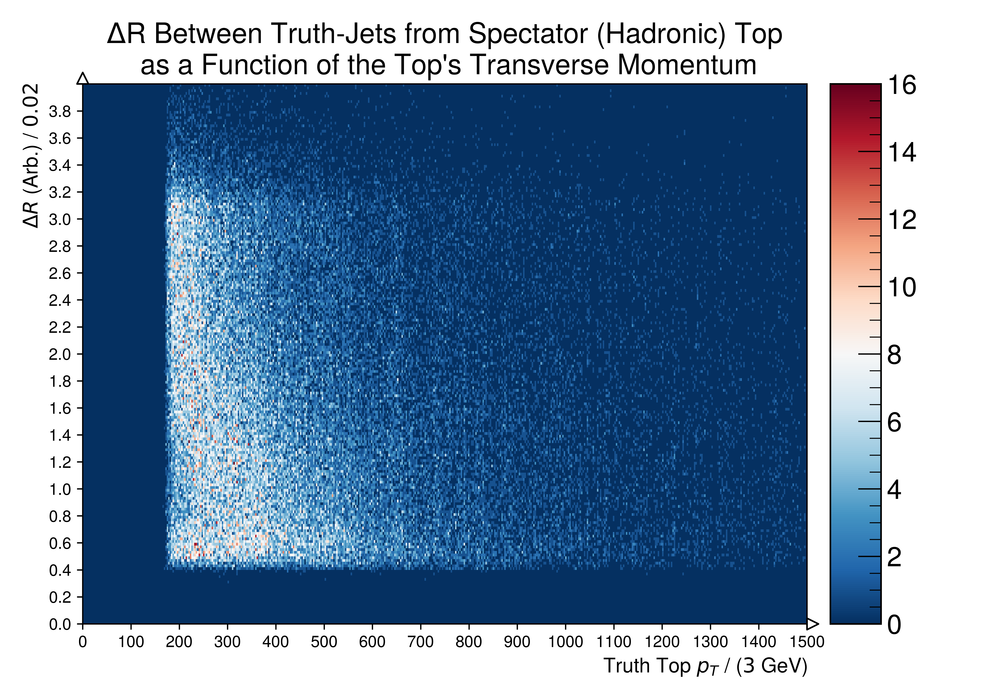
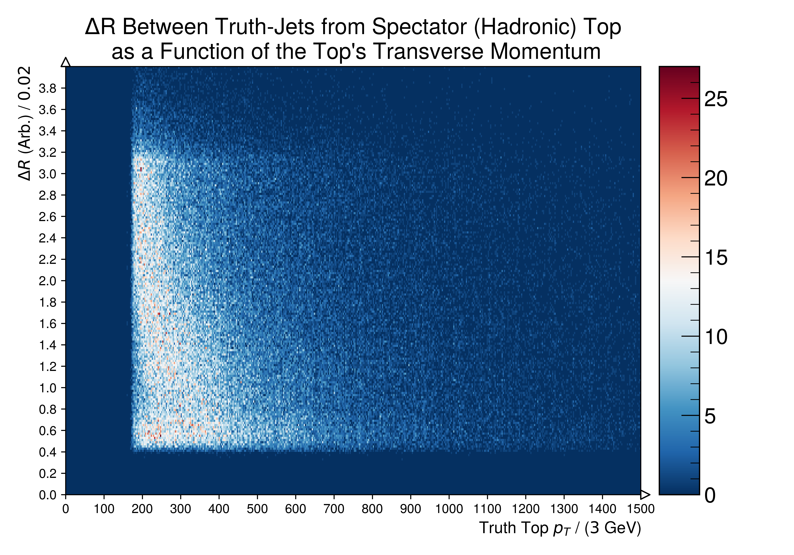
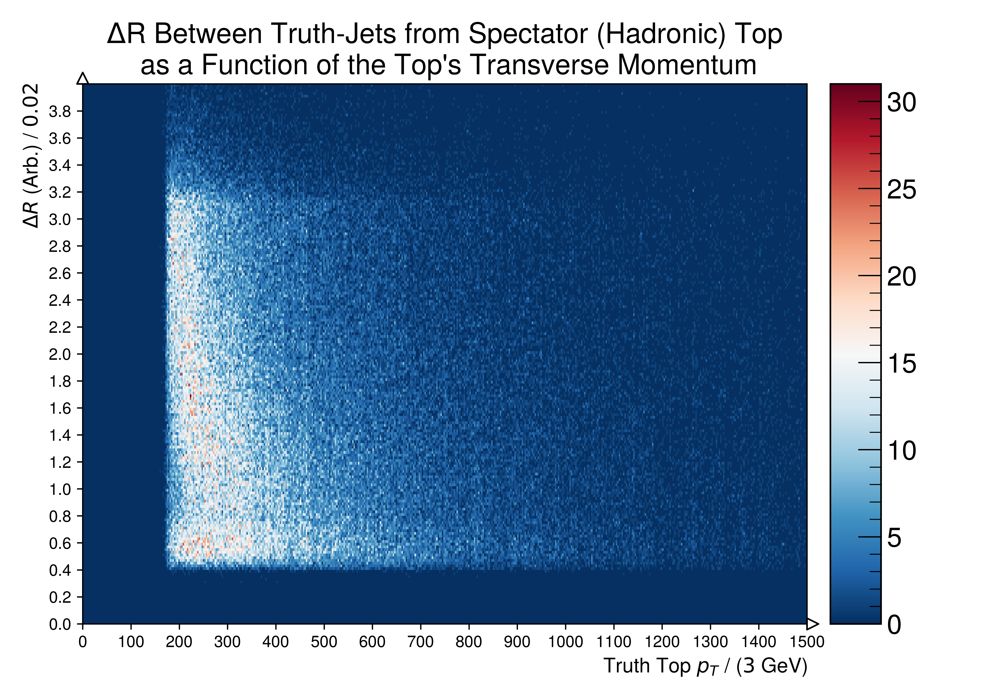
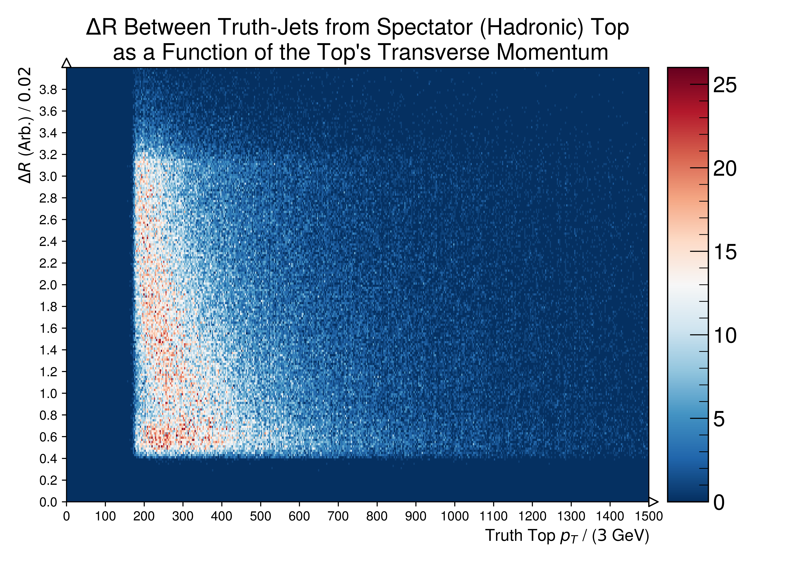
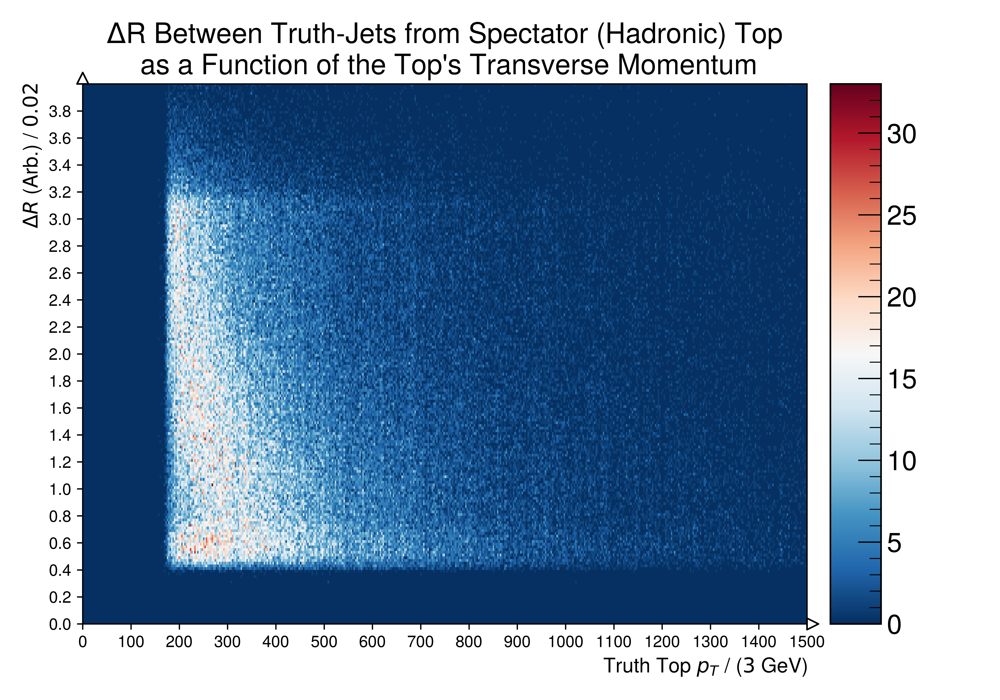

.. _figure_5n: 

Figure.5.n
----------

Heat-map representations of Figure 7.f as a function of **Spectator (Hadronic)** Top Transverse Momenta and the :math:`\Delta R` between Truth-Jets's originating from Mutual Tops.

Mass Point: 400 GeV
^^^^^^^^^^^^^^^^^^^

Mass Point: 500 GeV
^^^^^^^^^^^^^^^^^^^

Mass Point: 600 GeV
^^^^^^^^^^^^^^^^^^^

.. figure:: ./Mass.600.GeV/Figure.5.n.png
   :align: center

Mass Point: 700 GeV
^^^^^^^^^^^^^^^^^^^

Mass Point: 800 GeV
^^^^^^^^^^^^^^^^^^^

Mass Point: 900 GeV
^^^^^^^^^^^^^^^^^^^

.. figure:: ./Mass.900.GeV/Figure.5.n.png
   :align: center

Mass Point: 1000 GeV
^^^^^^^^^^^^^^^^^^^^

