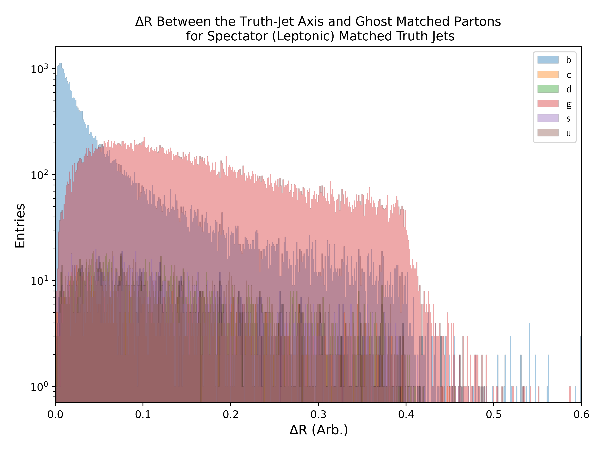
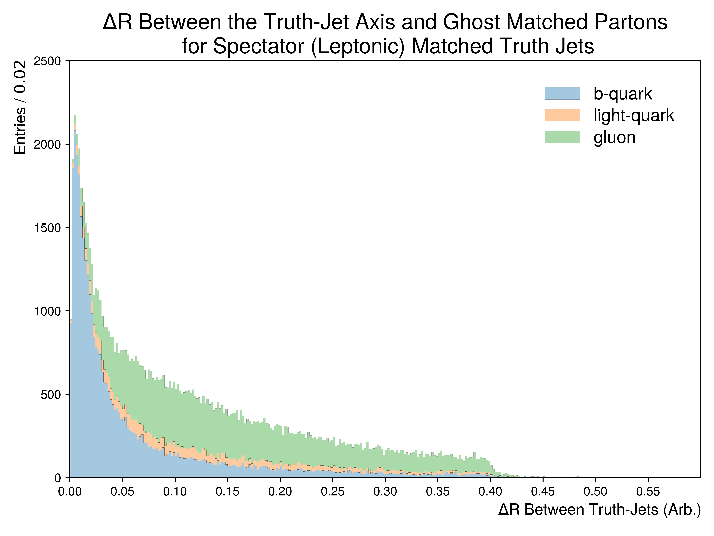
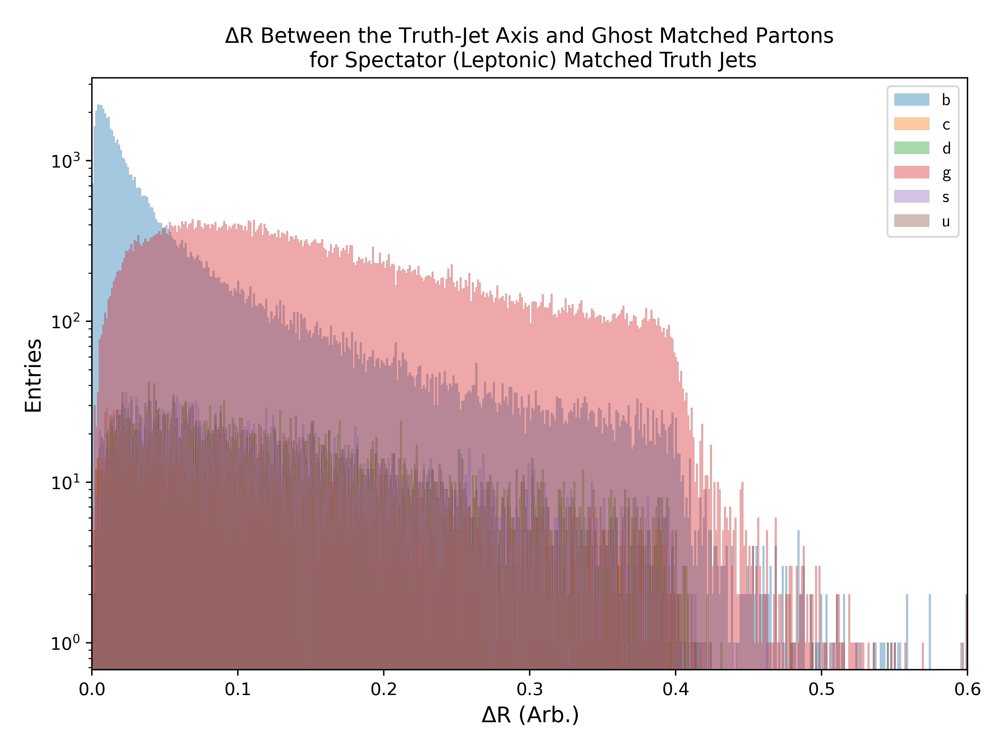
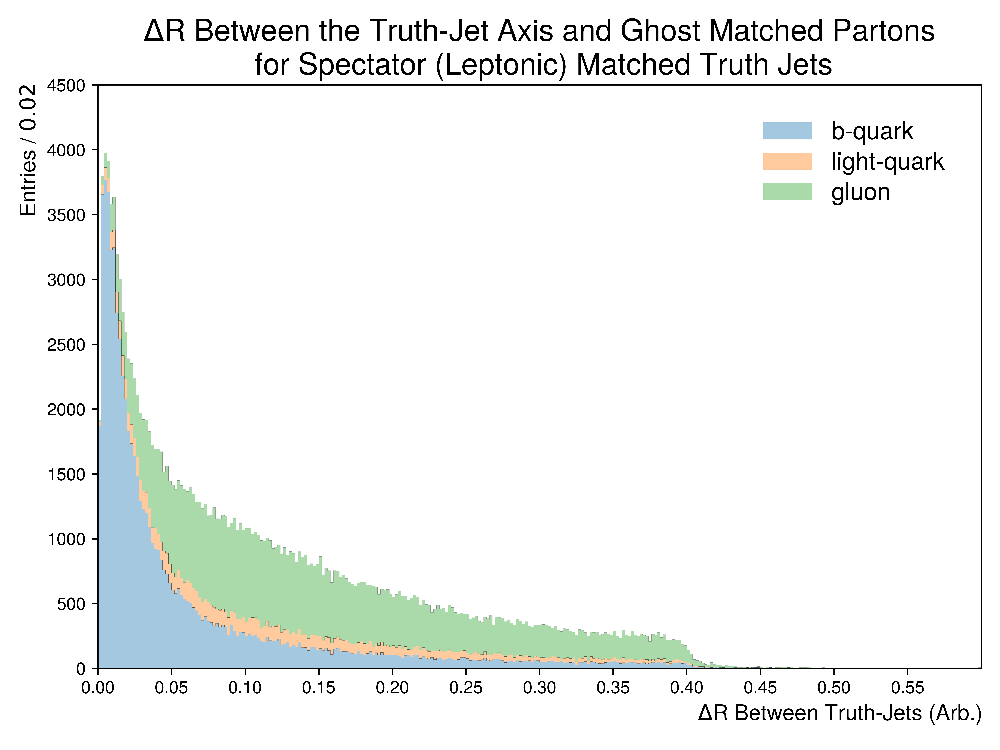

Figure.5.t
----------

A set of figures depicting the :math:`\Delta R` between the Truth-Jet axis and Ghost matched Partons. 
In these figures, only truth-jets matched to a **leptonically decaying spectator top-quark** are being considered.

Mass Point: 400 GeV
^^^^^^^^^^^^^^^^^^^

Mass Point: 500 GeV
^^^^^^^^^^^^^^^^^^^

Mass Point: 600 GeV
^^^^^^^^^^^^^^^^^^^

Mass Point: 700 GeV
^^^^^^^^^^^^^^^^^^^

Mass Point: 800 GeV
^^^^^^^^^^^^^^^^^^^

Mass Point: 900 GeV
^^^^^^^^^^^^^^^^^^^

.. figure:: ./Mass.900.GeV/Figure.5.t.png
   :align: center

Mass Point: 1000 GeV
^^^^^^^^^^^^^^^^^^^^

