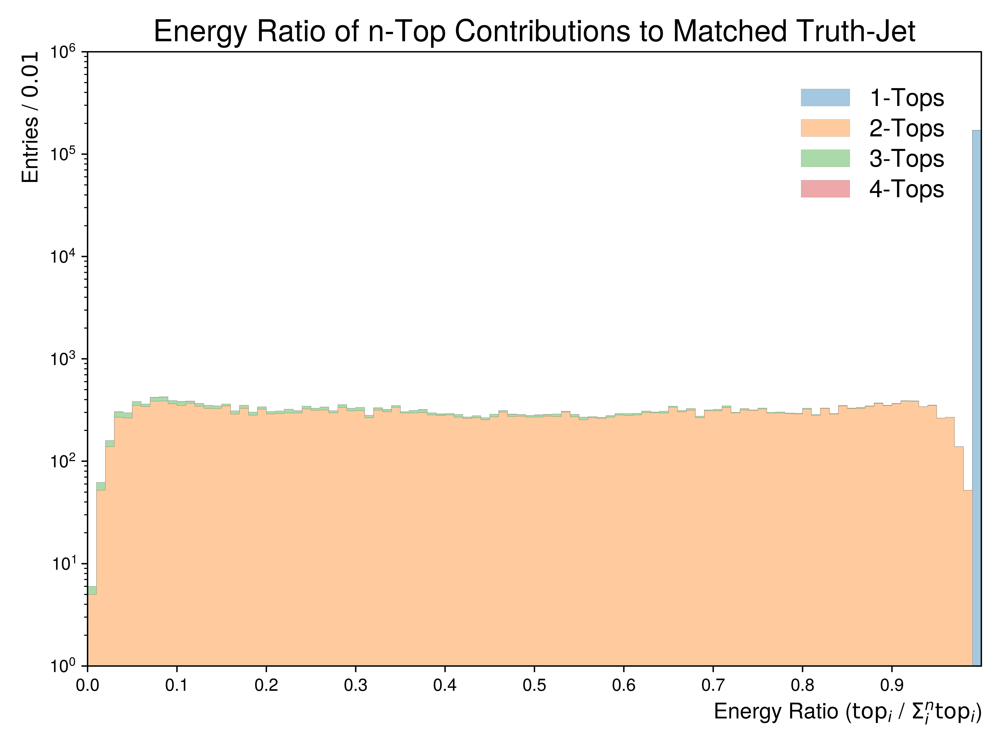
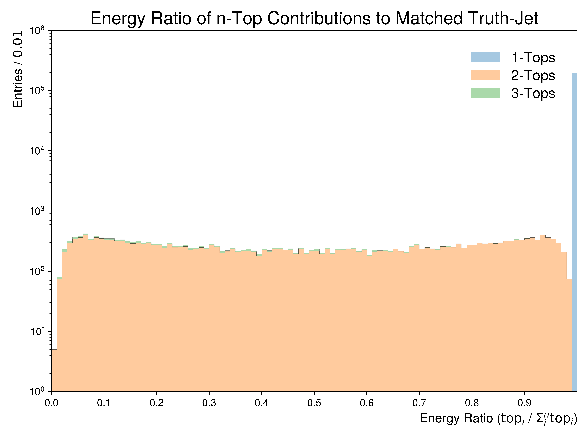
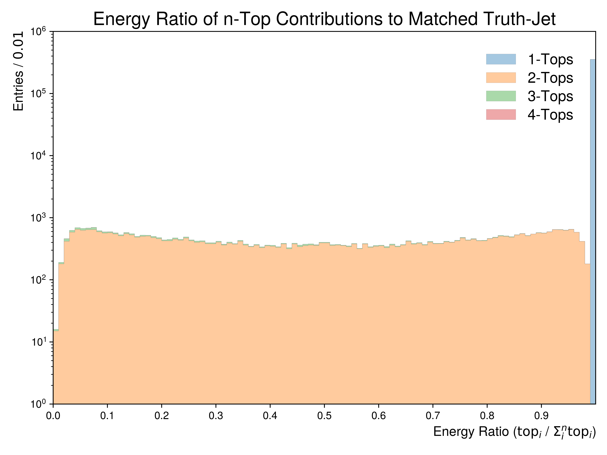
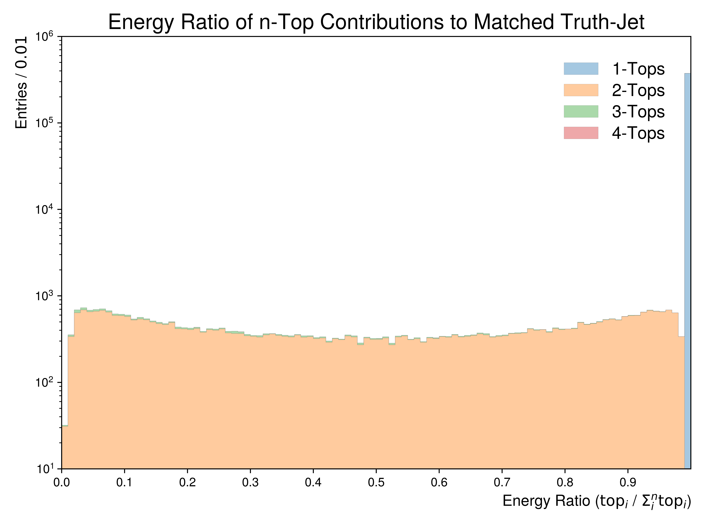

Figure.5.x
----------

A set of figures depicting the **ratio of multi-top energy contributions to a given truth-jet's Ghost Parton collection**.
To compute this ratio, ghost partons matched to the truth-children of tops are summed per top-quark and divided by the sum of all top-children
matched to a given truth-jet.

Mass Point: 400 GeV
^^^^^^^^^^^^^^^^^^^

Mass Point: 500 GeV
^^^^^^^^^^^^^^^^^^^

.. figure:: ./Mass.500.GeV/Figure.5.x.png
   :align: center

Mass Point: 600 GeV
^^^^^^^^^^^^^^^^^^^

Mass Point: 700 GeV
^^^^^^^^^^^^^^^^^^^

Mass Point: 800 GeV
^^^^^^^^^^^^^^^^^^^

Mass Point: 900 GeV
^^^^^^^^^^^^^^^^^^^

Mass Point: 1000 GeV
^^^^^^^^^^^^^^^^^^^^

