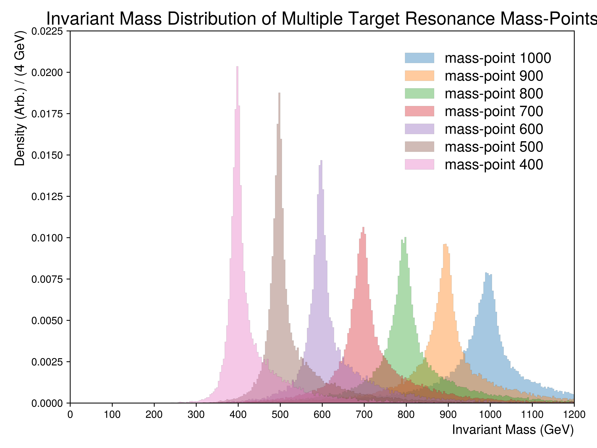

.. _figure_6c:

Figure 6.c
----------

  
A figure illustrating the collimation of all considered mass points for the resonance.
For this figure, a mixture of **truth jets and top children** were used, provided the underlying top decayed leptonically, to compute the resonance masses.
For visibility, all distributions have been normalized to unity.

