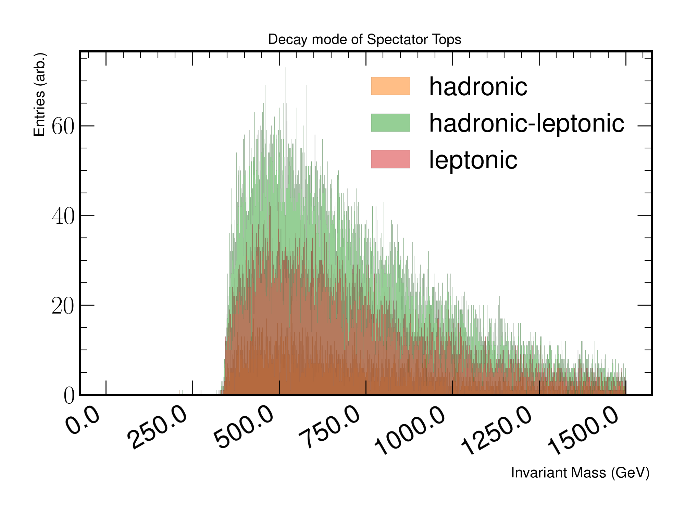

DecayModes
==========

A set of studies which investigates the decay modes of the resonant and spectator tops originating from a resonance. 
The aim is to understand the decay modes of the tops and if there are any discriminating variables, which could be useful for identifying signal events.
For this study, the event requires to have exactly two tops marked as originating from resonance and an additional two from spectator.

Figure 2.a
----------

 
   An invariant mass distribution plot of the resonance's decay modes. 
   For sub-plots with hadronic and leptonic titles, the resonant tops both decay the same way.

Figure 2.b
----------

 
   An invariant mass distribution plot of the resonance partitioned into same and opposite sign decay modes, where both tops-quarks decay leptonically.
   There should be no cases where the tops decay both leptonically with the same electric charge (Same-Sign should have no entries).

Figure 2.c
----------

 
   An invariant mass distribution plot of the spectator tops being combined to create an mtt distribution.
   This is predominantly used to verify whether the distributions are different between resonant top pairs and spectator pairs.

Figure 2.d
----------

 
   An invariant mass distribution of combining spectator tops to form an mtt distribution. 
   The plot is partitioned into cases where the leptonic decay products produce same or opposite signed lepton charges.

Figure 2.e
----------
.. figure:: ./figures/Figure.2.e.png
   :align: center
   :name: Figure.2.e
 
   A normalized fractional plot of the PDGID codes from tops decaying into their respective children. 
   The plot is divided by resonance and spectator top decay.

Figure 2.f
----------

 
   A figure depicting the invariant mass of the resonance, when constraining the decay mode of one spectator and resonant top to be leptonically.
   The resulting decaying leptons can be categorized as being opposite and same signed, to further resolve the resonance.
