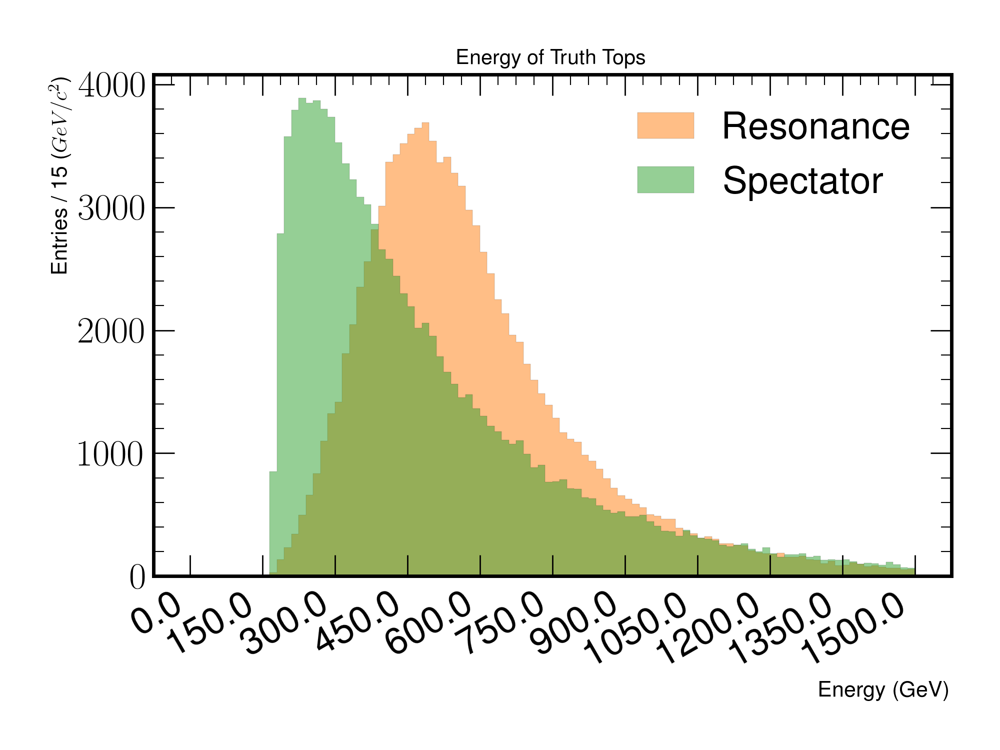
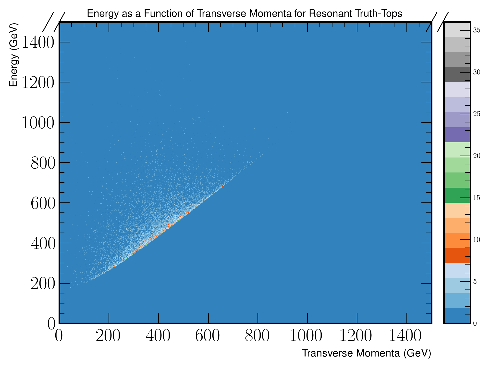
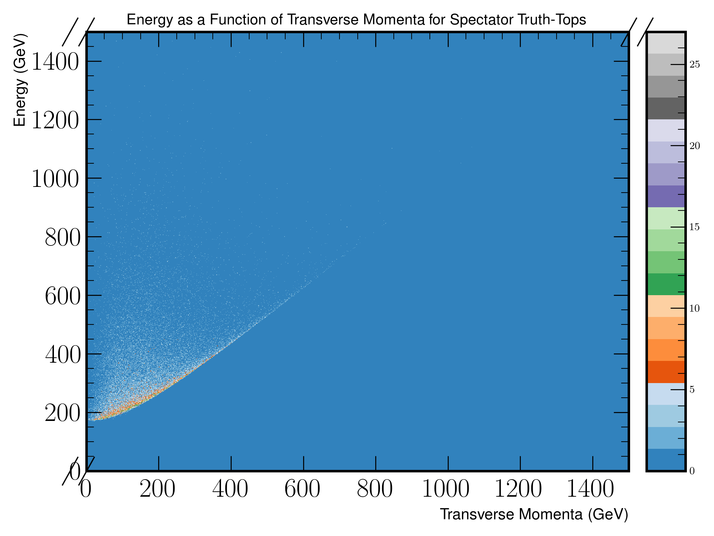
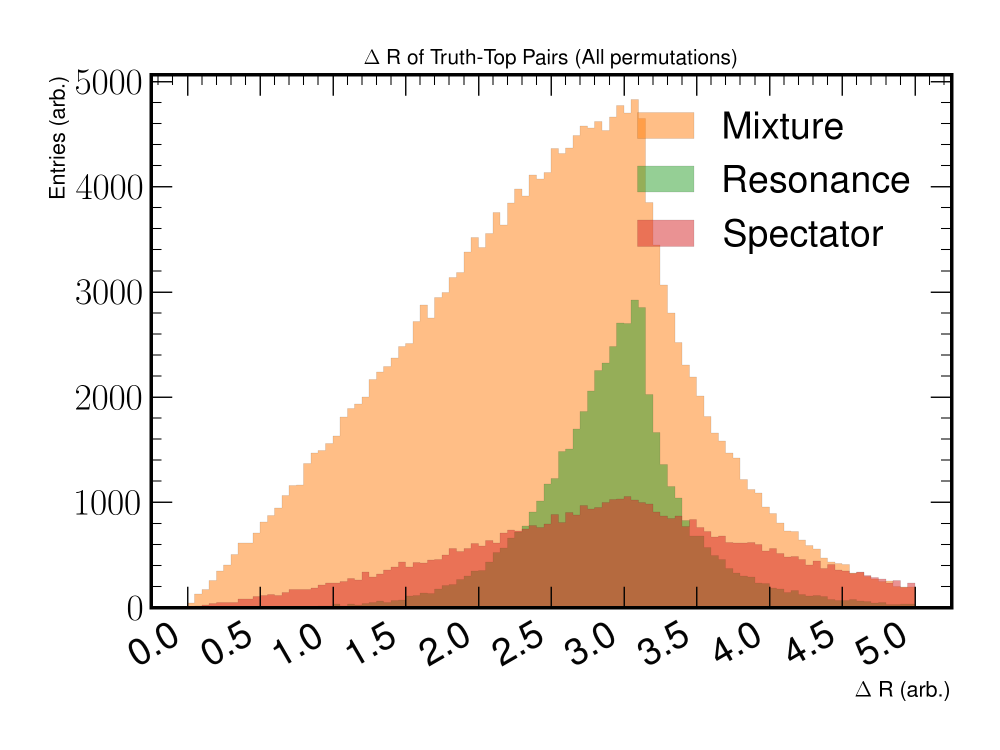
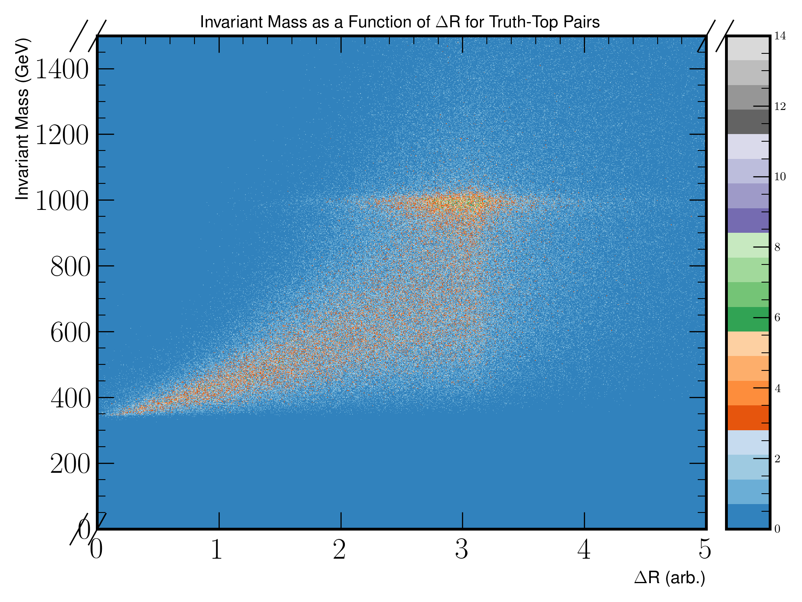

Top Kinematics
==============

Studies relating to the kinematics of the tops produced from the resonance and their corresponding spectator counterparts.

Figure 3.a
----------

   A figure depicting the transverse momenta of spectator and resonance tops.

Figure 3.b
----------

    
   A figure depicting the energy of spectator and resonant tops.

Figure 3.c
----------
.. figure:: ./figures/Figure.3.c.png
   :align: center
   :name: Figure.3.c
   
   A figure depicting the azimuthal angle of spectator and resonant tops.

Figure 3.d
----------

 
   A figure depicting the pseudorapidity of spectator and resonant tops.

Figure 3.e
----------

 
   A two dimensional heat-map of energy against transverse momenta for **resonant** tops.

Figure 3.f
----------

   A two dimensional heat-map of energy against transverse momenta for **spectator** tops.

Figure 3.g
----------

   A distribution plot of the :math:`\Delta R` between truth-top pairs.
   For plots with Resonance and Spectator titles, top-pairs are correctly assigned, otherwise they are labelled as a Mixture.

Figure 3.h
----------

   A distribution plot of the invariant mass produced when combining truth-top pairs.
   For plots with Resonance and Spectator titles, top-pairs are correctly assigned, otherwise they are labelled as a Mixture.

Figure 3.j
----------

   A two dimensional head-map of the invariant mass as a function of :math:`\Delta R`.
   For this plot, all possible truth-top pair permutations are used to compute the invariant mass and the :math:`\Delta R`.

