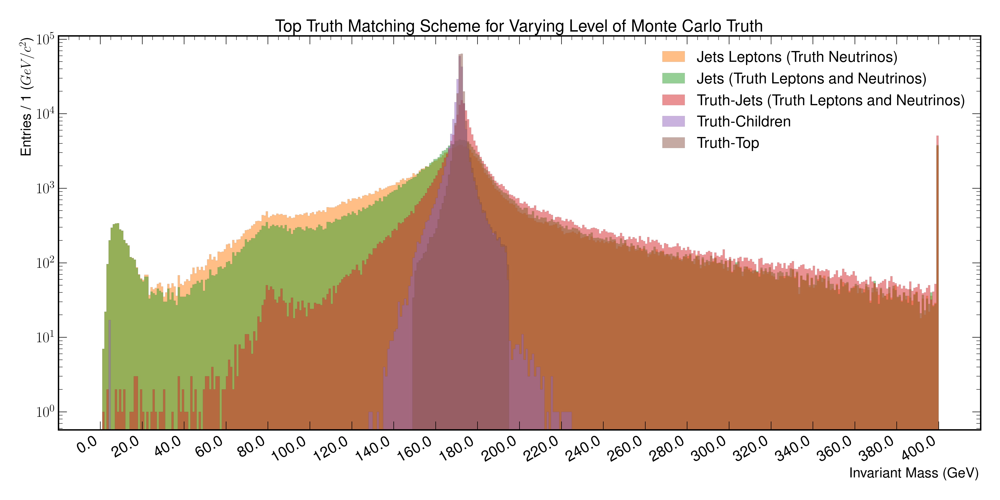
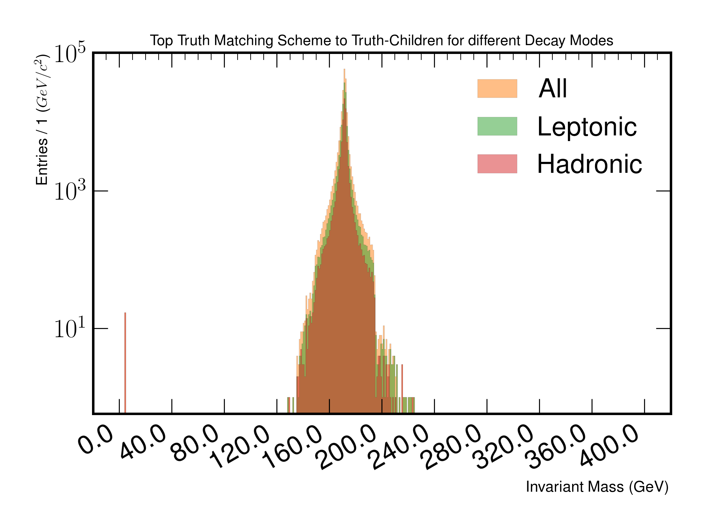
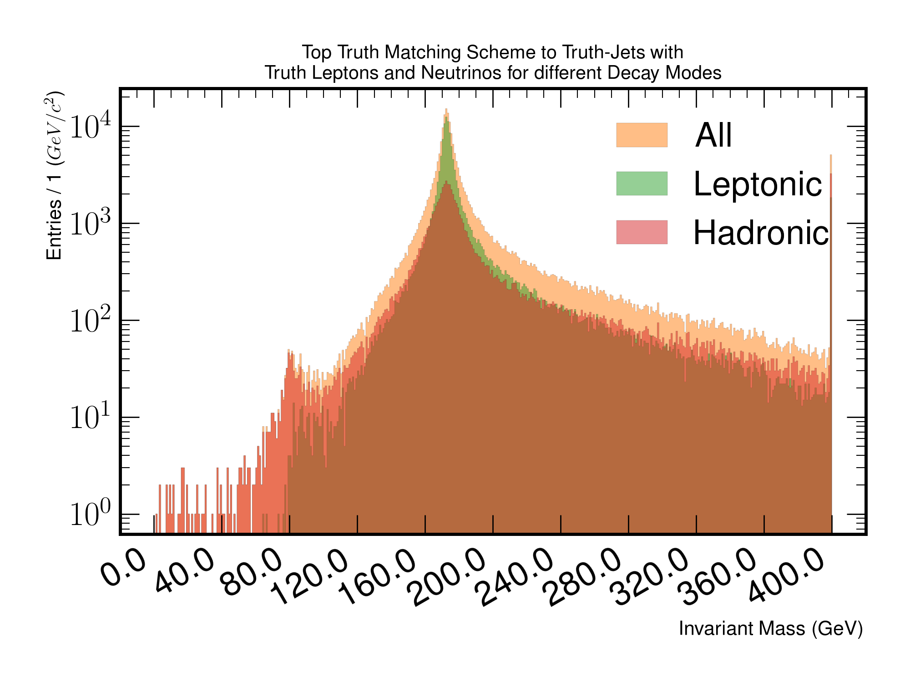
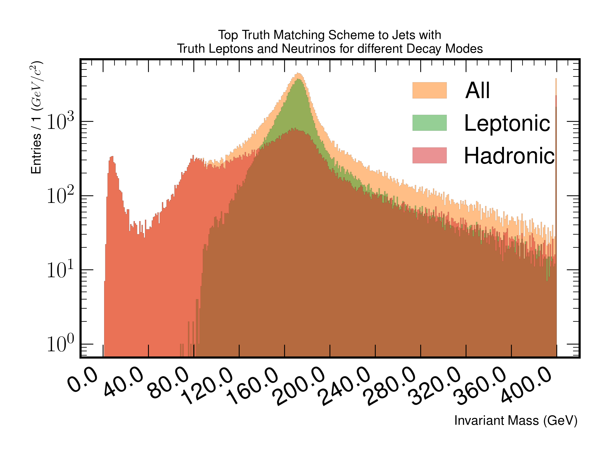
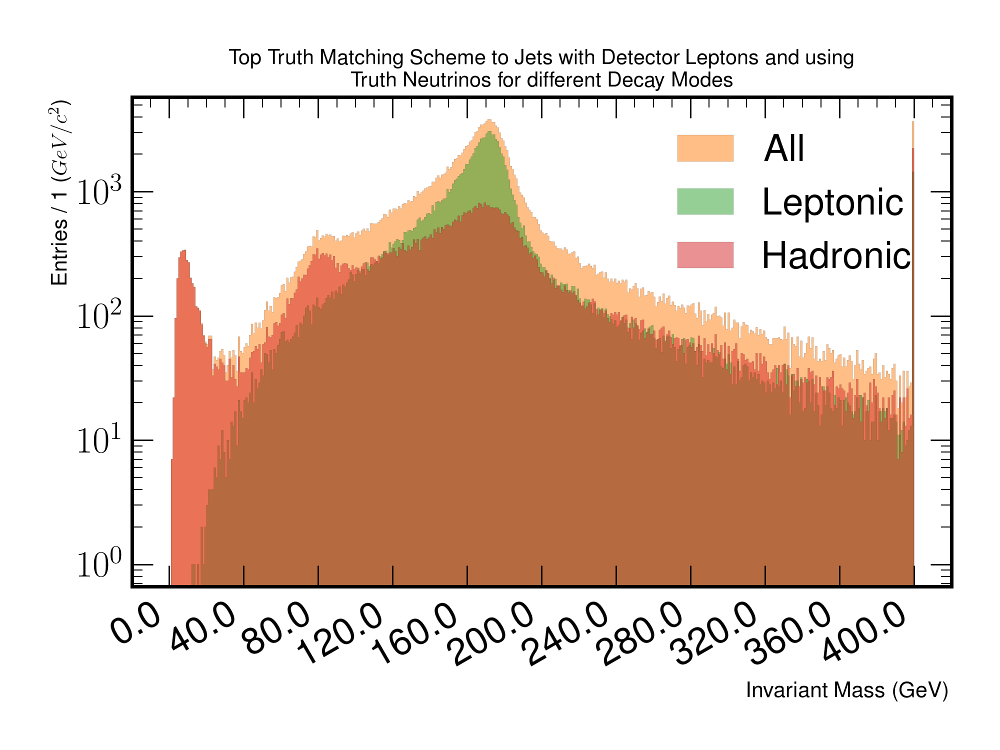
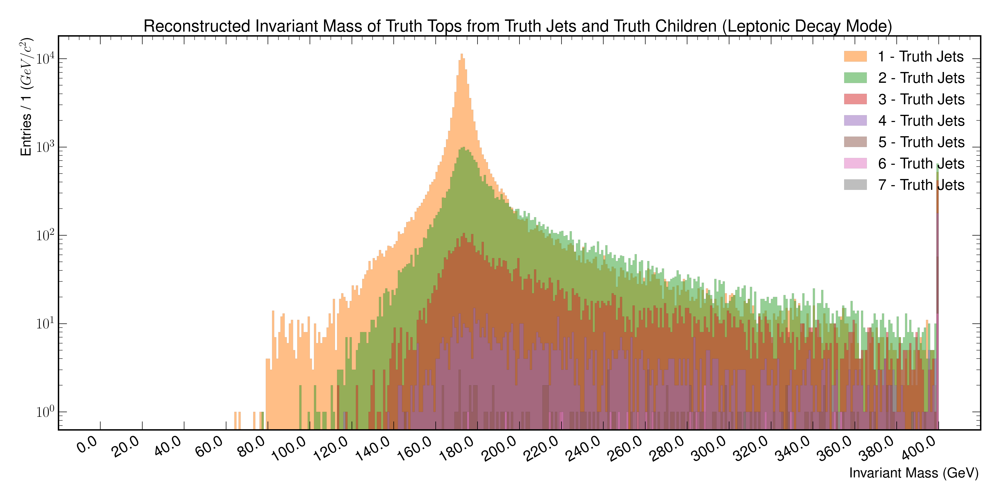
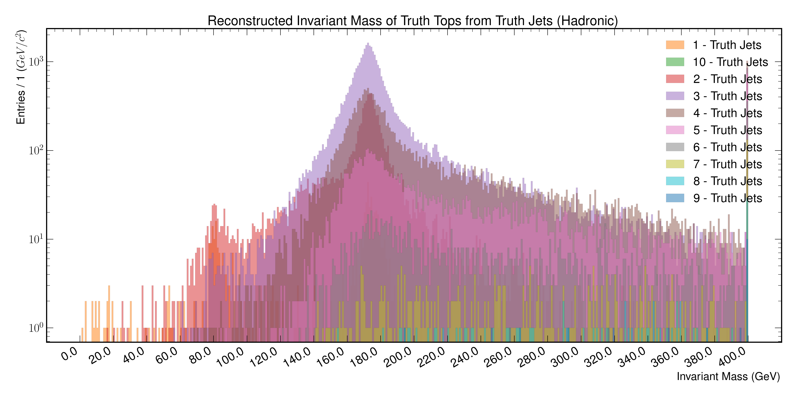
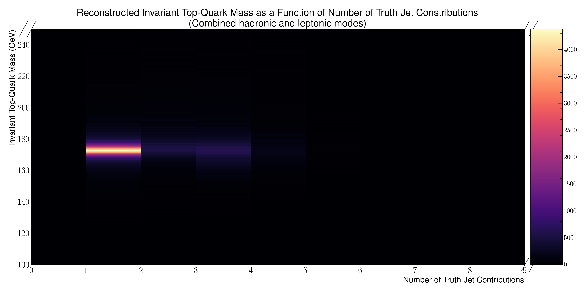
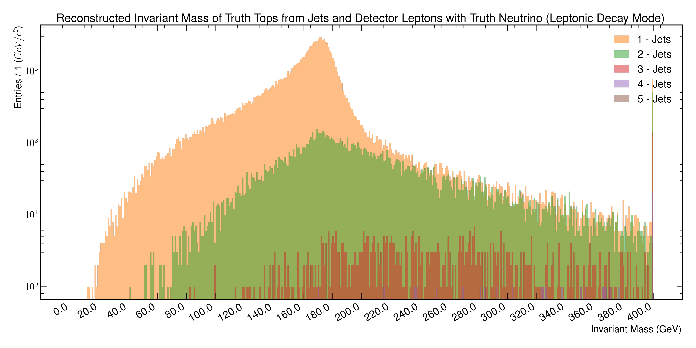
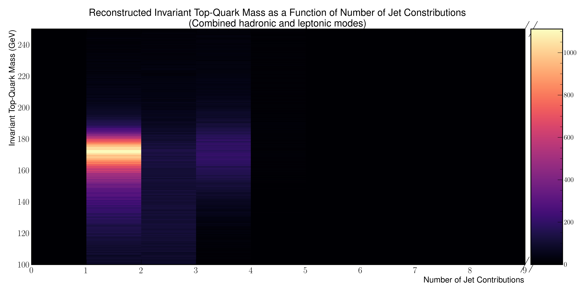

Top-Matching
============

Studies relating to the truth matching scheme being used to assign reconstructed detector physics objects to individual top quarks (from truth).
The aim is to investigate the best possible top reconstructibility available at different truth levels.
Investigated levels involve the truth-top, truth-children, truth-jets with truth leptons/neutrinos, jets with truth leptons/neutrinos and jets with detector matched leptons and truth truth neutrinos.

Figure 4.a
----------

   A figure depicting the top-quark invariant mass reconstruction, from the proposed truth matching scheme at different truth levels.
   The figure should illustrate a perfect peak at 172 GeV (truth-tops), with worsening resolution as more truth information is removed from the matching.
   The worst resolution is expected to be detector reconstructed jets and leptons.

Figure 4.b
----------

   A figure depicting the top-quark invariant mass reconstruction from truth children.
   The overall distribution is partitioned into the hadronic and leptonic decay modes of the tops.

Figure 4.c
----------

   A figure depicting the top-quark invariant mass reconstruction from truth jets.
   For leptonically decaying tops, the associated truth children (lepton and neutrino) were used.
   The overall distribution is partitioned into the hadronic and leptonic decay modes of the tops.

Figure 4.d
----------

   A figure depicting the top-quark invariant mass reconstruction from jets. 
   For leptonically decaying tops, the associated truth lepton and neutrino were used.
   The overall distribution is partitioned into the hadronic and leptonic decay modes of the tops.

Figure 4.e
----------

   A figure depicting the top-quark invariant mass reconstruction from jets and matched detector leptons.
   For leptonically decaying tops, only the associated truth neutrinos were used.
   The overall distribution is partitioned into the hadronic and leptonic decay modes of the tops.

Figure 4.f
----------

   A figure depicting the top-quark invariant mass reconstructed from **truth jets**. 
   For leptonically decaying tops, the associated truth leptons and neutrinos were used.
   **The figure aims to illustrate the number of truth jets contributing to leptonically decaying top-quarks.**

Figure 4.g
----------

   A figure depicting the top-quark invariant mass reconstructed from **truth jets**. 
   **In this figure, only tops-quarks, which have decayed hadronically are being shown, to illustrate the number of truth jets contributing.**

Figure 4.h
----------

   A heat-map representation of the number of **truth-jets** contributing to the reconstructed invariant top-quark mass, for all decay modes.

Figure 4.i
----------

   A figure depicting the top-quark invariant mass reconstructed from truth **jets**. 
   For leptonically decaying tops, only associated truth neutrinos were used.
   **The figure aims to illustrate the number of jets contributing to leptonically decaying top-quarks.**

Figure 4.j
----------

   A figure depicting the top-quark invariant mass reconstructed from **jets**. 
   **In this figure, only tops-quarks, which have decayed hadronically are being shown, to illustrate the number of jets contributing.**

Figure 4.k
----------

   A heat-map representation of the number of **jets** contributing to the reconstructed invariant top-quark mass, for all decay modes.
