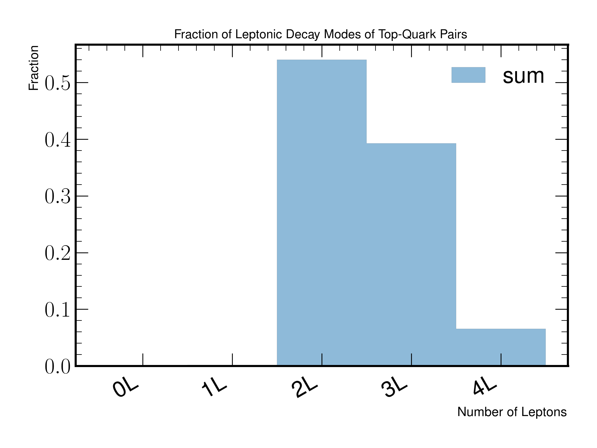

TruthEvent
==========

A set of studies aiming to investigate a large asymmetric differential between observed Missing Transverse Energy and the underlying truth neutrino/children.
The study also includes some meta analysis about the decay modes and number of leptonic decays in events, and their respective signs (if the event has a dilepton decay mode).

Figure 6.a
----------
.. figure:: ./figures/Figure.6.a.png
   :align: center
   :name: Figure.6.a

   In this figure, the measured missing transverse energy is being compared to the underlying event truth neutrinos and the sum of all truth children in the event.
   Assuming that events null transverse moment prior to the collision, most of the missing transverse energy should originate from the truth neutrinos.

Figure 6.b
----------

    
   An more granular split of the missing transverse energy differential when only considering truth neutrinos and segmenting the underlying distribution into number of neutrinos.

Figure 6.c
----------
.. figure:: ./figures/Figure.6.c.png
   :align: center
   :name: Figure.6.c
    
   An more granular split of the missing transverse energy differential when considering all truth children and segmenting the underlying distribution into number of neutrinos.

Figure 6.d
----------
.. figure:: ./figures/Figure.6.d.png
   :align: center
   :name: Figure.6.d
    
   The originally measured missing transverse energy with at least one neutrino overlayed with the resulting truth-neutrinos being summed.

Figure 6.e
----------

   A fractional breakdown of leptonic top-quark decays for all events.

Figure 6.f
----------
.. figure:: ./figures/Figure.6.f.png
   :align: center
   :name: Figure.6.f

   A fractional breakdown of dileptonic top-quark decay modes with opposite and same sign lepton pairs.
