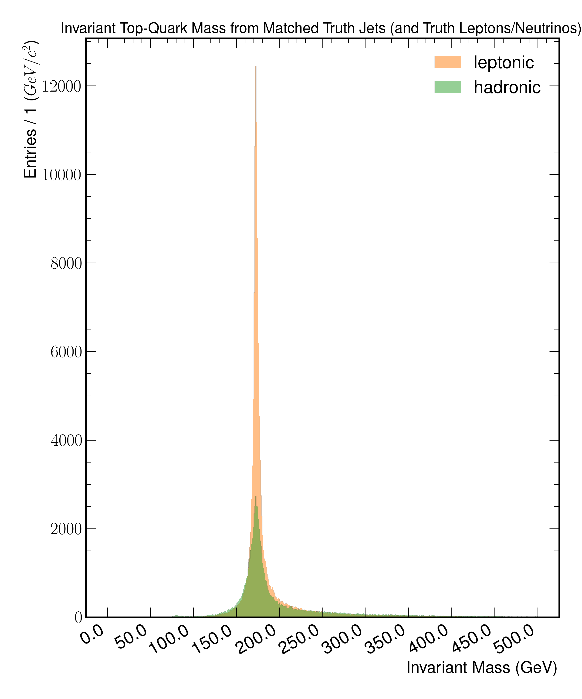
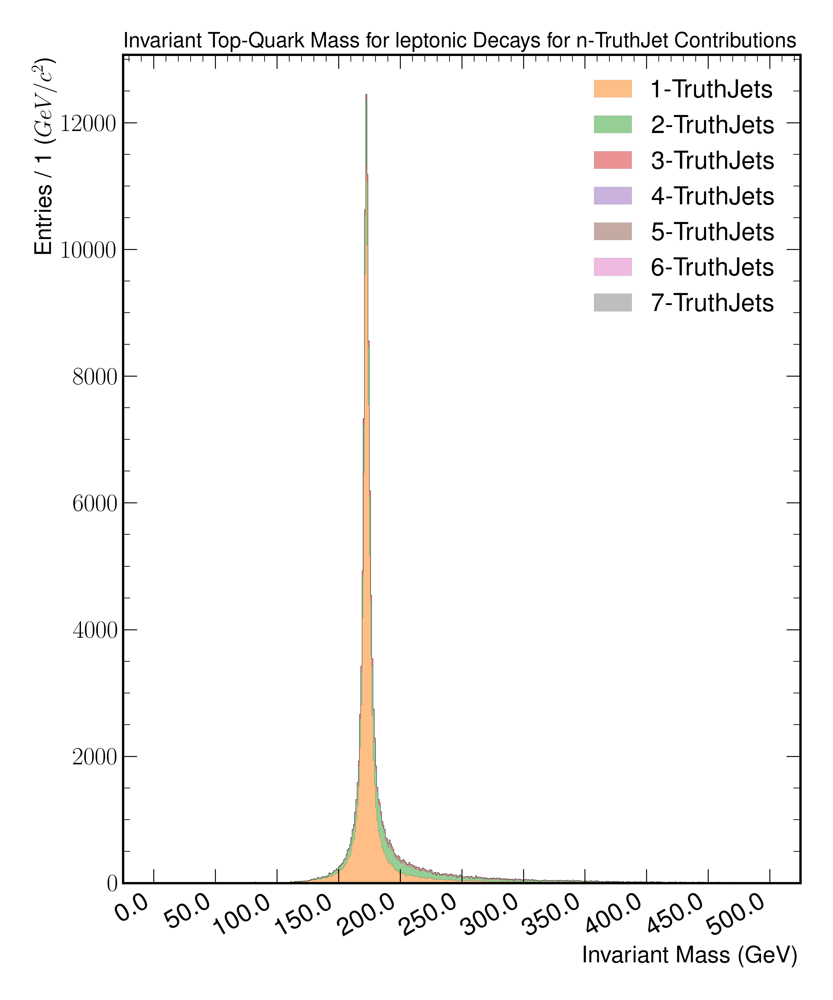
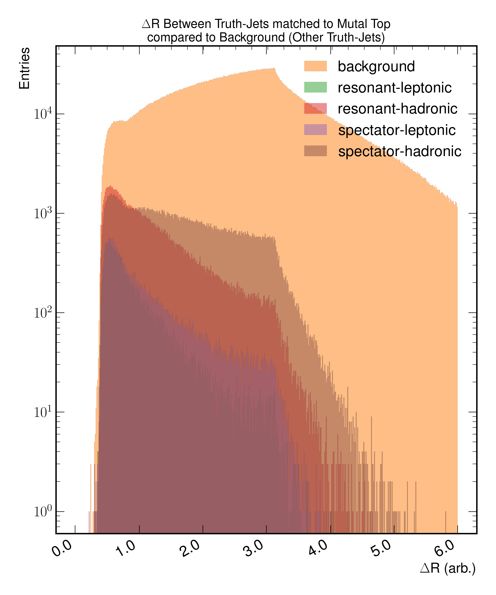
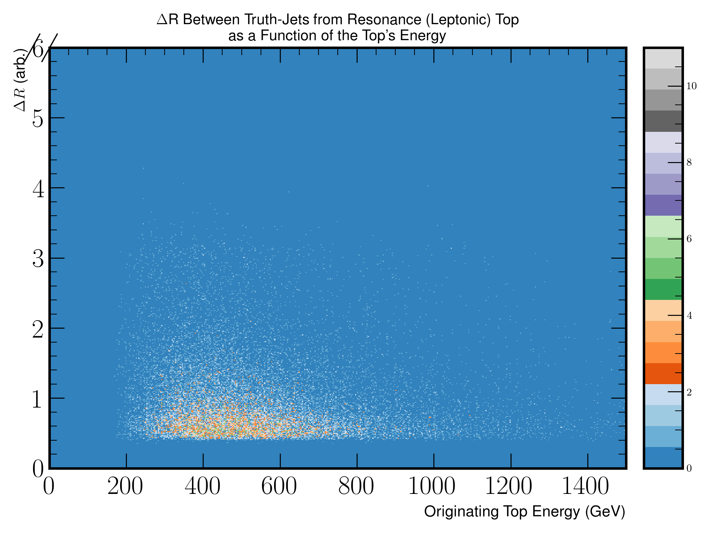
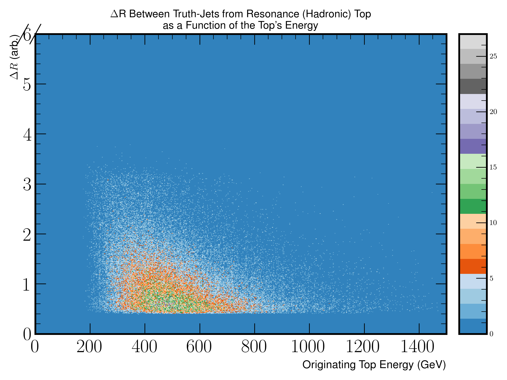
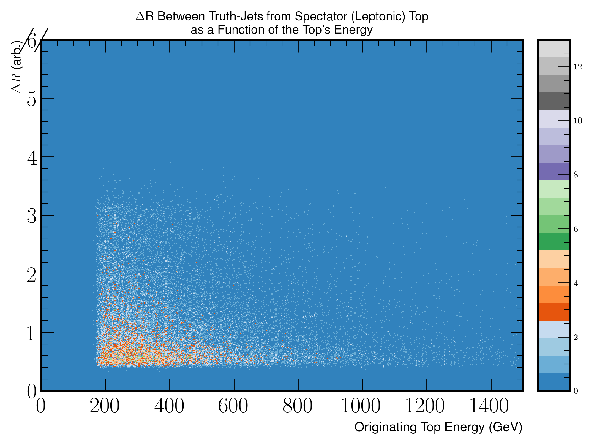
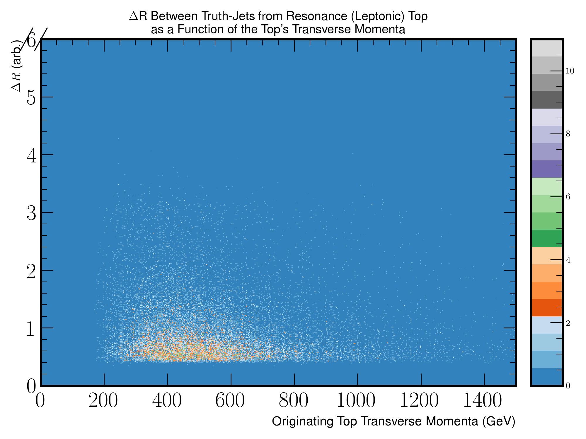
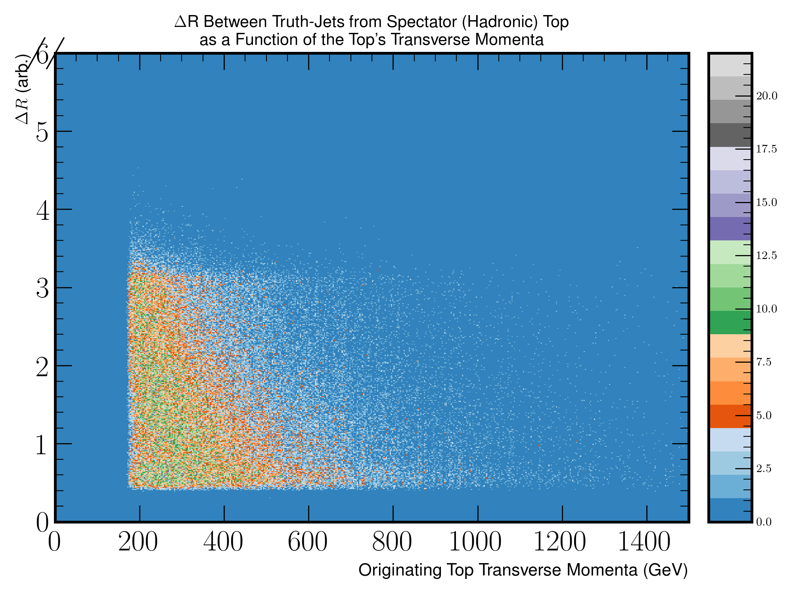
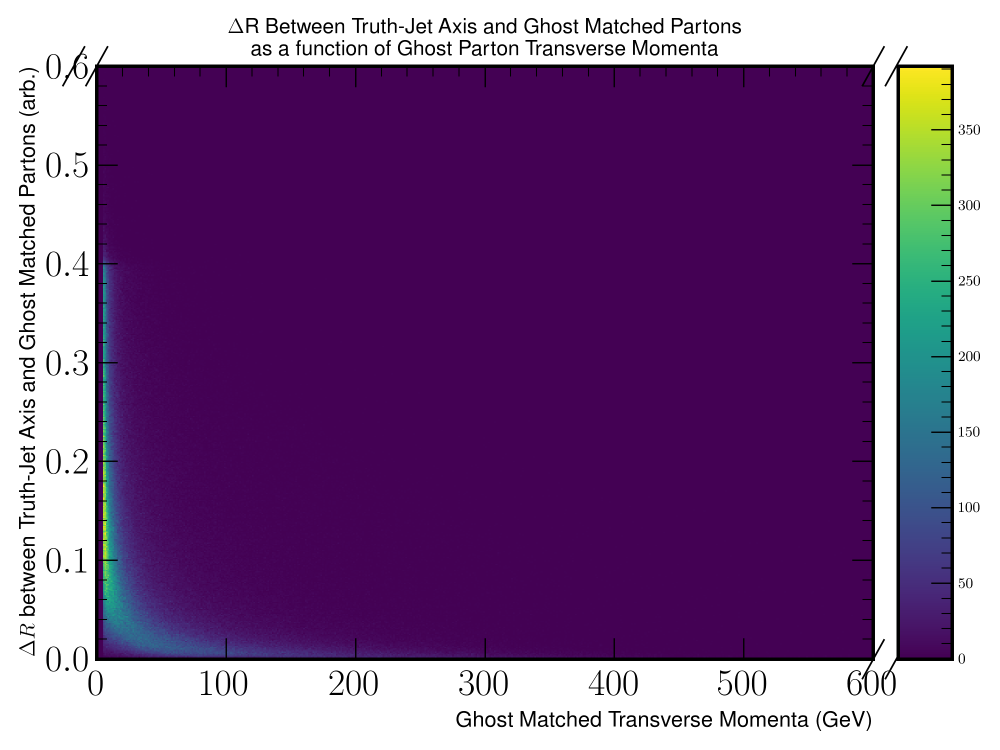

TopTruthJets
============

A set of studies involving the truth matching performance of truth jets and truth children (if the originating top is leptonic). 
The aim is to investigate the resolution of the formed invariant top-mass when using the truth jet container, followed by their respective kinematics and parton content.

Figure 7.a
----------

   The figure illustrates the formed invariant mass of the top-quark from truth jets being matched to individual tops by index.
   The underlying distribution is partitioned into whether a given top has decayed leptonically or hadronically.
   For leptonically decaying tops, truth children (lepton and neutrino) are used from the associated parent top.

Figure 7.b
----------

   The figure illustrates the formed invariant mass of the top-quark from truth jets being matched to individual tops **decaying leptonically**.
   The underlying distribution is partitioned into the number of truth-jet contributions.
   For this matching scheme the truth children are used to add the missing the neutrinos and leptons.

Figure 7.c
----------
.. figure:: ./figures/Figure.7.c.png
   :align: center
   :name: Figure.7.c

   The figure illustrates the formed invariant mass of the top-quark from truth jets being matched to individual tops **decaying hadronically**.
   The underlying distribution is partitioned into the number of truth-jet contributions.

Figure 7.d
----------
.. figure:: ./figures/Figure.7.d.png
   :align: center
   :name: Figure.7.d

   The figure illustrates the formed invariant mass of the top-quark from truth jets being matched to individual tops **decaying leptonically**.
   The underlying distribution is partitioned into the number of tops contributing to a given matched truth jet.
   This plot aims to illustrate cases, where a truth jet can be shared between adjacent tops.
   For this matching scheme the truth children are used to add the missing the neutrinos and leptons.

Figure 7.e
----------
.. figure:: ./figures/Figure.7.e.png
   :align: center
   :name: Figure.7.e

   The figure illustrates the formed invariant mass of the top-quark from truth jets being matched to individual tops **decaying hadronically**.
   The underlying distribution is partitioned into the number of tops contributing to a given matched truth jet.
   This plot aims to illustrate cases, where a truth jet can be shared between adjacent tops.

Figure 7.f
----------

   A figure depicting the :math:`\Delta R` between Truth-Jets originating from a common Top-Quark compared to other, non-Top based, Truth-Jets.
   The different distributions in the figure indicate whether the given truth jet originates from a spectator or resonance top, and how this top decayed.
   For background entries, the other truth jet is not allowed to originate from the same Top-Quark however, the other Truth-Jet can also originate from a different Top-Quark.

Figure 7.g
----------

   A heat-map representation of Figure 7.f as a function of the **Resonance (Leptonic)** Top's Energy and the :math:`\Delta R` between Truth-Jets's originating from Mutual Tops.

Figure 7.h
----------

   A heat-map representation of Figure 7.f as a function of the **Resonance (Hadronic)** Top's Energy and the :math:`\Delta R` between Truth-Jets's originating from Mutual Tops.

Figure 7.i
----------

   A heat-map representation of Figure 7.f as a function of the **Spectator (Leptonic)** Top's Energy and the :math:`\Delta R` between Truth-Jets's originating from Mutual Tops.

Figure 7.j
----------

   A heat-map representation of Figure 7.f as a function of the **Spectator (Hadronic)** Top's Energy and the :math:`\Delta R` between Truth-Jets's originating from Mutual Tops.

Figure 7.k
----------

   A heat-map representation of Figure 7.f as a function of the **Resonance (Leptonic)** Top's Transverse Momenta and the :math:`\Delta R` between Truth-Jets's originating from Mutual Tops.

Figure 7.l
----------

   A heat-map representation of Figure 7.f as a function of the **Resonance (Hadronic)** Top's Transverse Momenta and the :math:`\Delta R` between Truth-Jets's originating from Mutual Tops.

Figure 7.m
----------

   A heat-map representation of Figure 7.f as a function of the **Spectator (Leptonic)** Top's Transverse Momenta and the :math:`\Delta R` between Truth-Jets's originating from Mutual Tops.

Figure 7.n
----------

   A heat-map representation of Figure 7.f as a function of the **Spectator (Hadronic)** Top's Transverse Momenta and the :math:`\Delta R` between Truth-Jets's originating from Mutual Tops.

Figure 7.o
----------
.. figure:: ./figures/Figure.7.o.png
   :align: center
   :name: Figure.7.o

   A figure depicting the :math:`\Delta R` between the Truth-Jet axis and Ghost matched Partons. 
   In this figure, all truth-jets in the event are considered.

Figure 7.p
----------

   A heat-map of the :math:`\Delta R` dependency between the Truth-Jet axis and Ghost Matched Partons as a function of the Ghost Matched Parton's energy.
   This figure is a decomposition of Figure 7.o, where the underlying distributions are a function of the Ghost Matched Parton energy.

Figure 7.q
----------

   A heat-map of the :math:`\Delta R` dependency between the Truth-Jet axis and Ghost Matched Partons as a function of the Ghost Matched Parton's transverse momenta.
   This figure is a decomposition of Figure 7.o, where the underlying distributions are a function of the Ghost Matched Parton transverse momenta.

