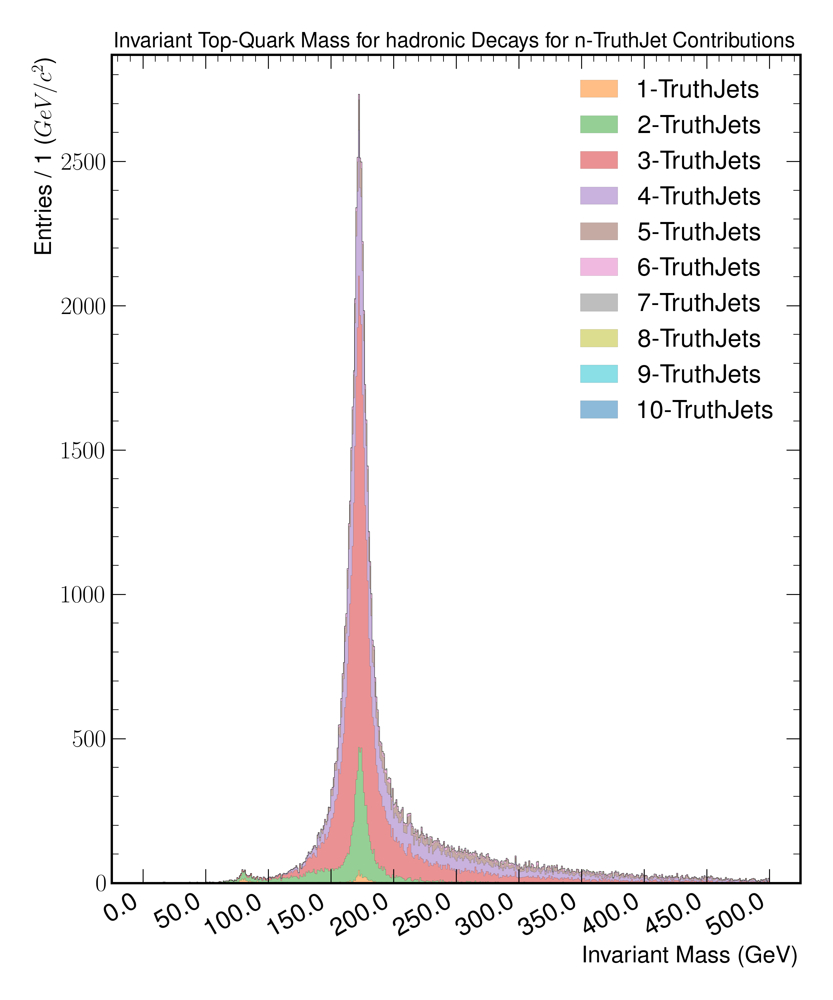
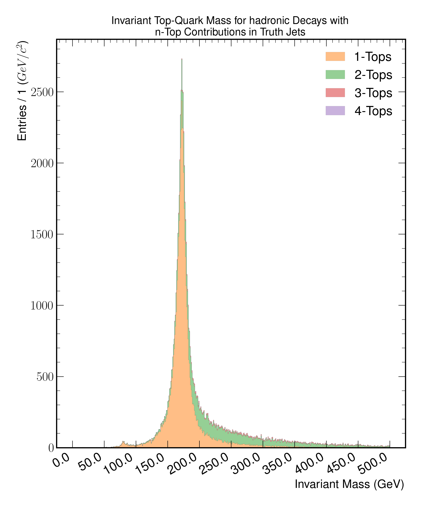

TopTruthJets
============

A set of studies involving the truth matching performance of truth jets and truth children (if the originating top is leptonic). 
The aim is to investigate the resolution of the formed invariant top-mass when using the truth jet container, followed by their respective kinematics and parton content.

Figure 7.a
----------
.. figure:: ./figures/Figure.7.a.png
   :align: center
   :name: Figure.7.a

   The figure illustrates the formed invariant mass of the top-quark from truth jets being matched to individual tops by index.
   The underlying distribution is partitioned into whether a given top has decayed leptonically or hadronically.
   For leptonically decaying tops, truth children (lepton and neutrino) are used from the associated parent top.

Figure 7.b
----------
.. figure:: ./figures/Figure.7.b.png
   :align: center
   :name: Figure.7.b

   The figure illustrates the formed invariant mass of the top-quark from truth jets being matched to individual tops **decaying leptonically**.
   The underlying distribution is partitioned into the number of truth-jet contributions.
   For this matching scheme the truth children are used to add the missing the neutrinos and leptons.

Figure 7.c
----------

   The figure illustrates the formed invariant mass of the top-quark from truth jets being matched to individual tops **decaying hadronically**.
   The underlying distribution is partitioned into the number of truth-jet contributions.

Figure 7.d
----------

   The figure illustrates the formed invariant mass of the top-quark from truth jets being matched to individual tops **decaying leptonically**.
   The underlying distribution is partitioned into the number of tops contributing to a given matched truth jet.
   This plot aims to illustrate cases, where a truth jet can be shared between adjacent tops.
   For this matching scheme the truth children are used to add the missing the neutrinos and leptons.

Figure 7.e
----------

   The figure illustrates the formed invariant mass of the top-quark from truth jets being matched to individual tops **decaying hadronically**.
   The underlying distribution is partitioned into the number of tops contributing to a given matched truth jet.
   This plot aims to illustrate cases, where a truth jet can be shared between adjacent tops.
