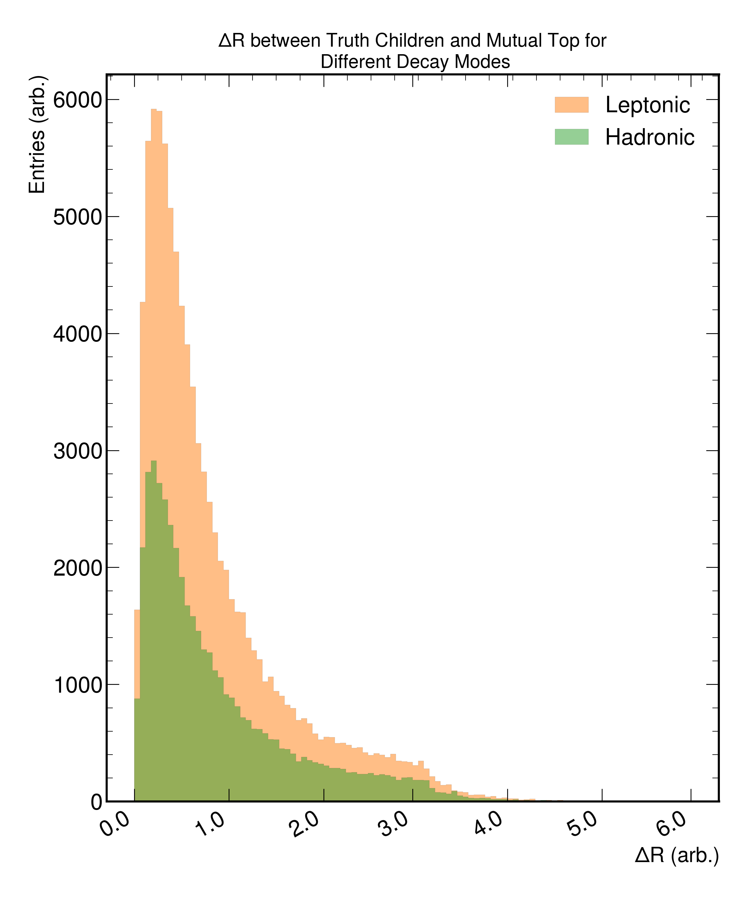
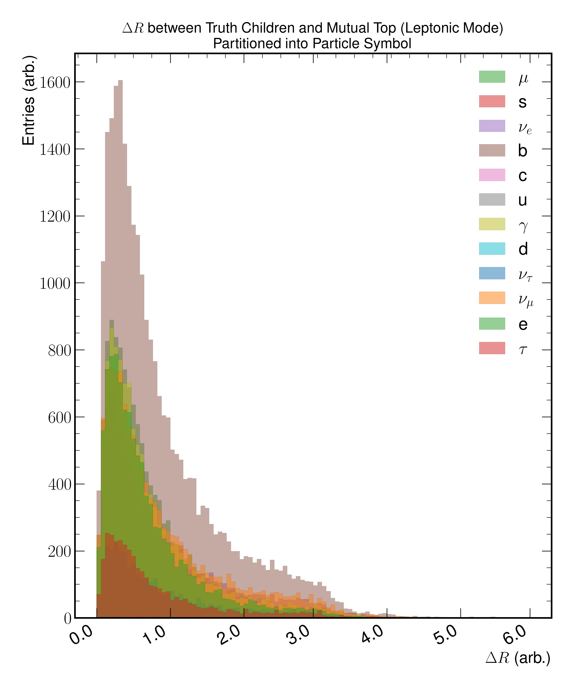
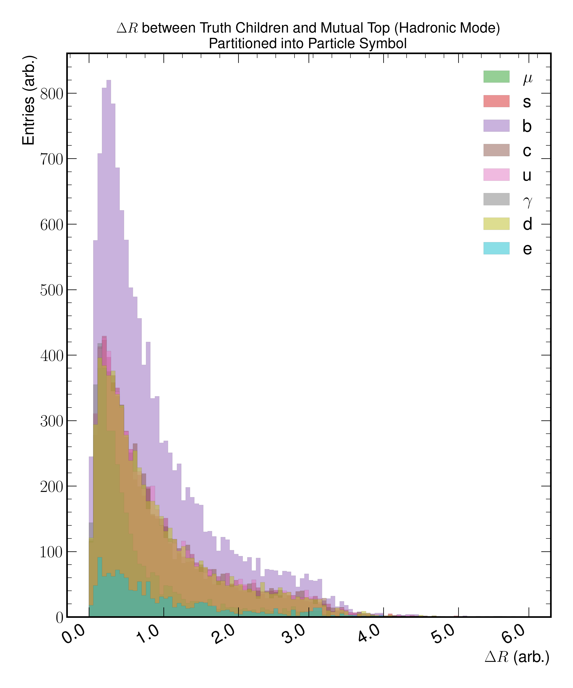
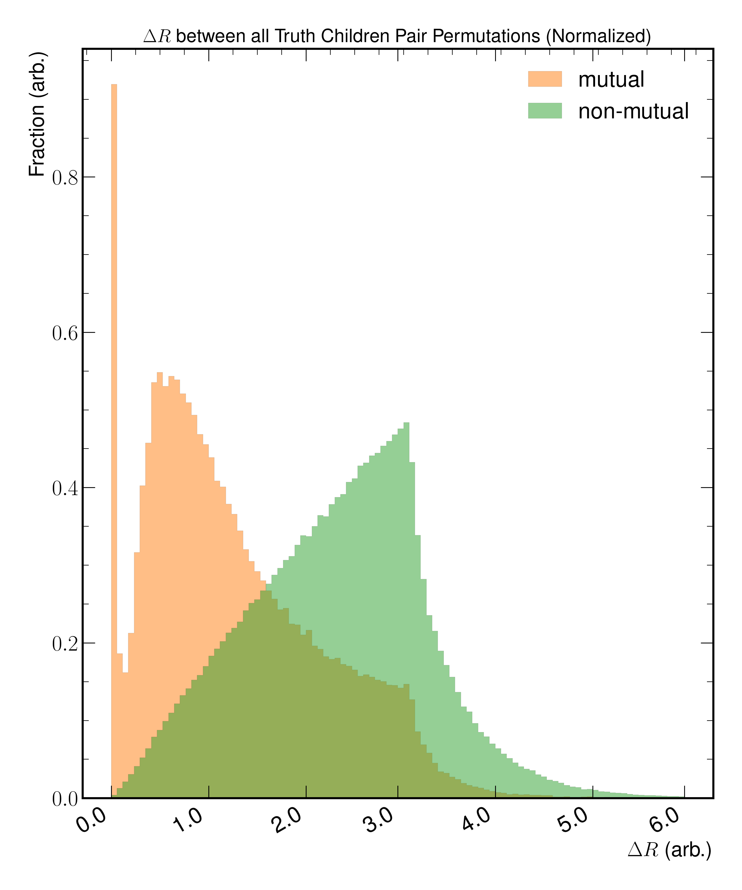

Children-Kinematics
===================

A set of studies relating to the decay children of truth-tops.

Figure 2.a
----------

   A histogram plot of the :math:`\Delta R` between the origin truth top and associated truth children.
   The plot is partitioned into the top decay channel being either hadronic or leptonic.

Figure 2.b
----------

   A histogram plot of the :math:`\Delta R` between the origin truth top and associated children for the leptonic decay mode.
   The plot is partitioned into the particle symbols.

Figure 2.c
----------

   A histogram plot of the :math:`\Delta R` between the origin truth top and associated children for the hadronic decay mode.
   The plot is partitioned into the particle symbols.

Figure 2.d
----------

   A histogram plot of the :math:`\Delta R` for all possible truth children pair permutations.
   The plot is partitioned into whether the truth children originated from a mutual top or if there was a cross over.
