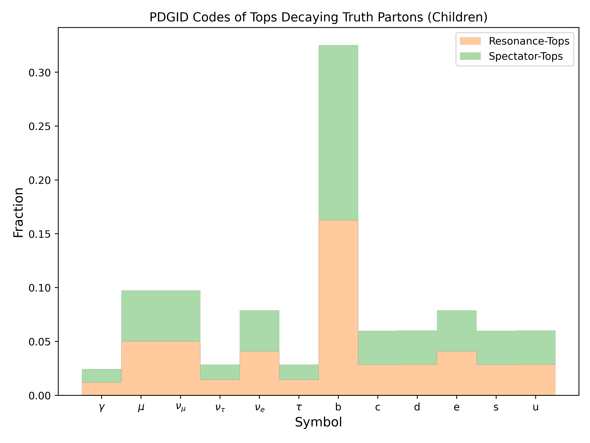
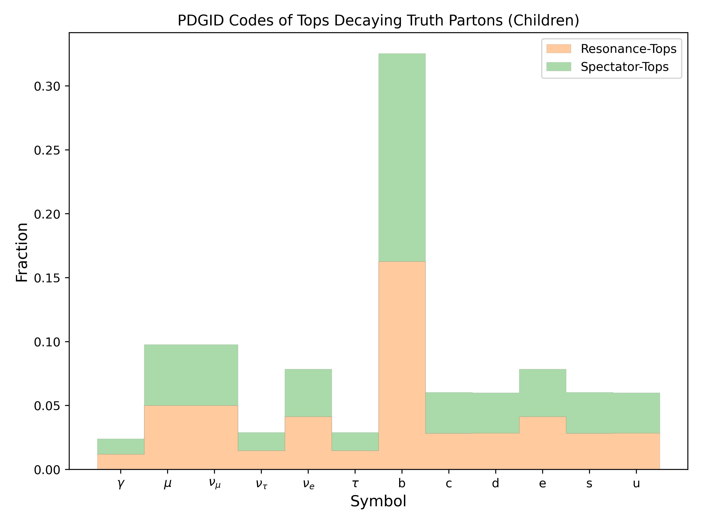

.. _figure_4b:

Figure.4.b
----------

A set of normalized fractional plots of the PDGID codes from tops decaying into their respective children. 
The plots are segmented by resonance and spectator top decay.

Fraction values for Mass Point: 1000 GeV
^^^^^^^^^^^^^^^^^^^^^^^^^^^^^^^^^^^^^^^^

- :math:`\gamma`: 2.3913222376975236
- :math:`\mu`: 9.760464072716319
- :math:`\nu_{\mu}`: 9.760464072716319
- :math:`\nu_{\tau}`: 2.900454476994334
- :math:`\nu_{e}`: 7.848462122517806
- :math:`\tau`: 2.900454476994334
- b: 32.537882140311815
- c: 6.037230780219149
- d: 5.988786358547723
- e: 7.848462122517806
- s: 6.037230780219149
- u: 5.988786358547723

Mass Point: 400 GeV
^^^^^^^^^^^^^^^^^^^

Mass Point: 500 GeV
^^^^^^^^^^^^^^^^^^^

Mass Point: 600 GeV
^^^^^^^^^^^^^^^^^^^

Mass Point: 700 GeV
^^^^^^^^^^^^^^^^^^^

Mass Point: 800 GeV
^^^^^^^^^^^^^^^^^^^

Mass Point: 900 GeV
^^^^^^^^^^^^^^^^^^^

Mass Point: 1000 GeV
^^^^^^^^^^^^^^^^^^^^

