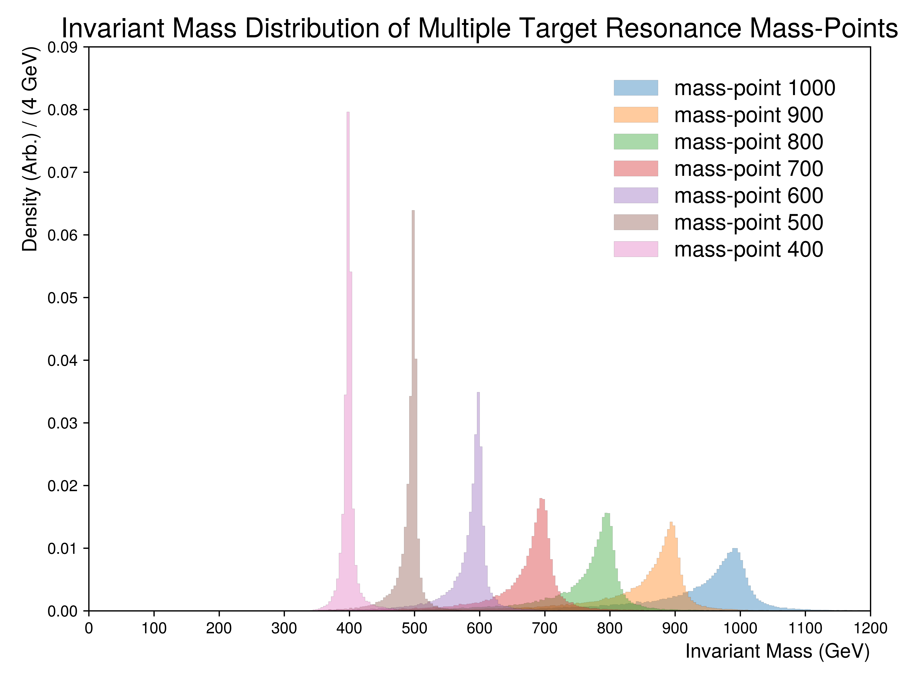

.. _figure_6b:

Figure 6.b
----------

  
A figure illustrating the collimation of all considered mass points for the resonance.
For this figure, only the **top children partons** were used to compute the invariant masses of their resonance.
For visibility, all distributions have been normalized to unity.

